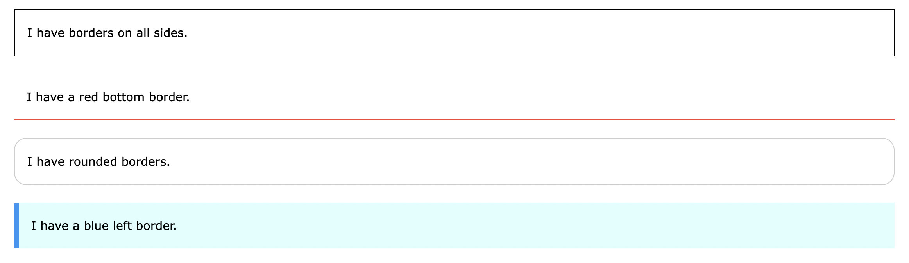
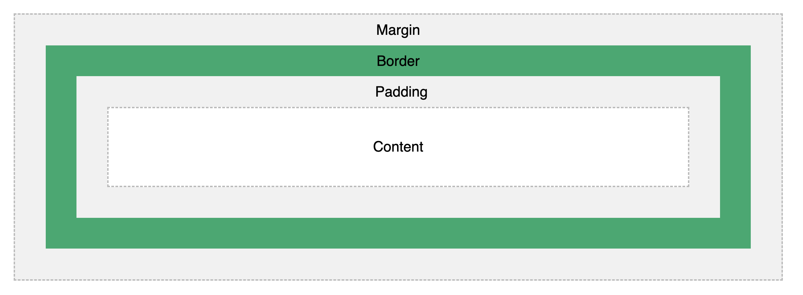

<div style="font-size: 17px;background: black;padding: 2rem;">

The CSS (Cascading Style Sheets) Box Model is a fundamental concept that describes how the layout and sizing of elements are handled in a web page. It consists of four main components: content, padding, border, and margin. These components wrap around an HTML element and define its overall dimensions and spacing.

# Content

This is the innermost part of the box and represents the actual content of the HTML element, such as text, images, or other media.

<h3 style="border-bottom: 2px solid white; padding-bottom: 2px; display: inline-block;">Height & Width</h3>

The CSS `height` and `width` properties are used to set the height and width of content area of an element. The `height` and `width` properties do not include padding, borders, or margins. It sets the height/width of the area inside the padding, border, and margin of the element. The height and width properties may have the following values:

- <b style="color: Salmon;">auto</b> - This is default. The browser calculates the height and width
- <b style="color: Salmon;">length</b> - Defines the height/width in px, cm, etc.
- <b style="color: Salmon;">%</b> - Defines the height/width in percent of the containing block
- <b style="color: Salmon;">initial</b> - Sets the height/width to its default value
- <b style="color: Salmon;">inherit</b> - The height/width will be inherited from its parent value
- <b style="color: Salmon;">min-content</b> and <b style="color: Salmon;">max-content</b>: These values for width or height can be used to make an element as small as possible or as large as the content allows. Example usage of `min-content` value:

    ```html
    <div>This is some dynamic content</div>
    ```

    ```css
    div { width: min-content; background-color: lightblue; padding: 10px;}
    /* We could use defined width for this but if a single word exceeds the width size, it would overflow. */
    ```
    <div style="width: min-content;background: blue; padding:10px;">This is some dynamic content</div><br>

<b style="color: Crimson;">The height and width of an inline element cannot be set in CSS. Their dimensions are usually determined by the content they contain.</b>

We can also set constraints on the minimum and maximum dimensions of an element using `min-width`, `max-width`, `min-height`, and `max-height` properties.

<h3 style="border-bottom: 2px solid white; padding-bottom: 2px; display: inline-block;">Overflow handling</h3>

In CSS, the `overflow` property is used to control what happens when the content of an element overflows the box(<b style="color: Chartreuse;">Inside Border</b>) that contains it. The property has several values that determine how the content is handled, and it is commonly used with block-level elements. Here are the primary values for this property:
- <b style="color: Salmon;">visible</b>: This is the default value. Content that overflows the box is rendered outside the box. In other words, it is not clipped, and it may overlap with other elements.
- <b style="color: Salmon;">hidden</b>: Content that overflows the box is clipped or hidden. The overflowing content is not visible.
- <b style="color: Salmon;">scroll</b>: A scrollbar is added to the box, allowing the user to scroll and view the overflowed content. Both horizontal and vertical scrollbars will appear if necessary.
- <b style="color: Salmon;">auto</b>: This value behaves like `scroll`, but it only adds a scrollbar if the content overflows. If the content fits within the box, no scrollbar is shown.
- <b style="color: Salmon;">inherit</b>: It means that the overflow property of the element is inherited from its parent.

The `overflow-x` and `overflow-y` properties specify whether to change the overflow of content just horizontally or vertically (or both). Also there's a property `overflow-wrap` that specifies whether or not the browser can break lines with long words, if they overflow its container. Read it <a src="https://www.w3schools.com/cssref/css3_pr_overflow-wrap.php">here</a>

<b style="color: Chartreuse;">Note:</b> **The overflow property only works for block elements with a specified width/height.**

<div style="background: DarkRed;  padding: 0.3rem 0.8rem;">
To add an ellipsis (...) to indicate that text is overflowing and is not fully visible, you can use a combination of the <span style="color: Yellow;">white-space</span> property, <span style="color: Yellow;">overflow</span> property, and the <span style="color: Yellow;">text-overflow</span> property. Example: 

```css
.element {
  width: 200px; /* Set the width to a fixed value or max-width */
  white-space: nowrap; /* Prevent text from wrapping to the next line */
  overflow: hidden; /* Hide the overflowing content */
  text-overflow: ellipsis; /* Display an ellipsis (...) when text overflows */
}
```
</div>

<br>

# Border

This property is used to define the border of an element. It allows you to control the style, width, and color of the border.



<h3 style="text-decoration: underline;">Properties</h3>

- <b style="color: Salmon;">border-width</b>: Specifies the width of the border. You can set it using various units such as pixels (px), ems (em), or other length units. This property can have from one to four values (for the top border, right border, bottom border, and the left border respectively).

  ```css
  p.one {
    border-width: 5px 20px; /* 5px top and bottom, 20px on the sides */
  }
  p.two {
    border-width: 20px 5px; /* 20px top and bottom, 5px on the sides */
  }
  p.three {
    border-width: 25px 10px 4px 35px; /* 25px top, 10px right, 4px bottom and 35px left */
  }
  ```

- <b style="color: Salmon;">border-style</b>: Specifies the style of the border, such as solid, dashed, dotted, etc. This property can also have from one to four values like above.
  <span style="color: Chartreuse;">None of the other css border properties will have any effect unless the border-style property is set!</span>

- <b style="color: Salmon;">border-color</b>: Specifies the color of the border. You can use color names, hexadecimal values, RGB values, or other color notations. If border-color is not set, it inherits the color of the element. This property can also have from one to four values like above.
- <b style="color: Salmon;">border</b>: The border property is a shorthand property for the following individual border properties: `border-width`, `border-style`(required) and `border-color`.
- <b style="color: Salmon;">border-left(right/top/bottom)</b>: We can also set each border property individually for specific sides using these properties.
- <b style="color: Salmon;">border-radius</b>: Used to add rounded borders to an element. Its value can be length, %, initial and inherit. It can also take upto 4 values(top-left, top-right, bottom-right, bottom-left). If bottom-left is omitted it is the same as top-right. If bottom-right is omitted it is the same as top-left. If top-right is omitted it is the same as top-left. This property can be used to create various shapes, such as circles or ellipses, depending on the values you provide.

### <a src="https://www.w3schools.com/css/css_outline.asp">Outline</a>

The `outline` property is similar to the `border` property but is drawn outside the border area and doesn't affect the layout of the box. Unlike border, the outline may overlap other content. It's often used for visual emphasis without altering the box dimensions. We can set it similarly like border.

The `outline-offset` property adds space between an outline and the edge/border of an element. The space between an element and its outline is transparent. <span style="color: Chartreuse;">It takes just 1 value, not 4!</span>

<br>

# Padding

The CSS `padding` properties are used to generate space around an element's content, inside of any defined borders. `padding-left(top/right/bottom/)` can be used for pecifying the padding for each side of an element specifically.

`padding` can have upto 4 values as well. <b>2 -> [top-bottom, left-right] & 4 -> [top, right, bottom, left]</b>

All the padding properties can have the following values:

- <b style="color: Salmon;">length</b> - specifies a padding in px, pt, cm, etc.
- <b style="color: Salmon;">%</b> - specifies a padding in % of the width of the containing element
- <b style="color: Salmon;">inherit</b> - specifies that the padding should be inherited from the parent element

<b style="color: Chartreuse;">Note: </b>Negative values are not allowed.

<div style="background: DarkRed;  padding: 0.3rem 0.8rem;">
<b style="color: YELLOW;">IMPORTANT!!</b>

When you set the width and height properties of an element with CSS, you just set the width and height of the content area. To calculate the total width and height of an element, you must also include the padding and borders.

```css
div {
  width: 320px;
  height: 50px;
  padding: 10px;
  border: 5px solid gray;
}
/*
320px (content area width) + 20px (left + right padding) + 10px (left + right border) = 350px (total width)

50px (content area height) + 20px (top + bottom padding) + 10px (top + bottom border) = 80px (total height)
*/
```

The <b style="color: Chartreuse;">box-sizing</b> property allows us to include the padding and border in an element's total width and height. If you set `box-sizing: border-box;` on an element, padding and border are included in the width and height.

Since the result of using this is so much better, many developers want all elements on their pages to work this way. The code below ensures that all elements are sized in this more intuitive way. Many browsers already use box-sizing: border-box; for many form elements (but not all - which is why inputs and text areas look different at width: 100%;). Applying this to all elements is safe and wise:

```css
* {
  box-sizing: border-box;
}
```

</div>

<br>

# Margin

The CSS `margin` properties are used to create space around elements, outside of any defined borders. It is set exactly like padding and has shorthands like that too - `margin-left(top/right/bottom)`. It takes same values as well <span style="color: Chartreuse;">except negative values are allowed here</span>.

<div style="background: DarkRed;  padding: 0.3rem 0.8rem;"> 

You can set the margin property to `auto` to horizontally center the element within its container. The element will then take up the specified width, and the remaining space will be split equally between the left and right margins.

```css
div {
  width: 300px;
  margin: auto;
  border: 1px solid red;
}
```

<b style="color: Chartreuse;">NOTE</b>: The `margin: auto;` technique is for centering block-level elements only. It won't work directly with inline elements like `<span>`. It is used for block-level elements that have a specified width. For inline elements, you might want to use other techniques.

</div>

<br><br>



</div>

<!-- <div style="background: DarkRed;  padding: 0.3rem 0.8rem;"> => HIGHLIGHT -->
<!-- <h3 style="text-decoration: underline;"> => SUBHEADING -->
<!-- <b style="color: Chartreuse;"> => IMPORTANT-1 -->
<!-- <i> => IMPORTANT-2 -->
<!-- <mark style="padding: 0.3rem 0.8rem;"> => IMPORTANT-3 -->
<!-- <b> => IMPORTANT-5 -->
<!-- <b style="color:red;"> => NOTE -->
<!-- <span style="color: Cyan;">-></span> -->
<!-- <b style="color: Salmon;"> -->
