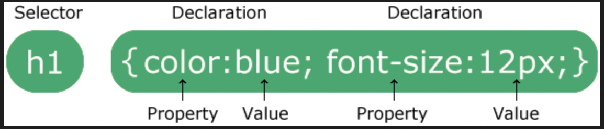
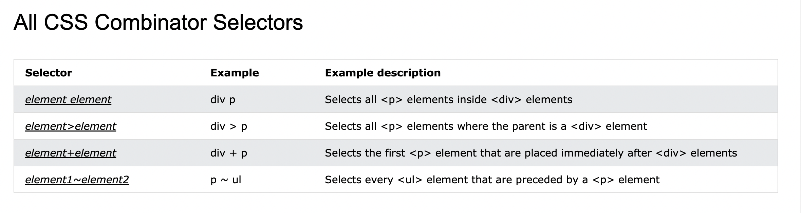
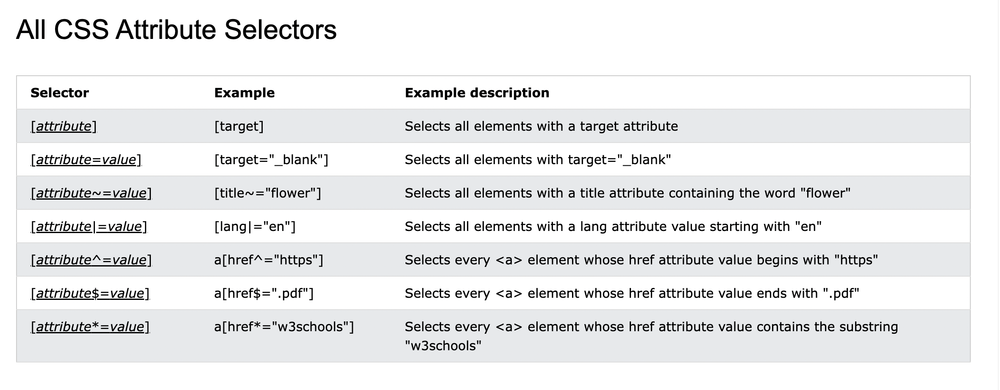

<div style="font-size: 17px;background: black;padding: 2rem;">

Cascading Style Sheets (CSS) is a stylesheet language used to describe the presentation of a document written in HTML or XML (including XML dialects such as SVG, MathML or XHTML). CSS describes how elements should be rendered on screen, on paper, in speech, or on other media. External stylesheets are stored in CSS files.

<br>

# Selectors



- The selector points to the HTML element you want to style.

- The declaration block contains one or more declarations separated by semicolons.

- Each declaration includes a CSS property name and a value, separated by a colon.

- Multiple CSS declarations are separated with semicolons, and declaration blocks are surrounded by curly braces.

### Example:

```css
p {
  color: red;
  text-align: center;
}
```

In the above example, all `<p>` elements will be center-aligned, with a red text color. So here:

- `p` is selector
- `color: red` is declaration
- `color` & `text-align` are properties
- `red` & `center` are values.

A CSS selector selects the HTML element(s) you want to style. Or simply we can say CSS selectors are used to "find" (or select) the HTML elements you want to style. CSS selectors can be of any of these (there are more but not so important right):

<div class="w3-responsive" style="background: maroon;">
<table class="ws-table-all notranslate">
  <tbody><tr>
    <th style="width:20%">Selector</th>
    <th style="width:20%">Example</th>
    <th>Example description</th>
  </tr>
  <tr>
    <td>#id</td>
    <td>#firstname</td>
    <td>Selects the element with id="firstname"</td>
  </tr>
  <tr>
    <td>.class</td>
    <td>.intro</td>
    <td>Selects all elements with class="intro"</td>
  </tr>
  <tr>
    <td>element.class</td>
    <td>p.intro</td>
    <td>Selects only &lt;p&gt; elements with class="intro"</td>
  </tr>
  <tr>
    <td>*</td>
    <td>*</td>
    <td>Selects all elements</td>
  </tr>
  <tr>
    <td>element</td>
    <td>p</td>
    <td>Selects all &lt;p&gt; elements</td>
  </tr>
  <tr>
    <td>element,element,..</td>
    <td>div, p</td>
    <td>Selects all &lt;div&gt; elements and all &lt;p&gt; elements</td>
  </tr>
</tbody></table>
</div>

> If there are two or more CSS rules that point to the same element, the selector with the highest specificity value will "win", and its style declaration will be applied to that HTML element. Specificity order: `Inline styles` > `IDs` > `Classes, pseudo-classes, attribute selectors` > `Elements and pseudo-elements`. Link - https://www.w3schools.com/css/css_specificity.asp

<br>

# Combinators

CSS combinators are used to explain the relationship between two or more selectors. They allow you to select elements based on their relationship in the HTML document. There are four different combinators in CSS:

- descendant selector (space)
- child selector (>)
- adjacent sibling selector (+)
- general sibling selector (~)



<br>

# Pseudo-classes

A pseudo-class in CSS is a keyword added to a selector that specifies a special state of the selected elements. It allows you to apply styles to elements when they are in a certain state, like when a user hovers over a link, when an element is focused, or when it's the first child of its parent.

**SYNTAX**: <b style="color:Khaki;">selector:pseudo-class { property: value; }</b>

- <b style="color:PaleGreen;">:hover</b>: Styles an element when the user hovers their mouse over it. Commonly used to create interactive button or link effects.

  ```css
  a:hover {
    color: red;
  }
  ```

- <b style="color:PaleGreen;">:focus</b>: Styles an element when it receives focus (e.g., when a user clicks on an input field or focuses on it via the keyboard). Often used to improve accessibility by highlighting the currently focused form field.

  ```css
  input:focus {
    outline: 2px solid blue;
  }
  ```

- <b style="color:PaleGreen;">:active</b>: Styles an element when it is being activated by the user (for example, when a link or button is clicked and held). Used to give feedback during user interactions, like pressing buttons.

  ```css
  button:active {
    background-color: green;
  }
  ```

- <b style="color:PaleGreen;">:visited</b>: Styles links that the user has already visited. Helps users identify links they have clicked on before, often styled differently from unvisited links.

  ```css
  a:visited {
    color: purple;
  }
  ```

- <b style="color:PaleGreen;">:nth-child()</b>: Styles an element based on its position within its parent, counting from the first child. Used to style specific children of an element, like styling alternating rows in a table.

  ```css
  li:nth-child(odd) {
    background-color: lightgray;
  }
  ```

  Result: The odd-numbered list items (1, 3, etc.) will have a light gray background. You can use various formulas in `nth-child()`, such as:

  - `nth-child(2)` — targets the second child.
  - `nth-child(3n)` — targets every 3rd child.

- <b style="color:PaleGreen;">:nth-of-type()</b>: Similar to `:nth-child()`, but it only counts elements of the same type (e.g., all `<p>` tags, or all `<div>` tags) rather than all children.

  ```css
  p:nth-of-type(2) {
    color: blue;
  }
  ```

- <b style="color:PaleGreen;">:first-child</b> and <b style="color:PaleGreen;">:last-child</b>: Styles the first or last child element of its parent.

  ```css
  p:first-child {
    font-weight: bold;
  }
  ```

- <b style="color:PaleGreen;">:first-of-type</b> and <b style="color:PaleGreen;">:last-of-type</b>: Styles the first or last element of a specific type within a parent.

  ```css
  p:first-of-type {
    color: blue;
  }
  ```

- <b style="color:PaleGreen;">:not</b>: Selects all elements that do not match a given selector.

  ```css
  /* All paragraphs except the ones with the highlight class will be gray. */
  p:not(.highlight) {
    color: gray;
  }
  ```

- <b style="color:PaleGreen;">:checked</b>: Styles form elements (checkboxes, radio buttons) when they are checked.

  ```css
  input:checked {
    background-color: green;
  }
  ```

- <b style="color:PaleGreen;">:root</b>: Targets the root element of the document (typically the `<html>` element). Often used to define CSS custom properties (variables) that can be used globally.

  ```css
  :root {
    --main-color: coral;
  }

  body {
    background-color: var(--main-color);
  }
  ```

<br>

# Pseudo-elements

A CSS pseudo-element is used to style specified parts of an element. They allow you to add decorative effects or content to elements without modifying the HTML structure.

**SYNTAX**: <b style="color:Khaki;">selector::pseudo-element { property: value; }</b>

<h3 style="border-bottom: 2px solid white; padding-bottom: 2px; display: inline-block;">List of important pseudo elements</h3>

- <b style="color:DeepSkyBlue;">::first-line</b>: It applies styles to the first line of a block of text. <b style="color:Violet;">Limitation:</b> It only works with block-level elements like `<p>`, `<div>`, etc. You can apply specific styles like font, color, background, letter-spacing, etc., but not things like margin, padding, border, or width.

  ```css
  p::first-line {
    color: #ff0000;
    font-variant: small-caps;
  }
  ```

- <b style="color:DeepSkyBlue;">::selection</b>: Allows you to style the part of an element that is selected by the user (e.g., when they click and drag to highlight text). <b style="color:Violet;">Limitation:</b> You can only change properties like `background-color` and `color`.

  ```css
  ::selection {
    color: DeepSkyBlue;
    background: yellow;
  }
  ```

- <b style="color:DeepSkyBlue;">::after</b> **&** <b style="color:DeepSkyBlue;">::before</b> : Can be used to insert some content after & before the content of an element respectively. We must set the <b style="color:orange;">content</b> property to specify what gets inserted. Without this, both of these pseudo elements are useless. Content is inline by default but we can change it using `display` property.

  ```html
  <style>
    p::before {
      content: "Note: ";
      color: red;
    }
  </style>
  <p>This is a paragraph.</p>
  ```

- <b style="color:DeepSkyBlue;">::marker</b>: It styles the marker of a list item, such as the bullet or number in an ordered or unordered list.

  ```css
  li::marker {
    color: red;
    font-size: 1.5em;
  }
  ```

- <b style="color:DeepSkyBlue;">::first-letter</b>: Styles the first letter of a block-level element. This is often used for typographic effects like drop caps in articles.

  ```css
  p::first-letter {
    font-size: 2em;
    color: red;
  }
  ```

<b style="color:SpringGreen;">A pseudo-class targets entire element but based on its current state (like "hover" or "active"), while a pseudo-element targets only a specific part of an element, allowing you to style a portion of the content without adding additional HTML elements.</b>

<br>

# Attribute Selectors

It is possible to style HTML elements that have specific attributes or attribute values.

1. `[attribute] selector`: Used to select elements with a specified attribute. The following example selects all `<a>` elements with a target attribute: `a[target] { background-color: yellow; }`
2. `[attribute="value"]`: Used to select elements with a specified attribute and value. The following example selects all `<a>` elements with a `target="\_blank"` attribute: `a[target="_blank"] { background-color: yellow; }`

```css
.input-field[type="password"] {
  border: 2px solid red;
}
```



<br>

# CSS Math Functions

The CSS math functions allow mathematical expressions to be used as property values. Here, we will explain the `calc()`, `max()` and `min()` functions.

- <b style="color:DarkSalmon;">calc()</b> : performs a calculation to be used as the property value. Syntax: calc(expression). Expression is mathematical expression consisting of following operator: `+ - \* /`. Example - `width: calc(100% - 100px);`
- <b style="color:DarkSalmon;">max()</b> / <b style="color:DarkSalmon;">min()</b> : uses the largest value, from a comma-separated list of values, as the property value. Syntax: `max(value1, value2, ...)`. Example -> `width: max(50%, 300px);`

List of all CSS functions - https://www.w3schools.com/cssref/css_functions.php

<br>

# CSS The !important Rule

The !important rule in CSS is used to add more importance to a property/value than normal. In fact, if you use the `!important` rule, it will override ALL previous styling rules for that specific property on that element! Example:- `background-color: red !important;`

### Important About `!important`:

The only way to override an `!important` rule is to include another `!important` rule on a declaration with the same (or higher) specificity in the source code - and here the problem starts! This makes the CSS code confusing and the debugging will be hard, especially if you have a large style sheet!

<br>

# How to add CSS in HTML files:

There are three ways of inserting a style sheet:

### 1. External CSS:

With an external style sheet, you can change the look of an entire website by changing just one file! We just have to create a file with .css extension and add all css in that file. External styles are defined within the `<link>` element, inside the `<head>` section of an HTML page like this -

```html
<head>
  <link rel="stylesheet" href="mystyle.css" />
</head>
```

### 2. Internal CSS:

An internal style sheet may be used if one single HTML page has a unique style. The internal style is defined inside the `<style>` element, inside the head section like this:

```html
<head>
  <style>
    body {
      background-color: linen;
    }

    h1 {
      color: maroon;
      margin-left: 40px;
    }
  </style>
</head>
```

### 3. Inline CSS:

An inline style may be used to apply a unique style for a single element. To use inline styles, add the style attribute to the relevant element. The style attribute can contain any CSS property. Example: <br/>
`<h1 style="color:blue;text-align:center;">This is a heading</h1>`

<br>

# Multiple Style Sheets

> If some properties have been defined for the same selector (element) in different style sheets, the value from the last read style sheet will be used.

Assume that an external style sheet has the following style for the `<h1>` element:

```css
h1 {
  color: navy;
}
```

Then, assume that an internal style sheet also has the following style for the `<h1>` element:

```css
h1 {
  color: orange;
}
```

Then if the internal style is defined after the link to the external style sheet, the `<h1>` elements will be "orange". And if the internal style is defined before the link to the external style sheet, the `<h1>` elements will be "navy".

<b style="color:red;">INTERNAL STYLE WILL ALWAYS HAVE HIGHEST PRIORITY IN EVERY CASE.</b>

All the styles in a page will "cascade" into a new "virtual" style sheet by the following rules, where number one has the highest priority:

1. Inline style (inside an HTML element)
2. External and internal style sheets (in the head section)
3. Browser default

<br>

# CSS Variables

<b><u>Custom properties</u></b> (sometimes referred to as CSS variables or cascading variables) are entities defined by CSS authors that represent specific values to be reused throughout a document. They provide a way to define values once and then use those values throughout your stylesheet, making it easier to maintain and update your styling.

Complex websites have very large amounts of CSS, and this often results in a lot of repeated CSS values. For example, it's common to see the same color used in hundreds of different places in stylesheets. Changing a color that's been duplicated in many places requires a search and replace across all rules and CSS files. Custom properties allow a value to be defined in one place, then referenced in multiple other places so that it's easier to work with. Another benefit is readability and semantics. For example, `--main-text-color` is easier to understand than the hexadecimal color `#00ff00`, especially if the color is used in different contexts.

Here's how you define and use CSS variables:

<h3 style="border-bottom: 2px solid white; padding-bottom: 2px; display: inline-block;">1. Defining CSS Variables:</h3>

To define a CSS variable, you use the <b style="color: Chartreuse;">--</b> prefix followed by the property name of your choice, and a property value that can be any <a href="https://developer.mozilla.org/en-US/docs/Learn_web_development/Core/Styling_basics/Values_and_units">valid CSS value</a>. <span style="color: Gold;">Like any other property, this is written inside a ruleset.</span> Conventionally, variable names are written in lowercase with hyphens for multi-word names.

```css
section {
  --main-bg-color: brown;
}
```

The selector given to the ruleset (`<section>` elements in the example above) defines the scope in which the custom property can be used. For this reason, a common practice is to define custom properties on the `:root` pseudo-class, so that it can be referenced globally:

```css
:root {
  --main-color: #3498db;
  --font-size: 16px;
}
```

In the example above, `--main-color` and `--font-size` are two CSS variables defined in the `:root` pseudo-class (the top-level element), making them available for use throughout your stylesheet. To create a variable with global scope, declare it inside the `:root` selector. The `:root` selector matches the document's `root` element. To create a variable with local scope, declare it inside the selector that is going to use it.

<span style="color: Cyan;">This doesn't always have to be the case: you maybe have a good reason for limiting the scope of your custom properties.</span>

```html
<div style="--bg-clr: red">
  <button style="background-color: var(--bg-clr)">Click Me!</button>
</div>
```

<h3 style="border-bottom: 2px solid white; padding-bottom: 2px; display: inline-block;">2. Using CSS Variables:</h3>

Once you've defined your variables, you can use them anywhere in your CSS code using the <b style="color: Chartreuse;">var()</b> function. The first argument to the function is the name of the custom property. The second argument to the function is an optional fallback value, which is used as the substitution value when the referenced custom property is invalid. For instance:

```css
.header {
  background-color: var(--main-color, red);
  font-size: var(--font-size, 20px);
}
```

<h3 style="border-bottom: 2px solid white; padding-bottom: 2px; display: inline-block;">3. Dynamic Updating:</h3>

<span style="color: Coral;">One of the key benefits of CSS variables is that they can be dynamically updated using JavaScript. This means you can change the value of a variable programmatically, and all elements using that variable will automatically reflect the new value without having to modify your CSS rules directly.</span>

```js
document.documentElement.style.setProperty("--main-color", "#FF5733");
```

In this JavaScript code, we change the value of the `--main-color` variable to `#FF5733`, which will update the `background-color` property for elements using that variable.

</div>

<!-- <div style="background: DarkRed;  padding: 0.3rem 0.8rem;"> => HIGHLIGHT -->
<!-- #  => SUBHEADING -->
<!-- <b style="color: Chartreuse;"> => IMPORTANT-1 -->
<!-- <i> => IMPORTANT-2 -->
<!-- <mark style="padding: 0.3rem 0.8rem;"> => IMPORTANT-3 -->
<!-- <b> => IMPORTANT-5 -->
<!-- <b style="color:red;"> => NOTE -->
<!-- <span style="color: Cyan;">-></span> -->
<!-- <span style="color: Salmon;"> -->
