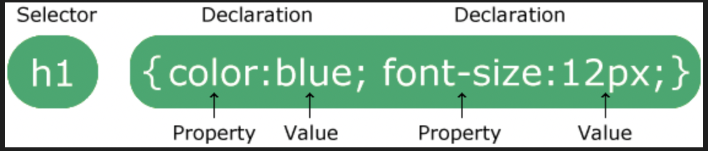
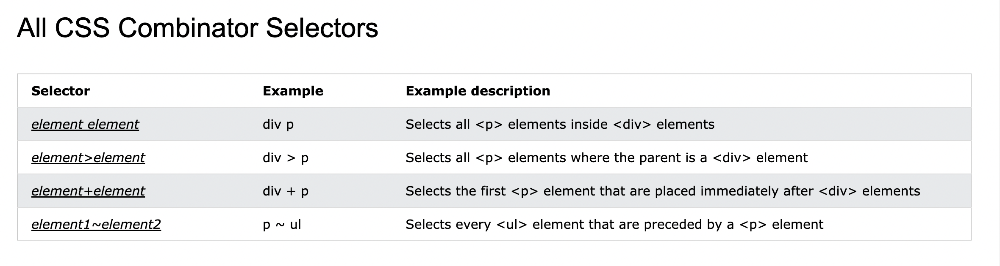
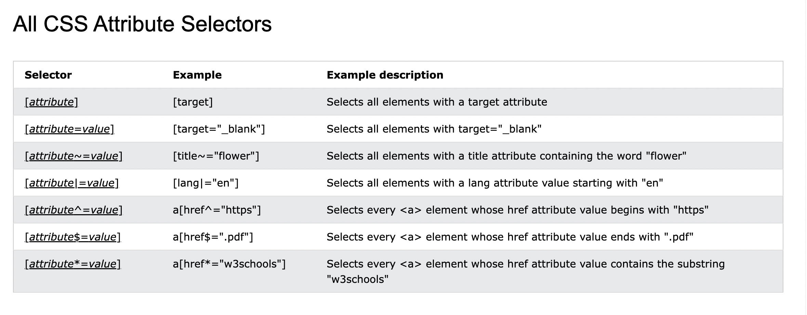

<div style="font-size: 17px;background: black;padding: 2rem;">

Cascading Style Sheets (CSS) is a stylesheet language used to describe the presentation of a document written in HTML or XML (including XML dialects such as SVG, MathML or XHTML). CSS describes how elements should be rendered on screen, on paper, in speech, or on other media. External stylesheets are stored in CSS files.

<h3 style="text-decoration: underline;">Selectors</h3>



- The selector points to the HTML element you want to style.

- The declaration block contains one or more declarations separated by semicolons.

- Each declaration includes a CSS property name and a value, separated by a colon.

- Multiple CSS declarations are separated with semicolons, and declaration blocks are surrounded by curly braces.

### Example:

```
p {
  color: red;
  text-align: center;
}
```

In the above example, all `<p>` elements will be center-aligned, with a red text color. So here:

- `p` is selector
- `color: red` is declaration
- `color` & `text-align` are properties
- `red` & `center` are values.

A CSS selector selects the HTML element(s) you want to style. Or simply we can say CSS selectors are used to "find" (or select) the HTML elements you want to style. CSS selectors can be of any of these (there are more but not so important right):

<div class="w3-responsive">
<table class="ws-table-all notranslate">
  <tbody><tr>
    <th style="width:20%">Selector</th>
    <th style="width:20%">Example</th>
    <th>Example description</th>
  </tr>
  <tr>
    <td>#id</td>
    <td>#firstname</td>
    <td>Selects the element with id="firstname"</td>
  </tr>
  <tr>
    <td>.class</td>
    <td>.intro</td>
    <td>Selects all elements with class="intro"</td>
  </tr>
  <tr>
    <td>element.class</td>
    <td>p.intro</td>
    <td>Selects only &lt;p&gt; elements with class="intro"</td>
  </tr>
  <tr>
    <td>*</td>
    <td>*</td>
    <td>Selects all elements</td>
  </tr>
  <tr>
    <td>element</td>
    <td>p</td>
    <td>Selects all &lt;p&gt; elements</td>
  </tr>
  <tr>
    <td>element,element,..</td>
    <td>div, p</td>
    <td>Selects all &lt;div&gt; elements and all &lt;p&gt; elements</td>
  </tr>
</tbody></table>
</div>

> If there are two or more CSS rules that point to the same element, the selector with the highest specificity value will "win", and its style declaration will be applied to that HTML element. Specificity order: `Inline styles` > `IDs` > `Classes, pseudo-classes, attribute selectors` > `Elements and pseudo-elements`. Link - https://www.w3schools.com/css/css_specificity.asp

<h3 style="text-decoration: underline;">Combinators</h3>

A combinator is something that explains the relationship between the selectors. A CSS selector can contain more than one simple selector. Between the simple selectors, we can include a combinator. There are four different combinators in CSS:

- descendant selector (space)
- child selector (>)
- adjacent sibling selector (+)
- general sibling selector (~)



<h3 style="text-decoration: underline;">Pseudo-classes</h3>

A pseudo-class is used to define a special state of an element. For example, it can be used to:

- Style an element when a user mouses over it
- Style visited and unvisited links differently
- Style an element when it gets focus

The syntax of pseudo-classes:- `selector:pseudo-class { property: value; }`

Examples:

```
a:link {
  color: #FF0000;
}

/* visited link */
a:visited {
  color: #00FF00;
}

/* mouse over link */
a:hover {
  color: #FF00FF;
}

/* selected link */
a:active {
  color: #0000FF;
}
```

> Read about `:first-child`, `:lang` & some more pseudo classes here - https://www.w3schools.com/css/css_pseudo_classes.asp

<h3 style="text-decoration: underline;">Pseudo-elements</h3>

A CSS pseudo-element is used to style specified parts of an element. For example, it can be used to:

- Style the first letter, or line, of an element
- Insert content before, or after, the content of an element

Syntax: `selector::pseudo-element { property: value; }`

-> `::first-line` pseudo element:

```
p::first-line {
  color: #ff0000;
  font-variant: small-caps;
}
```

-> `::selection`: matches the portion of an element that is selected by a user.

```
::selection {
  color: red;
  background: yellow;
}
```

-> `::after` & `::before ` : can be used to insert some content after & before the content of an element respectively.

```
h1::after {
  content: url(smiley.gif);
}
```

HERE IS THE LIST OF ALL PSEUDO CLASSES & ELEMENTS - https://pusher.com/tutorials/react-websockets/#0-introduction

<h3 style="text-decoration: underline;">Attribute Selectors</h3>

It is possible to style HTML elements that have specific attributes or attribute values.

1. [attribute] selector: Used to select elements with a specified attribute. The following example selects all `<a>` elements with a target attribute: `a[target] { background-color: yellow; }`
2. [attribute="value"] selector: Used to select elements with a specified attribute and value. The following example selects all `<a>` elements with a target="\_blank" attribute: `a[target="_blank"] { background-color: yellow; }`



<h3 style="text-decoration: underline;">CSS Math Functions</h3>

The CSS math functions allow mathematical expressions to be used as property values. Here, we will explain the `calc()`, `max()` and `min()` functions.

- calc() : performs a calculation to be used as the property value. Syntax: calc(expression). Expression is mathematical expression consisting of following operator: + - \* /. Example -> `width: calc(100% - 100px);`
- max()/min() : uses the largest value, from a comma-separated list of values, as the property value. Syntax: max(value1, value2, ...). Example -> `width: max(50%, 300px);`

List of all CSS functions - https://www.w3schools.com/cssref/css_functions.php

<h3 style="text-decoration: underline;">CSS The !important Rule</h3>

The !important rule in CSS is used to add more importance to a property/value than normal. In fact, if you use the !important rule, it will override ALL previous styling rules for that specific property on that element! Example:- `background-color: red !important;`

### Important About !important:

The only way to override an !important rule is to include another !important rule on a declaration with the same (or higher) specificity in the source code - and here the problem starts! This makes the CSS code confusing and the debugging will be hard, especially if you have a large style sheet!

<h3 style="text-decoration: underline;">How to add CSS in HTML files:</h3>

There are three ways of inserting a style sheet:

### 1. External CSS:

With an external style sheet, you can change the look of an entire website by changing just one file! We just have to create a file with .css extension and add all css in that file. External styles are defined within the `<link>` element, inside the `<head>` section of an HTML page like this -

```
<head>
 <link rel="stylesheet" href="mystyle.css">
</head>
```

### 2. Internal CSS:

An internal style sheet may be used if one single HTML page has a unique style. The internal style is defined inside the `<style>` element, inside the head section like this:

```
<head>
 <style>
 body {
   background-color: linen;
 }

 h1 {
   color: maroon;
   margin-left: 40px;
 }
 </style>
</head>
```

### 3. Inline CSS:

An inline style may be used to apply a unique style for a single element. To use inline styles, add the style attribute to the relevant element. The style attribute can contain any CSS property. Example: <br/>
`<h1 style="color:blue;text-align:center;">This is a heading</h1>`

<h3 style="text-decoration: underline;">Multiple Style Sheets</h3>

> If some properties have been defined for the same selector (element) in different style sheets, the value from the last read style sheet will be used.

Assume that an external style sheet has the following style for the `<h1>` element:

```
h1 { color: navy; }
```

Then, assume that an internal style sheet also has the following style for the `<h1>` element:

```
h1 { color: orange; }
```

Then if the internal style is defined after the link to the external style sheet, the `<h1>` elements will be "orange". And if the internal style is defined before the link to the external style sheet, the `<h1>` elements will be "navy".

<b style="color:red;">INTERNAL STYLE WILL ALWAYS HAVE HIGHEST PRIORITY IN EVERY CASE.</b>

All the styles in a page will "cascade" into a new "virtual" style sheet by the following rules, where number one has the highest priority:

1. Inline style (inside an HTML element)
2. External and internal style sheets (in the head section)
3. Browser default

<h3 style="text-decoration: underline;">CSS Variables</h3>

<i>CSS variables, also known as custom properties, are a powerful feature introduced in CSS3 that allow you to store and reuse values in your Cascading Style Sheets (CSS) code. They provide a way to define values once and then use those values throughout your stylesheet, making it easier to maintain and update your styling.</i>

Here's how you define and use CSS variables:

<b>1. Defining CSS Variables:</b>

To define a CSS variable, you use the <b style="color: Chartreuse;">--</b> prefix followed by a name of your choice. Conventionally, variable names are written in lowercase with hyphens for multi-word names.

```css
:root {
  --main-color: #3498db;
  --font-size: 16px;
}
```

In the example above, `--main-color` and `--font-size` are two CSS variables defined in the `:root` pseudo-class (the top-level element), making them available for use throughout your stylesheet. To create a variable with global scope, declare it inside the `:root` selector. The `:root` selector matches the document's `root` element. To create a variable with local scope, declare it inside the selector that is going to use it.

<b>2. Using CSS Variables:</b>

Once you've defined your variables, you can use them anywhere in your CSS code using the <b style="color: Chartreuse;">var()</b> function. For instance:

```css
.header {
  background-color: var(--main-color);
  font-size: var(--font-size);
}
```

<b>3. Dynamic Updating:</b>

One of the key benefits of CSS variables is that they can be dynamically updated using JavaScript. This means you can change the value of a variable programmatically, and all elements using that variable will automatically reflect the new value without having to modify your CSS rules directly.

```js
document.documentElement.style.setProperty("--main-color", "#FF5733");
```

In this JavaScript code, we change the value of the `--main-color` variable to `#FF5733`, which will update the `background-color` property for elements using that variable.

CSS variables offer several advantages:

- Reusability: You can reuse values across your stylesheet, making it easier to maintain consistency and make global changes.
- Readability: Variable names can provide meaningful descriptions of their purpose, enhancing the readability and maintainability of your code.
- Dynamic Changes: You can easily update styling properties across your site dynamically, providing a more interactive and responsive user experience.

</div>

<!-- <div style="background: DarkRed;  padding: 0.3rem 0.8rem;"> => HIGHLIGHT -->
<!-- <h3 style="text-decoration: underline;"> => SUBHEADING -->
<!-- <b style="color: Chartreuse;"> => IMPORTANT-1 -->
<!-- <i> => IMPORTANT-2 -->
<!-- <mark style="padding: 0.3rem 0.8rem;"> => IMPORTANT-3 -->
<!-- <b> => IMPORTANT-5 -->
<!-- <b style="color:red;"> => NOTE -->
<!-- <span style="color: Cyan;">-></span> -->
<!-- <span style="color: Salmon;"> -->
