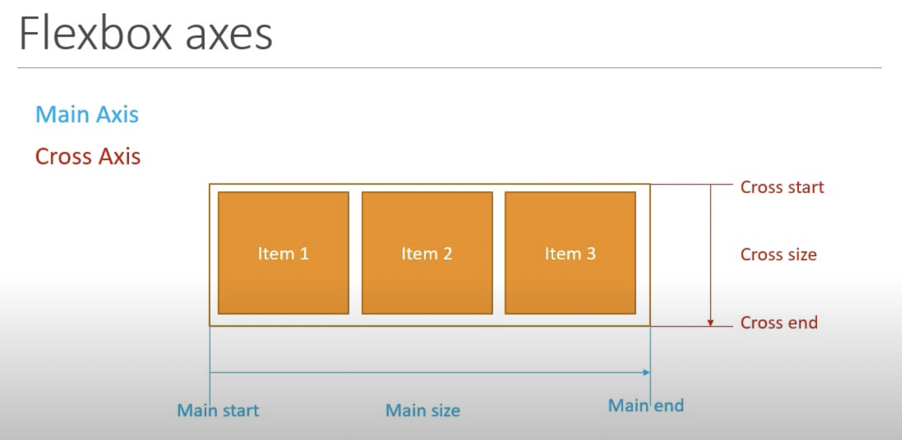
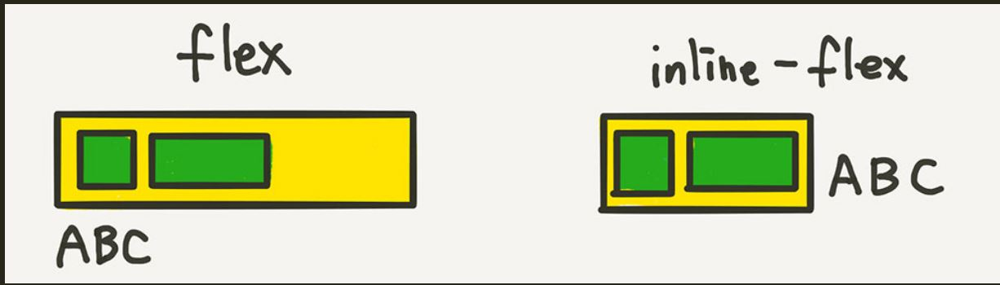
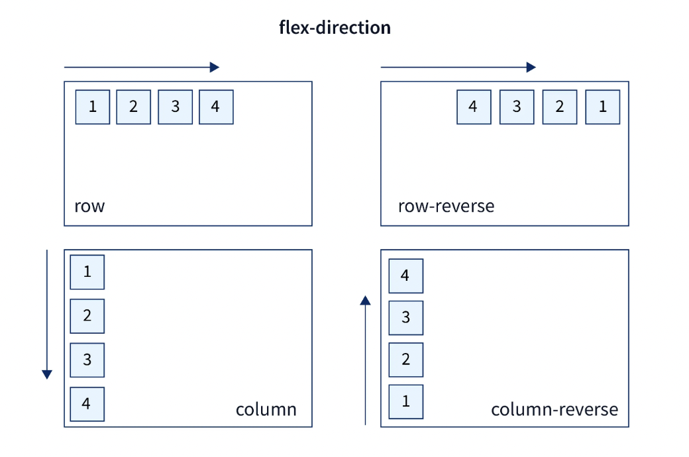
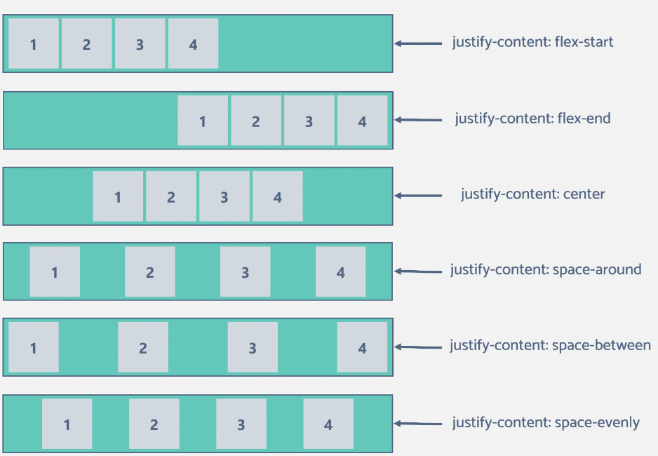
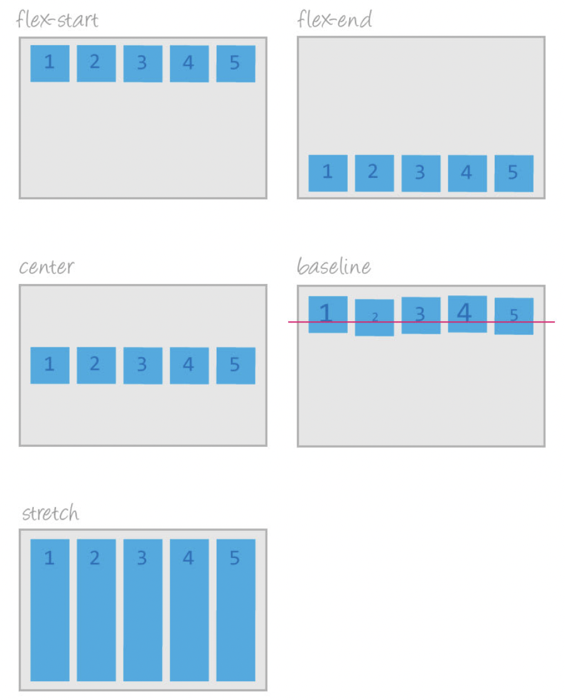
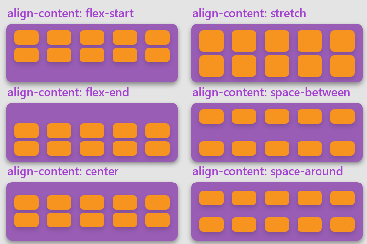

<div style="font-size: 17px;background: black;padding: 2rem;">

The flexible box layout module, usually referred to as flexbox, was designed as a one-dimensional layout model, and as a method that could offer space distribution between items in an interface and powerful alignment capabilities.

Flexbox, or the CSS Flexible Box Layout, operates along two main axes: the main axis and the cross axis. Understanding these axes is crucial for designing and aligning items within a flex container.

1. The main axis is the primary axis along which flex items are laid out. It runs in the direction defined by the flex-direction property. By default, the main axis runs horizontally from left to right if the flex-direction is set to row, and vertically from top to bottom if the flex-direction is set to column.
2. The cross axis is perpendicular to the main axis. It is the axis along which flex items are aligned when they do not stretch along the main axis.



To use Flexbox, you first need to designate a container as a flex container. This is done by applying `display: flex` or `display: inline-flex` to the container element. The container becomes a <span style="color: Salmon;">flex container</span>, and its direct children become <span style="color: Salmon;">flex items</span>.

<b style="color: Chartreuse;">Whenever we assign `display: flex;` to a container, all its children become block elements i.e. even if child is a `span` element, it will become block one and will take width and height.</b>



<br>

```css
.flex-container {
  display: "flex";
}
```

```html
<div class="flex-container">
  <div class="flex-item">1</div>
  <div class="flex-item">2</div>
  <div class="flex-item">3</div>
  <div class="flex-item">4</div>
</div>
```

<h3 style="text-decoration: underline;">Flex Container properties</h3>

1.) <b style="color: OrangeRed;">flex-direction</b>: This property defines in which direction the container wants to stack the flex items. It can take following values:

- `row`: Items are placed along the horizontal axis (default).
- `row-reverse`: Items are placed along the horizontal axis in reverse order.
- `column`: Items are placed along the vertical axis.
- `column-reverse`: Items are placed along the vertical axis in reverse order.

By default, value of this property is `row`.



2.) <b style="color: OrangeRed;">flex-wrap</b>: By default, flex items are laid out in a single line. If the container doesn't have enough space, it will shrink the items. This property allows you to control whether the items should wrap to a new line when there's not enough space. Values include:

- `nowrap`: No wrapping (default).
- `wrap`: Wrap items to the next line.
- `wrap-reverse`: Wrap items in the reverse order (only difference from wrap is that flex items are shifted above, not below).

By default, value of this property is `nowrap`.


3.) <b style="color: OrangeRed;">flex-flow</b>: This property is a shorthand property for setting both the `flex-direction` and `flex-wrap` properties.

```css
.flex-container {
  display: flex;
  flex-flow: row wrap;
}
```

4.) <b style="color: OrangeRed;">justify-content</b>: This property aligns flex items along the main axis of the flex container. It determines how extra space is distributed. Common values include:

- `flex-start`: Items are packed toward the start of the main axis.
- `flex-end`: Items are packed toward the end of the main axis.
- `center`: Items are centered along the main axis.
- `space-between`: Items are evenly distributed with the first item at the start and the last item at the end.
- `space-evenly`: Items are evenly distributed with equal space around them, i.e., distance between items = distance between start & first item = distance between last item and end.
- `space-around`: Similar to above value except space between start/end and flex items = 1/2 of distance between items.



5.) <b style="color: OrangeRed;">align-items</b>: This property aligns flex items along the cross axis (perpendicular to the main axis). Common values include:

- `stretch`: Items are stretched to fill the container (default).
- `flex-start`: Items are aligned at the start of the cross axis.
- `flex-end`: Items are aligned at the end of the cross axis.
- `center`: Items are centered along the cross axis.
- `baseline`: Items are aligned such as their baselines align.



6.) <b style="color: OrangeRed;">align-content</b>: It is used to align a flex container's lines within the flex container when there's extra space on the cross axis. It is applicable only when there are multiple lines of flex items in the container (i.e., when the `flex-wrap` property is set to `wrap` or `wrap-reverse`). It has all values of `justify-content` and behaviour of them also same but it has one additional value:

- `stretch`: stretches the flex lines to take up the remaining space (this is default).



7.) <b style="color: OrangeRed;">gap</b>: It defines the size of the gap between the rows and between the columns in flexbox, grid or multi-column layout. It is a shorthand for `row-gap` and `column-gap` properties. It can take up to 2 values. If given 2 values, 1st one defines `row-gap`, while 2nd one defines `column-gap`. If given single value, it is used for both. In case of flex box, row-gap defins space between flex items along main axis while column-gap indicates space between lines of flex-items.

<br>

<h3 style="text-decoration: underline;">Flex Items properties</h3>

1.) <b style="color: Yellow;">order</b>: This property controls the order in which the flex items appear in the flex container. By default, items have an order of 0. Items with higher order values appear later and the ones with same order appear exactly like they are defined in HTML.

2.) <b style="color: Yellow;">flex-grow</b>: This property defines the ability for a flex item to grow if necessary. It specifies the factor by which the flex item will grow relative to the other flex items. Suppose there are 3 items with `flex-grow` values of 1, 2 and 3 respectively. Default value: `0`. Here's how growth will be distributed:

```
Total growth factor =  sum of the flex-grow values = 1 + 2 + 3 = 6

Each item's share of the available space is determined by dividing its flex-grow value by the total growth factor.

Item 1: 1 / 6 of the available space
Item 2: 2 / 6 of the available space
Item 3: 3 / 6 of the available space
```

3.) <b style="color: Yellow;">flex-shrink</b>: This property defines the ability for a flex item to shrink if necessary. It specifies the factor by which the flex item will shrink relative to the other flex items. Default value: `1`.

```
Total shrink factor =  sum of the flex-shrink values = 1 + 2 + 3 = 6

Each item's share of the shrinkage is determined by dividing its flex-shrink value by the total shrink factor.

Item 1: 1 / 6 of the shrinkage
Item 2: 2 / 6 of the shrinkage
Item 3: 3 / 6 of the shrinkage
```

<b style="color:red;">NOTE</b>: Negative values for `flex-grow` and `flex-shrink` are invalid. These properties only accepts non-negative values.

<span style="color: Crimson;">When the `flex-shrink` property is set to non-zero value (1 by default), the flex item is allowed to shrink if there is not enough space in the container's main axis. That's why setting width to flex items row-wise flexbox might not work if the items are exceeding the width of container, which could equal to window or containing element.</span>

4.) <b style="color: Yellow;">flex-basis</b>: This property sets the initial size of a flex item before the remaining space is distributed. It can be a length, percentage, or keyword.

5.) <b style="color: Yellow;">flex</b>: This property is a shorthand for three individual properties: `flex-grow`, `flex-shrink`, and `flex-basis`.

```css
.flex-item {
  flex: 0 0 200px;
}
```

6.) <b style="color: Yellow;">align-self</b>: This property specifies the alignment for the selected item inside the flexible container. It overrides the default alignment set by the container's align-items property.

</div>

<!-- <div style="font-size: 17px;background: black;padding: 2rem;"> -->
<!-- <div style="background: DarkRed;padding: 0.3rem 0.8rem;"> [HIGHLIGHT] -->
<!-- <h3 style="border-bottom: 2px solid white; padding-bottom: 2px; display: inline-block;"> [SUBHEADING] -->
<!-- <b style="color: Chartreuse;"> [NOTE] -->
<!-- <b style="color:red;"> [NOTE-2] -->
<!-- <span style="color: Cyan;"> [IMP] -></span> -->
<!-- <b style="color: Salmon;"> [POINT] -->
<!-- <div style="border: 1px solid yellow; padding: 10px;"> [BORDER] -->