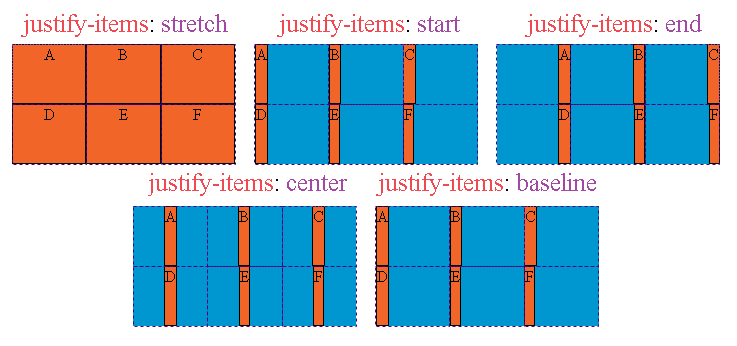
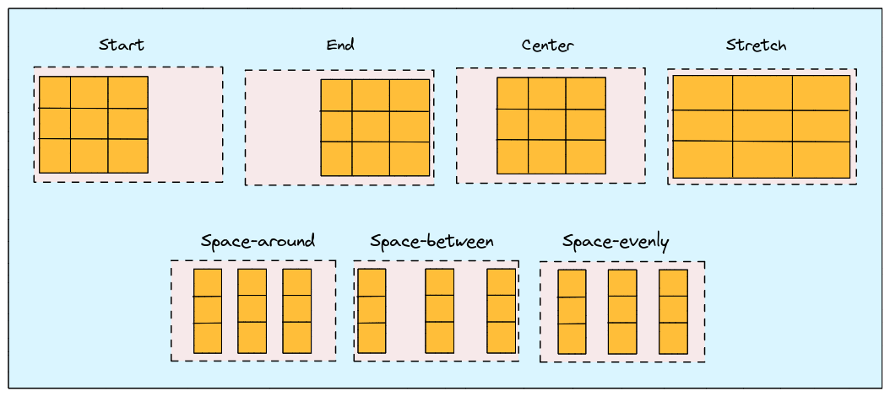
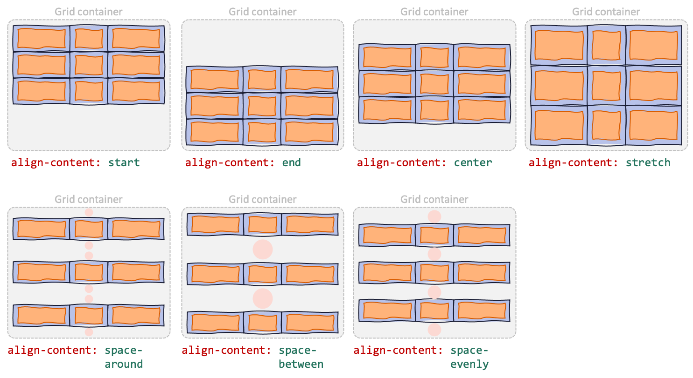

<div style="font-size: 17px;background: black;padding: 2rem;">

# <a href="https://css-tricks.com/snippets/css/complete-guide-grid/">Grid</a> <a href="https://www.youtube.com/watch?v=9zBsdzdE4sM&list=PLZlA0Gpn_vH85jM1TWO6TdCtSr6ruglWn&index=14&ab_channel=WebDevSimplified">Layout</a>

The CSS Grid Layout Module offers a grid-based layout system, with rows and columns, making it easier to design web pages without having to use floats and positioning.

To get started you have to define a container element as a grid with `display: grid`, set the column and row sizes with `grid-template-columns` and `grid-template-rows`, and then place its child elements into the grid with `grid-column` and `grid-row`. Similarly to flexbox, the source order of the grid items doesn’t matter. Your CSS can place them in any order, which makes it super easy to rearrange your grid with media queries.

<br><br><br>

<h3 style="border-bottom: 2px solid white; padding-bottom: 2px; display: inline-block;">Terminology</h3>

- <b style="color: Salmon;">Grid Container</b>: The element on which `display: grid` is applied. It’s the direct parent of all the grid items.
- <b style="color: Salmon;">Grid Items</b>: The direct children of a grid container are grid items. They are placed into the defined grid structure.
- <b style="color: Salmon;">Grid Lines</b>: These are the dividing lines that make up the structure of the grid, creating the boundaries of grid cells.
- <b style="color: Salmon;">Grid Cells</b>: The smallest unit of the grid, defined by the intersection of grid lines.
- <b style="color: Salmon;">Grid Tracks</b>: These are the spaces between two adjacent grid lines. They form the columns and rows of the grid.
- <b style="color: Salmon;">Grid Areas</b>: A rectangular area that can span multiple grid cells, defined by a start and end line for both columns and rows.

<h3 style="border-bottom: 2px solid white; padding-bottom: 2px; display: inline-block;">Grid Container Properties</h3>

- <b style="color: Chartreuse;">display</b>: Defines the element as a grid container and establishes a new grid formatting context for its contents.
  - <b style="color: Violet;">grid</b> – generates a block-level grid
  - <b style="color: Violet;">inline-grid</b> – generates an inline-level grid
- <b style="color: Chartreuse;">grid-template-columns</b> & <b style="color: Chartreuse;">grid-template-rows</b>: Defines the number and size of columns and rows of the grid with a space-separated list of values. The values represent the track size, and the space between them represents the grid line.

  - Can be a length, a percentage, or a fraction of the free space in the grid using the `fr` unit. The `fr` unit allows you to set the size of a track as a fraction of the free space of the grid container (like flex grow). Also value `auto` can be given which means automatically sized based on the content.

    ```css
    .grid-container {
      display: grid;
      grid-template-columns: 200px 1fr 200px; /* Defines three columns */
      grid-template-rows: 100px auto 100px; /* Defines three rows */
    }
    ```

    If your definition contains repeating parts, you can use the `repeat()` notation to streamline things. Also we commonly use `minmax()` to give minimum and maximum size to row/column. First value passed is minimum size and second value passed is maximum.

    ```css
    .grid-container {
      grid-template-columns: repeat(3, 1fr); /* 3 columns with 1/3 of total length each */
      grid-template-rows: 100px minmax(150px, auto); /* Row's content will be of 150px min. Beyond that, content driven. */
    }
    ```

    <b style="color:red;">If more rows and columns are given than the number of grid items, empty spaces are assigned to those spots.</b>

- <b style="color: Chartreuse;">grid-template</b>: This property is a shorthand property for the following properties: `grid-template: none|grid-template-rows / grid-template-columns|grid-template-areas|initial|inherit;` ---> Example: `auto 1fr auto / auto 1fr auto;` => Holy grail layout
- <b style="color: Chartreuse;">row-gap</b> & <b style="color: Chartreuse;">column-gap</b>: Specifies the size of the grid lines. You can think of it like setting the width of the gutters between the columns/rows. Takes just a length value.
- <b style="color: Chartreuse;">gap</b>: A shorthand for `row-gap` and `column-gap`. If single value is given, both of them is specified to same given value.
- <b style="color: Chartreuse;">justify-items</b>: Aligns grid items along the inline (row) axis. This value applies to all grid items inside the container.
  - <b style="color: Violet;">stretch</b> – fills the whole width of the cell (this is the default)
  - <b style="color: Violet;">start</b> – aligns items to be flush with the start edge of their cell
  - <b style="color: Violet;">end</b> – aligns items to be flush with the end edge of their cell
  - <b style="color: Violet;">center</b> – aligns items in the center of their cell

<br><br><br>

- <b style="color: Chartreuse;">align-items</b>: Aligns grid items along the block (column) axis (as opposed to justify-items which aligns along the inline (row) axis). This value applies to all grid items inside the container.
  - <b style="color: Violet;">stretch</b> – fills the whole height of the cell (this is the default)
  - <b style="color: Violet;">start</b> – aligns items to be flush with the start edge of their cell
  - <b style="color: Violet;">end</b> – aligns items to be flush with the end edge of their cell
  - <b style="color: Violet;">center</b> – aligns items in the center of their cell
  - <b style="color: Violet;">baseline</b> – align items along text baseline. There are modifiers to baseline — first baseline and last baseline which will use the baseline from the first or last line in the case of multi-line text.
- <b style="color: Chartreuse;">place-items</b>: Sets both the align-items and justify-items properties in a single declaration. The first value sets align-items, the second value justify-items. If the second value is omitted, the first value is assigned to both properties.
- <b style="color: Chartreuse;">justify-content</b>: Sometimes the total size of your grid might be less than the size of its grid container. This could happen if all of your grid items are sized with non-flexible units like px. In this case you can set the alignment of the grid within the grid container. This property aligns the grid along the inline (row) axis. <b style="color:red;">Note:</b> The grid's total height has to be less than the container's height for the align-content property to have any effect.
  - <b style="color: Violet;">start</b> – aligns the grid to be flush with the start edge of the grid container
  - <b style="color: Violet;">end</b> – aligns the grid to be flush with the end edge of the grid container
  - <b style="color: Violet;">center</b> – aligns the grid in the center of the grid container
  - <b style="color: Violet;">stretch</b> – resizes the grid items to allow the grid to fill the full width of the grid container
  - <b style="color: Violet;">space-around</b> – places an even amount of space between each grid item, with half-sized spaces on the far ends
  - <b style="color: Violet;">space-between</b> – places an even amount of space between each grid item, with no space at the far ends
  - <b style="color: Violet;">space-evenly</b> – places an even amount of space between each grid item, including the far ends.

<br><br><br>

- <b style="color: Chartreuse;">align-content</b>: Sometimes the total size of your grid might be less than the size of its grid container. This could happen if all of your grid items are sized with non-flexible units like px. In this case you can set the alignment of the grid within the grid container. This property aligns the grid along the block (column) axis (as opposed to justify-content which aligns the grid along the inline (row) axis). Values exactly same as `justify-content`.

<br><br><br>

- <b style="color: Chartreuse;">place-content</b>: Sets both the align-content and justify-content properties in a single declaration. The first value sets `align-content`, the second value `justify-content`. If the second value is omitted, the first value is assigned to both properties.

<h3 style="border-bottom: 2px solid white; padding-bottom: 2px; display: inline-block;">Grid Items Properties</h3>

- <b style="color: Chartreuse;">grid-column-start</b> & <b style="color: Chartreuse;">grid-column-end</b> **AND** <b style="color: Chartreuse;">grid-row-start</b> & <b style="color: Chartreuse;">grid-row-end</b>: Determines a grid item’s location within the grid by referring to specific grid lines. grid-column-start/grid-row-start is the line where the item begins, and grid-column-end/grid-row-end is the line where the item ends.

  - **line** – can be a number to refer to a numbered grid line, or a name to refer to a named grid line
  - <b style="color: Violet;">span </b> **number** – the item will span across the provided number of grid tracks
  - <b style="color: Violet;">auto</b> – indicates auto-placement, an automatic span, or a default span of one

  ```css
  .item-b {
    grid-column-start: 1;
    grid-column-end: 4;
    grid-row-start: 2;
    grid-row-end: span 2;
  }
  ```

<br><br><br>

- <b style="color: Chartreuse;">grid-column</b> & <b style="color: Chartreuse;">grid-row</b>: Shorthand for `grid-column-start` + `grid-column-end`, and `grid-row-start` + `grid-row-end`, respectively. - **start-line / end-line** – Each one accepts all the same values as the longhand version, including `span`. We can give value `-1` as well to indicate the end.
  For just above grid:

  ```css
  .item-b {
    grid-column: 1 / 4;
    grid-row: span / 2;
  }
  ```

- <b style="color: Chartreuse;">justify-self</b>: Aligns a grid item inside a cell along the inline (row) axis. This value applies to a grid item inside a single cell.
  - <b style="color: Violet;">start</b> – aligns the grid item to be flush with the start edge of the cell
  - <b style="color: Violet;">end</b> – aligns the grid item to be flush with the end edge of the cell
  - <b style="color: Violet;">center</b> – aligns the grid item in the center of the cell
  - <b style="color: Violet;">stretch</b> – fills the whole width of the cell (this is the default)
- <b style="color: Chartreuse;">align-self</b>: Aligns a grid item inside a cell along the block (column) axis (as opposed to justify-self which aligns along the inline (row) axis). This value applies to the content inside a single grid item.
  - <b style="color: Violet;">start</b> – aligns the grid item to be flush with the start edge of the cell
  - <b style="color: Violet;">end</b> – aligns the grid item to be flush with the end edge of the cell
  - <b style="color: Violet;">center</b> – aligns the grid item in the center of the cell
  - <b style="color: Violet;">stretch</b> – fills the whole height of the cell (this is the default)
- <b style="color: Chartreuse;">place-self</b>: Sets both the `align-self` and `justify-self` properties in a single declaration. The first value sets `align-self`, the second value `justify-self`. If the second value is omitted, the first value is assigned to both properties.

</div>

<!-- <div style="font-size: 17px;background: black;padding: 2rem;"> -->
<!-- <div style="background: DarkRed;padding: 0.3rem 0.8rem;"> [HIGHLIGHT] -->
<!-- <h3 style="border-bottom: 2px solid white; padding-bottom: 2px; display: inline-block;"> [SUBHEADING] -->
<!-- <b style="color: Chartreuse;"> [NOTE] -->
<!-- <b style="color:red;"> [NOTE-2] -->
<!-- <span style="color: Cyan;"> [IMP] -></span> -->
<!-- <b style="color: Salmon;"> [POINT] -->
<!-- <div style="border: 1px solid yellow; padding: 10px;"> [BORDER] -->
