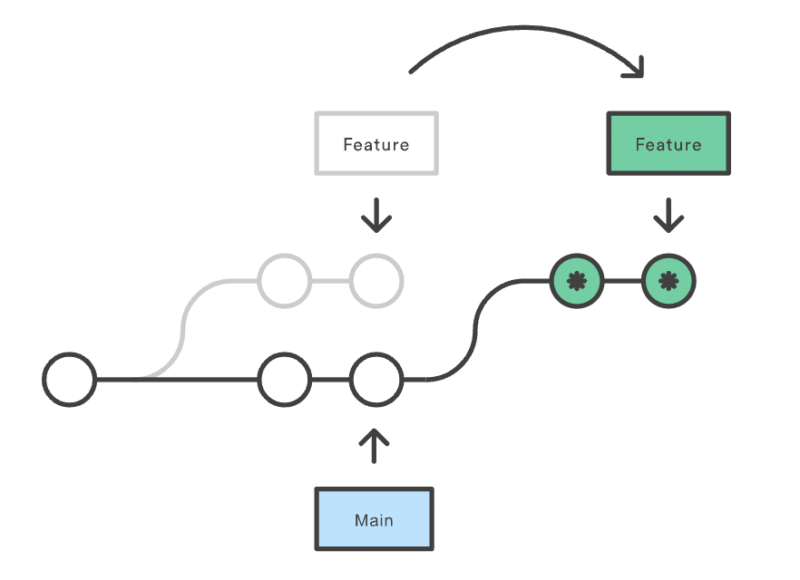

<div style="font-size: 17px;background: black;padding: 2rem;">

# Version Control Systems

Version control, also known as source control, is the practice of tracking and managing changes to software code. Version control systems are software tools that help software teams manage changes to source code over time. As development environments have accelerated, version control systems help software teams work faster and smarter.

Version control software keeps track of every modification to the code in a special kind of database. If a mistake is made, developers can turn back the clock and compare earlier versions of the code to help fix the mistake while minimizing disruption to all team members.

The history of version control systems (VCS) dates back several decades, and the evolution of Git is a notable chapter in the broader history of version control. Here's an overview of the history of version control systems leading up to the creation and development of Git:

<b style="color: Orchid;">1. Local Version Control Systems:</b> In the early days of software development, programmers used local version control systems to track changes in their code. These systems involved simple databases that kept track of file changes over time. 
<b>Drawbacks:</b> 
1. Local version control systems are designed for individual developers working on their machines. Collaboration between team members is limited, and there is no centralized repository for sharing changes.
2. If user's computer system gets damaged, there's no way he could get his project files back.<br><br>

<b style="color: Orchid;">2. Centralized Version Control Systems (CVCS):</b> As projects and teams grew, the need for collaborative version control systems emerged. Centralized Version Control Systems, such as CVS (Concurrent Versions System) and later SVN (Apache Subversion), were developed. These systems had a central server that stored the versioned files, and developers would check out a working copy from this central repository. 
<b>Drawbacks:</b>
1. Single Point of Failure -> CVCS relies on a central server to store the entire version history. If this server goes down, it can disrupt collaboration and make it difficult for team members to access the repository.
2. Limited Offline Capabilities -> Developers often need to be connected to the central server to perform version control operations. This limitation can hinder productivity when working offline or in areas with poor network connectivity.
3. Complex Branching and Merging -> Branching and merging operations in CVCS can be complex and error-prone, leading to difficulties in managing concurrent development efforts.<br><br>

<b style="color: Orchid;">3. Distributed Version Control Systems (DVCS):</b> The shortcomings of centralized systems led to the development of Distributed Version Control Systems. These systems provided each user with a complete local copy of the repository, enabling more flexibility, offline work, and improved branching and merging. Distributed version control systems rely upon a peer-to-peer approach as opposed to a client to server model. It’s not necessary to have a central location to store all the versions of a project, instead developers and programmers copy (called clone) the main project to their local hard drive, so everyone has a physical mirrored copy of it to work on.<br>
 Should the original source (such as the server) fail, any of the cloned clients can be copied back up to the original server to restore all revisions. Since cloned clients have a full copy of the project, viewing revisions, saving revisions, or restoring changes are much faster because there is no need to communicate to a central server.<br>
 The act of simply receiving the latest updates is called ‘pulling’. Pulling allows the user to pull down most recent changes from a location. The act of distributing your revisions to the group is called ‘pushing’, the process of moving changesets (changes to file groups as coherent wholes).<br>
 With a distributed system, this opens up the possibility of having several remote repositories (the database storing the versioned files). This then enables you to work with different groups of people or different ways simultaneously.<br>
 <span style="color: Cyan;">Mercurial</span> and <span style="color: Cyan;">Git</span> are two significant examples of DVCS.

<br>

 # Git

Git is a widely used distributed version control and source code management system. It effectively tracks changes to source code, enabling effortless branching, merging, and versioning. Linus Torvalds, the creator of the Linux operating system, developed Git in 2005 to address the specific needs of the Linux kernel development community. The Linux kernel project had outgrown existing version control systems, and Linus wanted a system that was fast, scalable, and designed for distributed collaboration.

<h3 style="text-decoration: underline;">Repository</h3>

When a folder is initialised with Git, it becomes a repository--a special location where Git logs all changes made to a hidden folder. In that folder, each time you change, add, or remove a file, Git takes note of the change and marks the file as “modified”. You can choose which modified files you want to save by staging them, so don’t worry. Consider staging as getting the changes ready for a particular snapshot that you want to keep. Once the staged changes are to your satisfaction, commit them, and Git will keep a permanent copy of those files in its history.

<h3 style="text-decoration: underline;">Staging Area (Index):</h3>

As you are working, you may be adding, editing and removing files. But whenever you hit a milestone or finish a part of the work, you should add the files to a Staging Environment. Staged files are files that are ready to be committed to the repository you are working on. You will learn more about commit shortly. `git add` command is used to move changes from the working directory to the staging area.

<h3 style="text-decoration: underline;">Commit:</h3>

A commit is a snapshot of the changes you have made in the staging area. It represents a point in the project's history. You use the command `git commit` to save these changes to the local repository.

<h3 style="text-decoration: underline;">Branch:</h3>

A branch is a separate line of development that diverges from the main codebase. Branches allow multiple parallel developments without affecting the main code until changes are merged.

<h3 style="text-decoration: underline;">Head:</h3>

The HEAD is a reference pointing to the latest commit in the currently checked-out branch. It represents the current state of your working directory.

<br>

# Git Commands

<h3 style="text-decoration: underline; color: Salmon;">git init</h3>

This command creates a new Git repository. It can be used to convert an existing, unversioned project to a Git repository or initialize a new, empty repository. Most other Git commands are not available outside of an initialized repository, so this is usually the first command you'll run in a new project.

Also executing this command creates a hidden `.git` subdirectory in the current working directory, which contains all of the necessary Git metadata for the new repository. This metadata includes subdirectories for objects, refs, and template files. A `HEAD` file is also created which points to the currently checked out commit.

<h3 style="text-decoration: underline; color: Salmon;">rm -rf .git</h3>

If you've accidentally run `git init` in the wrong directory or if you simply want to undo the initialization of a Git repository, you can revert it by removing the `.git` directory that was created by simply running the exact command in heading.

- `rm` is the command to remove files or directories.
- `-rf` is a combination of options:
    - `-r` stands for "recursive," which means it will delete the .git directory and its contents.
    - `-f` stands for "force," which is necessary to delete directories.

<h3 style="text-decoration: underline; color: Salmon;">git add</h3>

This command is a fundamental command in Git, and it is used to stage changes for the next commit. When you make modifications to files in your working directory, Git recognizes three states for each file: untracked, modified, and staged. This command is responsible for moving changes from the working directory to the staging area, preparing them for the next commit. However, this command doesn't really affect the repository in any significant way—changes are not actually recorded until you run git commit.

- <b style="color: MediumSpringGreen;">git add <span style="color: gold; font-weight: normal;">file_path</span></b>: Stage all changes in file for the next commit.
- <b style="color: MediumSpringGreen;">git add <span style="color: gold; font-weight: normal;">directory_path</span></b>: Stage all changes in directory for the next commit.
- <b style="color: MediumSpringGreen;">git add -A</b> / <b style="color: MediumSpringGreen;">git add --all</b>: Stages all changes (new, modified, or deleted files) in the working directory for the next commit.

<h3 style="text-decoration: underline; color: Salmon;">git commit</h3>

This command in Git is used to record changes in the repository. When you make changes to your project, such as editing files or adding new ones, you need to commit those changes to create a snapshot of the current state of your codebase. Each commit represents a specific set of changes and includes a commit message that describes the modifications made. It's an essential part of the Git workflow, allowing you to save your work and create a checkpoint in the history of your project. 

- <b style="color: MediumSpringGreen;">git commit</b>: Commit the staged snapshot. This will launch a text editor prompting you for a commit message. After you’ve entered a message, save the file and close the editor to create the actual commit.
- <b style="color: MediumSpringGreen;">git commit -a</b>: Commits all changes (including modifications and new files) in the working directory without explicitly using git add. This also opens editor similary to enter commit message.
- <b style="color: MediumSpringGreen;">git commit -m "<span style="color: gold; font-weight: normal;">Commit_Message</span>"</b>: A shortcut command that immediately creates a commit with a passed commit message.
- <b style="color: MediumSpringGreen;">git commit -am "<span style="color: gold; font-weight: normal;">Commit_Message</span>"</b>: A power user shortcut command that combines the -a and -m options.
- <b style="color: MediumSpringGreen;">git commit --amend</b>: Passing this option will modify the last commit. Instead of creating a new commit, staged changes will be added to the previous commit. This command will open up the system's configured text editor and prompt to <b style="color: Violet;">change the previously specified commit message</b>.

<h3 style="text-decoration: underline; color: Salmon;">git stash</h3>

This command takes your uncommitted changes (both staged and unstaged), saves them away for later use, and then reverts them from your working copy. At this point you're free to make changes, create new commits, switch branches, and perform any other Git operations; then come back and re-apply your stash when you're ready. Note that the stash is local to your Git repository; stashes are not transferred to the server when you push. By default, running `git stash` not stash new files in your working copy that have not yet been staged.
- <b style="color: MediumSpringGreen;">git stash pop</b>: You can reapply previously stashed changes with this command. Popping your stash removes the changes from your stash</b> and reapplies them to your working copy.
- <b style="color: MediumSpringGreen;">git stash apply</b>: Alternatively way to reapply the changes to your working copy and keep them in your stash. This is useful if you want to apply the same stashed changes to multiple branches.
- <b style="color: MediumSpringGreen;">git stash drop</b>: Removes the most recent stash from the stash list. The changes are not applied to the working directory.
- <b style="color: MediumSpringGreen;">git stash -u</b>:  Tells git stash to also stash your untracked files.
- <b style="color: MediumSpringGreen;">git stash list</b>: You can run git stash several times to create multiple stashes, and then use this command to view them. By default, stashes are identified simply as a "WIP" – work in progress – on top of the branch and commit that you created the stash from. After a while it can be difficult to remember what each stash contains.
- <b style="color: MediumSpringGreen;">git stash save "<span style="color: gold; font-weight: normal;">message</span>"</b>: To provide a bit more context, it's good practice to annotate your stashes with a description. This command fulfils that purpose.
- <b style="color: MediumSpringGreen;">git stash clear</b>: Removes all stashes. Use with caution, as this action is irreversible.
- <b style="color: MediumSpringGreen;">git stash pop stash@{<span style="color: gold; font-weight: normal;">index_num</span>}</b>/ <b style="color: MediumSpringGreen;">git stash pop apply@{<span style="color: gold; font-weight: normal;">index_num</span>}</b> / <b style="color: MediumSpringGreen;">git stash pop drop@{<span style="color: gold; font-weight: normal;">index_num</span>}</b>: By default stash/apply/drop commands are applied on most recently created stash. You can choose which stash to re-apply by passing its identifier as the last argument.

<h3 style="text-decoration: underline; color: Salmon;">git revert</h3>

This command can be considered an 'undo' type command, however, it is not a traditional undo operation. Instead of removing the commit from the project history, it figures out how to invert the changes introduced by the commit and appends a new commit with the resulting inverse content. This prevents Git from losing history, which is important for the integrity of your revision history and for reliable collaboration. This command also launches a text editor where we can add commit message. By default, Git provides a pre-filled message indicating that the revert is for the specified commit.

- <b style="color: MediumSpringGreen;">git revert <span style="color: gold; font-weight: normal;">commit_id</span></b>: Creates a new commit that undoes the changes introduced by the specified commit.
- <b style="color: MediumSpringGreen;">git revert HEAD</b>: Reverts the changes made in the last commit. The `HEAD` reference points to the latest commit on the current branch.
- <b style="color: MediumSpringGreen;">git revert HEAD~<span style="color: gold; font-weight: normal;">n</span></b> - Reverts nth commit before `HEAD`
- <b style="color: MediumSpringGreen;">git revert <span style="color: gold; font-weight: normal;">commit_id1 commit_id2 commit_id2</span></b>: Reverts multiple commits in the order specified.
- <b style="color: MediumSpringGreen;">git revert <span style="color: gold; font-weight: normal;">commit_id_start</span>^..<span style="color: gold; font-weight: normal;">commit_id_last</span></b>: Reverts a range of commits, excluding the start commit id provided.

<h3 style="text-decoration: underline; color: Salmon;">git reset</h3>

The git reset command is used to undo the changes in your working directory and get back to a specific commit while discarding all the commits made after that one. For instance, imagine you made ten commits. Using git reset on the first commit will remove all nine commits, taking you back to the first commit stage.

- <b style="color: MediumSpringGreen;">git reset --soft <span style="color: gold; font-weight: normal;">commit_id</span></b>: Moves the branch pointer to the specified commit, keeping the changes staged. It does not modify the working directory or uncommit the changes.
- <b style="color: MediumSpringGreen;">git reset <span style="color: gold; font-weight: normal;">commit_id</span></b> / <b style="color: MediumSpringGreen;">git reset --mixed <span style="color: gold; font-weight: normal;">commit_id</span></b>: <span style="color: Violet;">Its the default spanehaviour.</span> Moves the branch pointer to the specified commit and unstages changes. The working directory is not modified, so the changes remain in the working directory.
- <b style="color: MediumSpringGreen;">git reset --hard <span style="color: gold; font-weight: normal;">commit_id</span></b>: Moves the branch pointer to the specified commit, discarding changes in both the staging area and the working directory. <span style="color:red;">Be cautious with this option, as it permanently discards changes.</span>
- <b style="color: MediumSpringGreen;">git reset [--soft|--mixed|--hard]</b> / <b style="color: MediumSpringGreen;">git reset [--soft|--mixed|--hard] HEAD</b>: Keeps the branch pointer at current commit only but removes changes from staging area or both staging area and working directory depending on type of reset command used.
- <b style="color: MediumSpringGreen;">git reset [--soft|--mixed|--hard] HEAD~<span style="color: gold; font-weight: normal;">n</span></b>: Takes branch pointer to n commits before current one and performs the respective reset command.

<h3 style="text-decoration: underline; color: Salmon;">git rebase</h3>
This command in Git is used to integrate changes from one branch onto another by moving or applying a series of commits to a different base commit. It's a powerful tool for rewriting commit history and maintaining a clean, linear project history. The general process can be visualized as the following:<br>

<br>

The primary reason for rebasing is to maintain a linear project history. For example, consider a situation where the main branch has progressed since you started working on a feature branch. You want to get the latest updates to the main branch in your feature branch, but you want to keep your branch's history clean so it appears as if you've been working off the latest main branch. This gives the later benefit of a clean merge of your feature branch back into the main branch. When you perform a rebase, Git takes the commits in your current branch that are not in the upstream branch (the one you're rebasing onto) and "replays" them on top of the upstream branch. This effectively makes it look like you've made your changes on top of the latest changes in the upstream branch.

Here's a detailed explanation of how `git rebase` works:

1. <b style="color: Orange;">Starting a Rebase: </b> To start a rebase, you specify the upstream branch that you want to rebase onto. This can be another branch or a commit hash. There are 2 ways to do this:
    - <b style="color: MediumSpringGreen;">git rebase <span style="color: gold; font-weight: normal;">upstream_branch</span></b>: This way is called Standard Rebase. In this mode, Git will automatically take the commits in your current working branch and apply them to the head of the passed branch. Not only upstream branch but any kind of commit reference can be passed (for example an ID, a branch name, a tag, or a relative reference to `HEAD`)
    - <b style="color: MediumSpringGreen;">git rebase -i <span style="color: gold; font-weight: normal;">upstream_branch</span></b>: This is called interactive rebase. Instead of blindly moving all of the commits to the new base, interactive rebasing gives you the opportunity to alter individual commits in the process. This lets you clean up history by removing, splitting, and altering an existing series of commits.<br>This opens an editor where you can enter commands (described below) for each commit to be rebased. These commands determine how individual commits will be transferred to the new base. You can also reorder the commit listing to change the order of the commits themselves. Once you've specified commands for each commit in the rebase, Git will begin playing back commits applying the rebase commands.
2. <b style="color: Orange;">Resolving Conflicats: </b> If there are any conflicts during the rebase process (i.e., if changes in your branch conflict with changes in the upstream branch), Git will pause the rebase and prompt you to resolve the conflicts manually. You'll need to resolve the conflicts, stage the changes, and then continue the rebase using <b style="color: MediumSpringGreen;">git rebase --continue</b>.

3. <b style="color: Orange;">Never Rebase Public Commits:</b> Avoid rebasing commits that you've already pushed to a shared repository. This can cause confusion and conflicts for collaborators.

4. <b style="color: Orange;">Force Push:</b> If you've rebased commits that have already been pushed, you might need to force-push (git push --force) to update the remote repository.

<h3 style="text-decoration: underline; color: Salmon;">git remote</h3>

This command is used to manage connections to remote repositories. Remote repositories are versions of your project that are hosted on the internet or on a network. These remote repositories can be on services like GitHub, GitLab, Bitbucket, or on your own server. It's particularly useful for collaborating with others and sharing your work with a wider audience. It's working:

- <b style="color: MediumSpringGreen;">git remote</b>: List the remote connections you have to other repositories.
- <b style="color: MediumSpringGreen;">git remote -v</b>: Same as the above command, but include the URL of each connection.
- <b style="color: MediumSpringGreen;">git remote add <span style="color: gold; font-weight: normal;">remote_name remote_url</span></b>: To add a new remote repository, you use the `git remote add` command followed by a name for the remote and the URL of the remote repository. After adding a remote, you’ll be able to use `remote_name` as a convenient shortcut for `remote_url` in other Git commands. Example: `git remote add origin https://github.com/user/repository.git`.
- <b style="color: MediumSpringGreen;">git remote rename <span style="color: gold; font-weight: normal;">old_name new_name</span></b>: Remove the connection to the remote repository called `remote_name`.
- <b style="color: MediumSpringGreen;">git remote rm <span style="color: gold; font-weight: normal;">remote_name</span></b>: Rename a remote connection.
- <b style="color: MediumSpringGreen;">git remote show <span style="color: gold; font-weight: normal;">remote_name</span></b>: Used to see information about a specific remote, such as the remote's URL and tracked branches.

<h3 style="text-decoration: underline; color: Salmon;">git clone</h3>

This command used to create a copy of an existing Git repository. It copies the entire repository, including all branches, commits, and files, from a remote repository to your local machine. We have to run it the directory where we want to setup the copied local repository.

- <b style="color: MediumSpringGreen;">git clone <span style="color: gold; font-weight: normal;">repository_URL directory_name</span></b>: `repository_URL` is URL of the repository and `directory_name` is optional argument specify name of directory. If it is not passed, Git will create a directory with the same name as the repository.

<h3 style="text-decoration: underline; color: Salmon;">git fetch</h3>

This command in Git is used to retrieve changes from a remote repository without merging them into your current branch. It's a safe way to see what changes have been made in the remote repository since the last time you fetched or cloned it. Here's a detailed explanation of how it works:

To better understand how `git fetch` works let us discuss how Git organizes and stores commits. Behind the scenes, in the repository's `./.git/objects` directory, Git stores all commits - local and remote. Git keeps remote and local branch commits distinctly separate through the use of branch refs. The refs for local branches are stored in the `./.git/refs/heads/`. Executing the git branch command will output a list of the local branch refs. Command `ls ./.git/refs/heads/` will give same output as `git branch` - list of local branches.

Remote branches are just like local branches, except they map to commits from somebody else’s repository. Remote branches are prefixed by the remote they belong to so that you don’t mix them up with local branches. Like local branches, Git also has refs for remote branches. Remote branch refs live in the `./.git/refs/remotes/ directory`. The next example code snippet shows the branches you might see after fetching a remote repo conveniently named remote-repo:

```sh
git branch -r
# origin/main
# origin/feature1
# origin/debug2
# remote-repo/main
# remote-repo/other-feature
```

This output displays the local branches we had previously examined but now displays them prefixed with `origin/`. Additionally, we now see the remote branches prefixed with `remote-repo`. You can check out a remote branch just like a local one, but this puts you in a detached `HEAD` state (just like checking out an old commit). You can think of them as read-only branches. To view your remote branches, simply pass the `-r`/`a` flag to the `git branch` command.

You can inspect remote branches with the usual `git checkout` and `git log` commands. If you approve the changes a remote branch contains, you can merge it into a local branch with a normal `git merge`. 

`git fetch` commands:

- <b style="color: MediumSpringGreen;">git fetch</b> / <b style="color: MediumSpringGreen;">git fetch <span style="color: gold; font-weight: normal;">remote_name</span></b>: Fetch all of the branches from the repository. 
- <b style="color: MediumSpringGreen;">git fetch <span style="color: gold; font-weight: normal;">remote_name branch_name</span></b>: Same as above but fetches only the specified branch.
- <b style="color: MediumSpringGreen;">git fetch <span style="color: gold; font-weight: normal;">remote_name branch_name</span></b>: Same as above but fetches only the specified branch.
- <b style="color: MediumSpringGreen;">git fetch --all</b>: A power move which fetches all registered remotes and their branches.
- <b style="color: MediumSpringGreen;">git fetch --tags:</b> By default, `git fetch` does not fetch tags from the remote repository. To fetch tags along with other changes, you can use this command.

<h3 style="text-decoration: underline; color: Salmon;">git push</h3>

The git push command is used to upload local repository content to a remote repository. Pushing is how you transfer commits from your local repository to a remote repo. It's the counterpart to `git fetch`, but whereas fetching imports commits to local branches, pushing exports commits to remote branches. Remote branches are configured using the `git remote` command. Pushing has the potential to overwrite changes, caution should be taken when pushing.

- <b style="color: MediumSpringGreen;">git push <span style="color: gold; font-weight: normal;">remote_name branch_name</span></b>: Push the specified branch to , along with all of the necessary commits and internal objects. This creates a local branch in the destination repository.
- <b style="color: MediumSpringGreen;">git push</b>: If you've checked out a local branch that has a tracking relationship with a branch in a remote repository, you can simply run git push without specifying the remote or branch name. Git will automatically push changes to the corresponding branch in the remote repository.
- <b style="color: MediumSpringGreen;">git push -f <span style="color: gold; font-weight: normal;">remote_name branch_name</span></b>: In some cases, you may need to force push changes to the remote repository, overwriting changes that have been made by others. This should be used with caution, as it can overwrite history and cause data loss. The only time you should ever need to force push is when you realize that the commits you just shared were not quite right and you fixed them with a <b style="color: violet;">git commit --amend or an interactive rebase</b>.
- <b style="color: MediumSpringGreen;">git push remote_name --tags</b>: Tags are not automatically pushed when you push a branch or use the `--all` option. The `--tags` flag sends all of your local tags to the remote repository.
- <b style="color: MediumSpringGreen;">git push origin :<span style="color: gold; font-weight: normal;">branch_name</span></b> / <b style="color: MediumSpringGreen;">git push <span style="color: gold; font-weight: normal;">remote_name</span> --delete <span style="color: gold; font-weight: normal;">branch_name</span></b>: The above will delete the remote branch named `branch_name` passing a branch name prefixed with a colon to `git push` will delete the remote branch.

<h3 style="text-decoration: underline; color: Salmon;">git pull</h3>

This command is used to fetch and download content from a remote repository and immediately update the local repository to match that content. Merging remote upstream changes into your local repository is a common task in Git-based collaboration work flows. The `git pull` command is actually a combination of two other commands, `git fetch` followed by `git merge`. In the first stage of operation `git pull` will execute a `git fetch` scoped to the local branch that `HEAD` is pointed at. Once the content is downloaded, `git pull` will enter a merge workflow. A new merge commit will be-created and `HEAD` updated to point at the new commit.

- <b style="color: MediumSpringGreen;">git pull <span style="color: gold; font-weight: normal;">remote_name</span></b>: Fetch the specified remote’s copy of the current branch and immediately merge it into the local copy. This is the same as `git fetch remote_name` followed by `git merge origin/current_branch`.
- <b style="color: MediumSpringGreen;">git pull --rebase <span style="color: gold; font-weight: normal;">remote_name</span></b>: Same as the previous pull but instead of using `git merge` to integrate the remote branch with the local one, use `git rebase`.
- <b style="color: MediumSpringGreen;">git pull <span style="color: gold; font-weight: normal;">remote_name branch_name</span></b>: You can also specify the remote repository and branch to pull changes.

<h3 style="text-decoration: underline; color: Salmon;">git branch</h3>

This command in Git is used to create, list, rename, and delete branches in a Git repository. It allows you to manage different lines of development within your project. Working:

- <b style="color: MediumSpringGreen;">git branch</b>: Lists all the branches in your local repository.
- <b style="color: MediumSpringGreen;">git branch <span style="color: gold; font-weight: normal;">branch_name</span></b>: Create a new branch called `branch_name`. This does not check out the new branch.
- <b style="color: MediumSpringGreen;">git branch -d <span style="color: gold; font-weight: normal;">branch_name</span></b>: Deletes the specified branch. This is a “safe” operation in that Git prevents you from deleting the branch if it has unmerged changes.
- <b style="color: MediumSpringGreen;">git branch -D <span style="color: gold; font-weight: normal;">branch_name</span></b>: Force delete the specified branch, even if it has unmerged changes.
- <b style="color: MediumSpringGreen;">git branch -m <span style="color: gold; font-weight: normal;">new_branch_name</span></b>: Rename the current branch to `new_branch_name`.
- <b style="color: MediumSpringGreen;">git branch -a</b> / <b style="color: MediumSpringGreen;">git branch -r</b>: List all remote branches.

<h3 style="text-decoration: underline; color: Salmon;">git tag</h3>

In Git, a tag is a reference that points to a specific commit in the repository's history. It's like a bookmark or a label that you can attach to a particular commit to mark it as significant in some way. Tags are immutable and provide a way to easily reference specific points in history, such as releases, milestones, or important commits.

One of the most common uses of tags is to mark releases of software projects. Each release is typically tagged with a version number (e.g., `v1.0`, `v2.0`) to indicate a stable and well-tested version of the software. Tags provide a convenient way to roll back to a previous state of the repository if needed. By tagging important commits, such as stable releases or known-good states, you can easily revert to these points in history if a problem arises. 

- <b style="color: MediumSpringGreen;">git tag <span style="color: gold; font-weight: normal;">tag_name</span></b>: To create a new tag. A common pattern is to use version numbers like `git tag v1.4`. These tags are `lightweight` tags which do not have metadata.
- <b style="color: MediumSpringGreen;">git tag -a <span style="color: gold; font-weight: normal;">tag_name</span> -m "Tag message"</b>: You can create an `annotated` tag, which includes additional information such as the tagger's name, email, and a message. Annotated tags are recommended for creating release versions or documenting important points in history.
- <b style="color: MediumSpringGreen;">git tag</b>: To list stored tags in a repo.
- <b style="color: MediumSpringGreen;">git tag -a <span style="color: gold; font-weight: normal;">tag_name commit_hash</span></b>: You can also tag an existing commit by specifying the commit hash.
- <b style="color: MediumSpringGreen;">git tag -d <span style="color: gold; font-weight: normal;">tag_name</span></b>: Delete a tag.
- <b style="color: MediumSpringGreen;">git push <span style="color: gold; font-weight: normal;">remote_name tag_name</span></b>: By default, `git push` will not push tags. Tags have to be explicitly passed to it.


<h3 style="text-decoration: underline; color: Salmon;">git checkout</h3>

This command in Git is used to switch branches, restore files, and navigate between different states of your project. It's a versatile command that plays a crucial role in managing your Git repository. 

- <b style="color: MediumSpringGreen;">git checkout <span style="color: gold; font-weight: normal;">branch_name</span></b>: Switching branches is a straightforward operation. Executing the following will point `HEAD` to the tip of `branch_name`. <span style="color: Cyan;">In modern versions of Git, you can then checkout the remote branch like a local branch.</span> Older versions of Git require the creation of a new branch based on the `remote` like this - `git checkout -b ＜remotebranch＞ origin/＜remotebranch＞`.
- <b style="color: MediumSpringGreen;">git checkout -b <span style="color: gold; font-weight: normal;">new_branch</span></b>: Create new branch and immediately switch to it. 

<h3 style="text-decoration: underline; color: Salmon;">git merge</h3>

This command in Git is used to integrate changes from one branch into another. It's a fundamental command for combining different lines of development and incorporating changes made in separate branches into a single branch. 

- <b style="color: MediumSpringGreen;">git merge branch_name</b>: To merge changes from a branch named `branch_name` into the current branch.

    <div style="border: 2px solid red; padding: 10px;">

    <h4><u>Fast-Forward Merge</u></h4>

    If the branch you're merging into has not diverged from the branch you're merging from (i.e., there are no new commits on the current branch since the branching point), Git performs a "fast-forward" merge. In this case, Git simply moves the current branch pointer forward to the latest commit in the branch being merged.

    <h4><u>3-Way Merge(Recursive Merge)</u></h4>

    If the branches have diverged and there are conflicting changes between them, it is impossible to perform Fast-Forward merge, as there is no way to move main branch up to new branch without backtracking. Git performs a "Recursive" merge in this case. This involves finding the common ancestor commit of the branches, applying the changes introduced in both branches since the common ancestor, and creating a new merge commit to reconcile the changes.<br>
    <b style="color: Peru;">Conflict Resolution</b>: If the two branches you're trying to merge both changed the same part of the same file, Git won't be able to figure out which version to use. When such a situation occurs, it stops right before the merge commit so that you can resolve the conflicts manually.<br>
    <b style="color: Peru;">Merge Commit</b>: When a merge involves conflicting changes or when the branches being merged have diverged, Git creates a new commit known as a "merge commit" to record the result of the merge. This commit has two or more parent commits, representing the branches that were merged.
    <hr>
    While you can use either of these merge strategies, many developers like to use fast-forward merges <b style="color: Violet;">(facilitated through rebasing)</b> for small features or bug fixes, while reserving 3-way merges for the integration of longer-running features. In the latter case, the resulting merge commit serves as a symbolic joining of the two branches.
    </div>
    <br>
- <b style="color: MediumSpringGreen;">git merge --ff-only <span style="color: gold; font-weight: normal;">branch_name</span></b>: If you want to ensure that a merge operation only performs a fast-forward merge and does not create a merge commit if the branches have diverged, you can use this command.
- <b style="color: MediumSpringGreen;">git merge --squash <span style="color: gold; font-weight: normal;">branch_name</span></b>: A squash merge is a merge strategy where all the changes from the branch being merged are combined into a single commit on the target branch. This can be useful for keeping a clean and linear commit history, especially when merging feature branches.
- <b style="color: MediumSpringGreen;">git merge --squash <span style="color: gold; font-weight: normal;">branch_name</span></b>: A squash merge is a merge strategy where all the changes from the branch being merged are combined into a single commit on the target branch. This can be useful for keeping a clean and linear commit history, especially when merging feature branches.

<h3 style="text-decoration: underline; color: Salmon;">git cherry-pick</h3>

This command in Git is used to apply a specific commit (or a range of commits) from one branch onto another branch. It allows you to pick individual commits and apply them to the current branch, essentially bringing changes from one branch into another without merging the entire branch.

- <b style="color: MediumSpringGreen;">git cherry-pick <span style="color: gold; font-weight: normal;">commit_hash_1 commit_hash_2 commit_hash_3 ...</span></b> Adds the specified commits in current branch.

Additionally, `git cherry-pick` also accepts option input for merge conflict resolution, this includes options: `--abort` `--continue` and `--quit`.

</div>

<!-- <div style="font-size: 17px;background: black;padding: 2rem;"> -->
<!-- <div style="background: DarkRed;padding: 0.3rem 0.8rem;"> [HIGHLIGHT] -->
<!-- <h3 style="border-bottom: 2px solid white; padding-bottom: 2px; display: inline-block;"> [SUBHEADING] -->
<!-- <b style="color: Chartreuse;"> [NOTE] -->
<!-- <b style="color:red;"> [NOTE-2] -->
<!-- <span style="color: Cyan;"> [IMP] -></span> -->
<!-- <b style="color: Salmon;"> [POINT] -->
<!-- <div style="border: 1px solid yellow; padding: 10px;"> [BORDER] -->