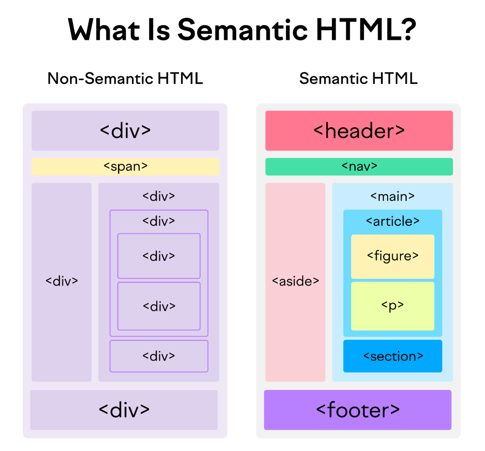

<div style="font-size: 17px;background: black;padding: 2rem;">

# Semantic HTML

Semantic HTML involves using HTML elements that convey meaning about the content they enclose, enhancing clarity for both browsers and developers.

- Examples of non-semantic elements: `<div>` and `<span>` - Tells nothing about its content.
- Examples of semantic elements: ``, `<table>`, and `<article>` - Clearly defines its content.

<h3 style="border-bottom: 2px solid white; padding-bottom: 2px; display: inline-block;">Common Semantic Elements</h3>

- `<header>`: Introductory content (e.g., site logo, navigation).
- `<nav>`: Primary navigation links.
- `<main>`: The dominant content of the page.
- `<article>`: Self-contained content (e.g., blog post, news story).
- `<section>`: Thematic grouping of content (e.g., chapters, tabs).
- `<aside>`: Tangentially related content (e.g., sidebars, pull quotes).
- `<footer>`: Closing content (e.g., copyright, contact info).
- `<time>`: Machine-readable date/time.
- `<figure>`/`<figcaption>`: Media with a caption.
- `<blockquote>`: Long quotations.
- `<em>`: (emphasis) conveys importance
- `<i>`: (italic) is purely stylistic.


<br>

<h3 style="border-bottom: 2px solid white; padding-bottom: 2px; display: inline-block;">Accessibility Benefits:</h3>

- Screen readers use semantic tags to interpret page structure, improving navigation for users with disabilities.
- Example: `<nav>` is recognized as a navigation landmark, allowing quick access to menus.

<h3 style="border-bottom: 2px solid white; padding-bottom: 2px; display: inline-block;">SEO & Maintainability:</h3>

- Search engines prioritize well-structured content, potentially boosting rankings.
- Code becomes more readable and maintainable (e.g., `<article>` is clearer than `<div class="post">`).

Example code:

```html
<body>
  <header>
    <h1></h1>
    <nav>
      <ul>
        <li><a href="#"></a></li>
        <li><a href="#"></a></li>
        <li><a href="#"></a></li>
      </ul>
    </nav>
  </header>

  <main>
    <article>
      <header>
        <h2></h2>
        <p><time datetime=""></time> by <a href="#"></a></p>
      </header>
      <section>
        <h3></h3>
        <p></p>
      </section>
      <section>
        <h3></h3>
        <p></p>
        <figure>
          
          <figcaption></figcaption>
        </figure>
      </section>
      <section>
        <h3></h3>
        <ul>
          <li><code></code></li>
          <li><code></code></li>
          <li><code></code></li>
        </ul>
      </section>
      <footer>
        <p><a href="#"></a></p>
      </footer>
    </article>

    <aside>
      <h3></h3>
      <ul>
        <li><a href="#"></a></li>
        <li><a href="#"></a></li>
        <li><a href="#"></a></li>
      </ul>
    </aside>
  </main>

  <footer>
    <p></p>
    <address>
      <a href="mailto:"></a>
    </address>
  </footer>
</body>
```

<br>

# Accessibility

Web Accessibility ensures that websites, tools, and technologies are designed and developed so that people with disabilities can perceive, understand, navigate, and interact with them effectively. It encompasses all disabilities affecting web access, including:

- **Visual** (blindness, low vision, color blindness).
- **Auditory** (deafness, hearing impairments).
- **Motor** (limited mobility, tremors).
- **Cognitive** (dyslexia, ADHD, memory impairments).
- **Situational/Temporary** (broken arm, glare on a screen).

<h3 style="border-bottom: 2px solid white; padding-bottom: 2px; display: inline-block;">Importance</h3>

- **Ethical Responsibility:** Inclusive design reflects social equity and human rights.
- **Legal Compliance:**
  - **ADA (Americans with Disabilities Act):** Requires accessibility for public entities in the U.S.
  - **WCAG (Web Content Accessibility Guidelines):** Global standard (versions 2.0/2.1, level AA).
  - **Section 508:** U.S. federal agencies must make digital content accessible.
  - **EU Web Accessibility Directive:** Mandates accessibility for public sector sites in Europe.
- **Business Benefits:** Expands audience reach, improves SEO, reduces legal risks, and enhances usability for all users.

<h3 style="border-bottom: 2px solid white; padding-bottom: 2px; display: inline-block;">Common Accessibility Barriers</h3>

- **Non-Semantic HTML:** Misusing `<div>` instead of `<button>` or `<nav>`.
- **Missing Alt Text:** Images without descriptions exclude visually impaired users.
- **Poor Contrast:** Low contrast between text and background hinders readability.
- **Inaccessible Forms:** Unlabeled fields or unclear error messages.
- **Keyboard Traps:** Users can’t navigate via keyboard (e.g., custom widgets).
- **Auto-Playing Media:** Disrupts screen readers or users with cognitive disabilities.

<h3 style="border-bottom: 2px solid white; padding-bottom: 2px; display: inline-block;">Best Practices & Solutions</h3>

- **Semantic HTML:** Use elements like `<header>`, `<nav>`, `<main>`, and ARIA roles (`role="navigation"`) for clarity.
- **Keyboard Navigation:** Ensure all interactive elements (buttons, links) are focusable and operable via keyboard.
- **Alt Text & Captions:**
  - Describe images contextually (e.g., ``).
  - Provide transcripts for audio/video.
- **Color Contrast:** Tools like <a href="https://webaim.org/resources/contrastchecker/">WebAIM Contrast Checker</a> verify ratios.
- **Responsive Design:** Ensure mobile accessibility (e.g., touch targets ≥ 44x44px).
- **Testing Tools:**
  - **Automated:** Axe, WAVE, Lighthouse.
  - **Manual:** Screen readers (VoiceOver, NVDA), keyboard-only navigation.

<br>

## WAI-ARIA

WAI-ARIA (Web Accessibility Initiative – Accessible Rich Internet Applications) is a set of technical specifications developed by the World Wide Web Consortium (W3C) to improve web accessibility for users with disabilities. It provides additional semantic information to web elements, making them more accessible to assistive technologies like screen readers.

Modern web applications use complex UI elements like modals, accordions, carousels, tooltips, tabs, and dynamically updated content. However, many of these elements lack built-in accessibility support in HTML. WAI-ARIA helps by:

- Enhancing standard HTML elements with additional accessibility information.
- Making custom UI components accessible (e.g., JavaScript-driven elements that don’t have native HTML equivalents).
- Providing better interactions for users with disabilities, such as screen reader users and keyboard-only users.

**<u>ARIA Roles</u>**

Roles define the purpose of an element and how assistive technologies interpret it.

```html
<div role="button" tabindex="0">Click Me</div>
```

- The `role="button"` tells screen readers that the `<div>` should be treated as a button.
- `tabindex="0"` makes it focusable via keyboard.

Below are some common ARIA roles:

- `role="button"`: Declares an element as a button.
- `role="alert"`: Identifies an important alert message.
- `role="dialog"`: Defines a modal dialog box.
- `role="navigation"`: Marks a section as a navigation menu.
- `role="tabpanel"`: Represents a tab panel in a tabbed interface.

<b style="color:red;">NOTE:</b> Prefer `<button>` over `<div role="button">`, since native HTML elements have built-in accessibility.

</div>
