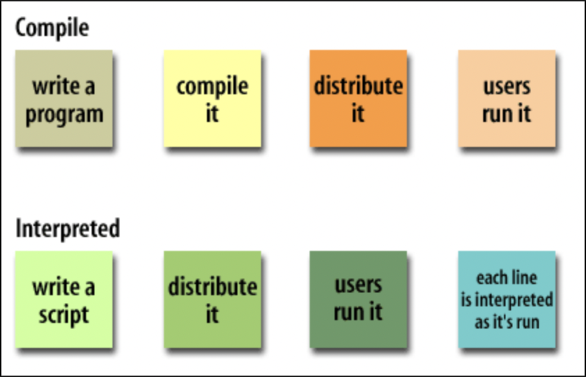

<div style="font-size: 17px;background: black;padding: 2rem;">

JavaScript (JS) is the most popular <span style="color: Cyan;">lightweight</span>, <span style="color: Yellow;">interpreted</span>, <span style="color: SpringGreen;">cross-platform</span>, <span style="color: HotPink;">dynamically typed</span>, <span style="color: Crimson;">single-threaded</span> programming language. It can be used for both Client-side as well as Server-side developments. JavaScript also known as a scripting language for web pages. A scripting language is a computer language that is interpreted instead of compiled. Some examples of scripting languages include: JavaScript, Python, Ruby, PHP.

<div style="background: DarkGreen;padding: 0.3rem 0.8rem;">
A cross-platform programming language is one that can be used to develop software that runs on multiple operating systems and hardware platforms. This allows developers to write code once and deploy it to various devices, saving time and effort. Example: JavaScript, Java, C/C++, Python, etc.

An example of non-cross-platform language is Swift - Primarily used for iOS, macOS, watchOS, and tvOS development.

</div>

<br>

<div style="background: DarkBlue;padding: 0.3rem 0.8rem;">

A dynamically typed language is a programming language in which variable types are checked at `runtime` rather than at `compile-time`. In these languages, you don’t need to specify the type of a variable explicitly. Instead, the interpreter infers the type based on the value assigned to the variable at runtime. This makes dynamically typed languages more flexible but can lead to runtime errors if types are used inconsistently. Examples: JavaScript, Python, PHP, Ruby.

A statically typed language is one where variable types are checked at compile-time. In these languages, variable types must be explicitly declared, and they cannot change type once assigned. This helps prevent certain types of errors at runtime. Examples: Java, C++, C.

</div>

<br>

<table style="font-family: Arial, Helvetica, sans-serif;border-collapse: collapse; width: 100%; border: 1px solid #ddd;">
  <tr>
    <th>Compiled Language</th>
    <th>Interpreted Language</th>
  </tr>

  <tr>
    <td>Compiled languages are translated directly into machine code or intermediate code (bytecode) by a compiler before execution. The resulting machine code can be executed directly by the computer's processor.</td>
    <td>Interpreted languages are translated line-by-line or statement-by-statement into machine code instructions by an interpreter at runtime. The interpreter reads and executes the code directly without producing a separate executable file.</td>
  </tr>

  <tr>
    <td>Compiled languages tend to have faster execution speeds because the code is translated into machine code beforehand, and there is no need for interpretation during runtime.</td>
    <td>Interpreted languages generally have slower execution speeds because the interpreter has to translate and execute the code line-by-line or statement-by-statement during runtime.</td>
  </tr>

<tr>
    <td>Compiled languages often require separate compilation for different platforms or architectures, resulting in platform-specific executables. However, some compiled languages (like Java) produce bytecode, which can be executed on any platform with the appropriate virtual machine.</td>
    <td>Interpreted languages typically have greater portability since the interpreter can run on different platforms, allowing the same source code to be executed without modification on various systems.</td>
</tr>
</table>

<br>

<br>

When JavaScript was created, it initially had another name: “LiveScript”. But Java was very popular at that time, so it was decided that positioning a new language as a “younger brother” of Java would help. But as it evolved, JavaScript became a fully independent language with its own specification called ECMAScript, and now it has no relation to Java at all.

<div style="background: DarkRed;padding: 0.3rem 0.8rem;">ECMAScript is a standardized scripting language specification that serves as the basis for several scripting languages, the most well-known of which is JavaScript. It defines the core features and functionality of the language, providing guidelines for how implementations of the language should behave.</div><br>

Today, JavaScript can execute not only in the browser, but also on the server, or actually on any device that has a special program called the JavaScript engine. The browser has an embedded engine sometimes called a “JavaScript virtual machine". Different engines have different “codenames”. For example:

- V8 – in Chrome, Opera and Edge.
- SpiderMonkey – in Firefox.
- …There are other codenames like “Chakra” for IE, “JavaScriptCore”, “Nitro” and “SquirrelFish” for Safari, etc.

<br>

# Where to write JS Code

## Internal JS

In HTML, JavaScript code is inserted between `<script>` and `</script>` tags. Old JavaScript examples may use a type attribute: `<script type="text/javascript">`. The `type` attribute is not required. JavaScript is the default scripting language in HTML. Example:

```
<script>
document.getElementById("demo").innerHTML = "My First JavaScript";
</script>
```

You can place any number of scripts in an HTML document. Scripts can be placed in the `<body>`, or in the `<head>` section of an HTML page, or in both.

## External JS

Scripts can also be placed in separate files called as Javascript files. JavaScript files have the file extension `.js`. Those files will directly have js code, they cannot contain `<script>` tags. To use an external script, put the path of the script file in the `src` (source) attribute of a `<script>` tag: `<script src="myScript.js"></script>`. <br/>

An external script can be referenced in 3 different ways:

- With a full URL (a full web address) : `<script src="https://www.w3schools.com/js/myScript.js"></script>`
- With a file path (like /js/) : `<script src="/js/myScript.js"></script>`
- Without any path : `<script src="myScript.js"></script>` <br/>

Placing scripts in external files has some advantages:

- It separates HTML and code
- It makes HTML and JavaScript easier to read and maintain
- Cached JavaScript files can speed up page loads

<div style="border: 2px solid yellow; padding: 10px;">

If you have to do something important using JavaScript, then you can display a warning message to the user using `<noscript>` tags. You can add a noscript block immediately after the script block as follows −

```html
<html>
  <head>
    <script>
      document.write("Hello World!");
    </script>

    <noscript> Sorry...JavaScript is needed to go ahead. </noscript>
  </head>
  <body></body>
</html>
```

Now, if the user's browser does not support JavaScript or JavaScript is not enabled, then the message from `</noscript>` will be displayed on the screen.

</div>

<br>

# Applications of JavaScript

- <b style="color:DeepSkyBlue;">Web Development (Frontend)</b>

  - <span style="color: Orange;">Dynamic Web Pages:</span> JavaScript is the foundation for creating dynamic, interactive websites by manipulating the Document Object Model (DOM). It enables adding real-time data, updating page content without reloading, and controlling multimedia.
  - <span style="color: Orange;">Event Handling:</span> Essential for responding to user interactions like clicks, mouse movements, keyboard inputs, and form submissions, enabling a seamless and interactive user experience.
  - <span style="color: Orange;">Frontend Frameworks and Libraries:</span> Frameworks like React, Angular, and Vue.js simplify building interactive UI components, routing, and state management, making JavaScript central in modern frontend development.
  - <span style="color: Orange;">Single-Page Applications (SPAs):</span> JavaScript enables SPAs where pages dynamically update without reloading, creating a smooth user experience similar to desktop applications.

- <b style="color:DeepSkyBlue;">Web Development (Backend)</b>

  - <span style="color: Orange;">Server-Side Development:</span> With Node.js, JavaScript powers server-side programming, allowing JavaScript to handle backend processes, build APIs, and manage databases, often replacing traditional server-side languages like PHP or Java.
  - <span style="color: Orange;">APIs and Web Services:</span> JavaScript is used to create RESTful APIs and GraphQL endpoints that provide data to frontend applications. This makes it versatile for both frontend and backend development.
  - <span style="color: Orange;">Serverless Functions:</span> Platforms like AWS Lambda, Google Cloud Functions, and Azure Functions enable serverless JavaScript functions that execute on-demand, helping developers build scalable backend systems without maintaining servers.

- <b style="color:DeepSkyBlue;">Mobile Application Development</b>

  - <span style="color: Orange;">Cross-Platform Mobile Apps:</span> Using frameworks like React Native and Ionic, JavaScript allows developers to create mobile applications for iOS and Android from a single codebase. These frameworks make it possible to develop cross-platform apps with native-like performance.
  - <span style="color: Orange;">Progressive Web Apps (PWAs):</span> JavaScript is also essential for PWAs, which are web apps that behave like native mobile apps, providing offline functionality, push notifications, and home screen access.

- <b style="color:DeepSkyBlue;">Desktop Application Development</b>

  - <span style="color: Orange;">Cross-Platform Desktop Applications:</span> With frameworks like Electron (used by applications like VS Code and Slack), JavaScript enables the development of desktop applications that work across Windows, macOS, and Linux.
  - <span style="color: Orange;">Native API Access:</span> Through Electron or other frameworks, JavaScript can access OS-level APIs, allowing developers to create applications with a native feel.

- <b style="color:DeepSkyBlue;">Game Development</b>

  - <span style="color: Orange;">Browser-Based Games:</span> JavaScript, in combination with HTML5 canvas and WebGL, is widely used for 2D and 3D game development that runs in browsers, often without needing plugins.
  - <span style="color: Orange;">Game Engines and Libraries:</span> Libraries like Phaser and Babylon.js provide tools and frameworks for creating interactive and high-performance games, making JavaScript a viable choice for web-based games.

- <b style="color:DeepSkyBlue;">Machine Learning and Data Science</b>

  - <span style="color: Orange;">Machine Learning Models:</span> Libraries like TensorFlow.js allow JavaScript developers to create and deploy machine learning models directly in the browser or Node.js, making it accessible to a wider audience.
  - <span style="color: Orange;">Data Visualization:</span> Libraries such as D3.js, Chart.js, and Plotly.js make JavaScript a powerful tool for creating data-driven visualizations, charts, and dashboards, widely used in analytics and data-driven applications.

- <b style="color:DeepSkyBlue;">Internet of Things (IoT)</b>

  - <span style="color: Orange;">Device Control and Edge Computing:</span> JavaScript, through platforms like Johnny-Five and Node-RED, is used to control and communicate with IoT devices. This extends JavaScript’s application to hardware and embedded devices, making it possible to run JavaScript on IoT platforms like Raspberry Pi.

- <b style="color:DeepSkyBlue;">Browser Extensions</b>

  - <span style="color: Orange;">Custom Browser Features:</span> JavaScript is used to develop extensions and plugins for browsers like Chrome, Firefox, and Edge, enhancing browser capabilities and adding new functionalities such as ad blockers, custom UI themes, and password managers.

- <b style="color:DeepSkyBlue;">Automation and Scripting</b>

  - <span style="color: Orange;">Task Automation:</span> JavaScript is used for automating repetitive tasks, such as file operations, data manipulation, and report generation, using libraries like Cheerio and Puppeteer for web scraping and browser automation.
  - <span style="color: Orange;">Testing Automation:</span> JavaScript’s popularity has led to the development of numerous testing frameworks like Jest, Mocha, and Cypress that support unit, integration, and end-to-end testing for applications, automating the QA process.

- <b style="color:DeepSkyBlue;">Blockchain and Cryptocurrency</b>

  - <span style="color: Orange;">Smart Contracts:</span> JavaScript is also used in the blockchain domain, specifically with platforms like Ethereum, where developers use JavaScript libraries such as web3.js to interact with decentralized applications (dApps) and manage smart contracts.
  - <span style="color: Orange;">dApp Development:</span> JavaScript plays a crucial role in developing decentralized applications, particularly in creating frontends for interacting with blockchain networks and Web3 technologies.

- <b style="color:DeepSkyBlue;">Real-Time Communication (RTC)</b>

  - <span style="color: Orange;">WebRTC for Video/Audio Communication:</span> JavaScript enables real-time audio, video, and data communication through WebRTC, which is commonly used in video calling and screen sharing applications, making it crucial for apps like Zoom and Google Meet.
  - <span style="color: Orange;">Collaborative Applications:</span> Frameworks like Socket.IO enable real-time bidirectional communication, essential for chat applications, collaborative tools, and real-time dashboards.

- <b style="color:DeepSkyBlue;">Content Management Systems (CMS)</b>

  - <span style="color: Orange;">Headless CMS:</span> JavaScript frameworks enable the use of headless CMS systems like Strapi and Contentful, where developers manage content that can be delivered to any frontend framework or mobile app via APIs.
  - <span style="color: Orange;">Website Builders:</span> Some website-building platforms, like WordPress (Gutenberg editor), are increasingly integrating JavaScript to enhance interactivity and provide customizable content-building experiences.

- <b style="color:DeepSkyBlue;">Cloud Computing and Microservices</b>

  - <span style="color: Orange;">Cloud and Microservices Architecture:</span> JavaScript is commonly used to develop microservices, especially with Node.js, which provides high scalability and is ideal for cloud environments like AWS, Azure, and Google Cloud.
  - <span style="color: Orange;">Cloud Functions:</span> JavaScript-based cloud functions provide on-demand services for various applications, and frameworks like Serverless allow deploying JavaScript services that scale seamlessly.

- <b style="color:DeepSkyBlue;">Augmented Reality (AR) and Virtual Reality (VR)</b>
  - <span style="color: Orange;">WebAR and WebVR:</span> With the advent of AR.js and Three.js, JavaScript is used to create augmented and virtual reality experiences directly within browsers, bringing immersive 3D experiences to users without needing specialized software.
  - <span style="color: Orange;">3D Modeling and Visualization:</span> JavaScript libraries like Three.js and A-Frame make it possible to render 3D models and create interactive visual experiences, which are used in AR/VR applications.

</div>

<!-- <div style="background: DarkRed;padding: 0.3rem 0.8rem;"> [HIGHLIGHT] -->
<!-- <h3 style="border-bottom: 2px solid white; padding-bottom: 2px; display: inline-block;"> [SUBHEADING] -->
<!-- <b style="color: Chartreuse;"> [NOTE] -->
<!-- <b style="color:red;"> [NOTE-2] -->
<!-- <span style="color: Cyan;"> [IMP] -></span> -->
<!-- <b style="color: Salmon;"> [POINT] -->
