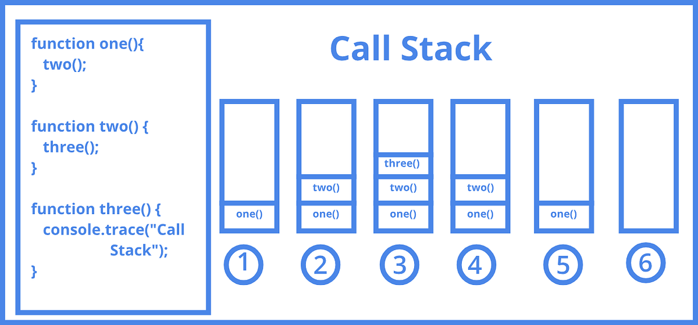

<div style="font-size: 17px;background: black;padding: 2rem;">

# <a href="https://youtu.be/eiC58R16hb8?si=Wf1w-4AF5TqKJQgw">Event Loop</a>

JavaScript is a single-threaded language, which means that it can only execute one task at a time. However, JavaScript also has an <b style="color: Yellow;">event loop</b>, which allows it to execute asynchronous code, enabling JavaScript to handle multiple tasks such as user interactions, network requests, and timers without blocking the main thread.

<h3 style="border-bottom: 2px solid white; padding-bottom: 2px; display: inline-block;">Call Stack</h3>

A stack where function calls are added and executed in last-in-first-out (LIFO) order. When a function is called, it's added to the top of the stack, and when it completes, it's removed.


<br>
<br>

<h3 style="border-bottom: 2px solid white; padding-bottom: 2px; display: inline-block;">Web APIs (or Node.js APIs):</h3>

These are not part of the JavaScript language itself but are provided by the environment (browser or Node.js). Examples in browser environment - `setTimeout`, `DOM events`, `HTTP requests (AJAX)`, etc.

<h3 style="border-bottom: 2px solid white; padding-bottom: 2px; display: inline-block;">Callback Queue / Task Queue / Event Queue / Macrotask Queue</h3>

This is a queue ("First In, First Out (FIFO)" Data Structure) where callbacks are placed when their associated asynchronous operations (like timers or events) are completed. They are also called macrotasks. These callbacks are waiting to be executed. Here are some example callbacks of macrotasks:

- <b style="color: Salmon;">I/O operations</b> - network requests, file system operations
- <b style="color: Salmon;">Timer events</b> - setTimeout, setInterval
- <b style="color: Salmon;">User interface events</b> - DOM manipulation, user input

<h3 style="border-bottom: 2px solid white; padding-bottom: 2px; display: inline-block;">Microtask Queue</h3>

In modern JavaScript environments (ES6 and later), there's an additional layer of task handling known as microtasks. Microtasks are high-priority functions that are executed before the next event from the event queue is processed. This allows for finer-grained control over asynchronous task execution. Microtasks are typically used for promise resolution or cleanup operations after the current event loop iteration. They are managed by a separate task queue that is processed after the call stack is empty but before the event queue. In short, <span style="color: Chartreuse;">microtasks</span> are higher priority than <span style="color: Chartreuse;">macrotasks</span>. This means that the event loop will always execute all of the microtasks in the queue before it executes any of the macrotasks.

Here are some example callbacks of microtasks:

- <b style="color: Salmon;">Promises</b> - Promise.resolve(), Promise.reject(), etc
- <b style="color: Salmon;">Mutation Observer </b>callbacks

<h3 style="border-bottom: 2px solid white; padding-bottom: 2px; display: inline-block;">Event Loop</h3>

The event loop is a process that continuously checks the call stack and callback queue. If the call stack is empty, it pushes the first callback from the callback queue to the call stack for execution. This ensures that asynchronous operations are handled in a non-blocking manner.

The event loop works as follows:

1. The event loop checks the call stack to see if there are any functions that need to be executed.
2. If there are no functions in the call stack, the event loop checks the microtask queue to see if there are any microtasks that need to be executed.
3. If there are any microtasks in the queue, the event loop executes them.
4. If there are no microtasks in the queue, the event loop checks the macrotask queue to see if there are any macrotasks that need to be executed.
5. If there are any macrotasks in the queue, the event loop executes them.
6. The event loop repeats steps 2-5 until there are no more tasks in either queue.

The event loop is a fundamental part of JavaScript and it is important to understand how it works in order to write efficient and effective asynchronous code.

<span style="color: Pink;">------------CODE EXAMPLE------------</span>

```js
console.log(1);

setTimeout(() => console.log(2));

Promise.resolve().then(() => console.log(3));

Promise.resolve().then(() => setTimeout(() => console.log(4)));

Promise.resolve().then(() => console.log(5));

setTimeout(() => console.log(6));

console.log(7);
```

<span style="color: Orange;">Output = 1 7 3 5 2 6 4</span>

<span style="color: Pink;">------------EXPLANATION------------</span>

1. Numbers `1` and `7` show up immediately, because simple `console.log` calls don’t use any queues.
2. Then, after the main code flow is finished, the microtask queue runs.
   - It has commands: `console.log(3);` `setTimeout(...4);` `console.log(5)`.
   - Numbers `3` and `5` show up, while `setTimeout(() => console.log(4))` adds the `console.log(4)` call to the end of the macrotask queue.
   - The macrotask queue is now: `console.log(2);` `console.log(6);` `console.log(4)`.
3. After the microtask queue becomes empty, the macrotask queue executes. It outputs `2, 6, 4`.

Finally, we have the output: `1 7 3 5 2 6 4`.

<br>

# <a href="https://developer.mozilla.org/en-US/docs/Web/API/Web_Workers_API">Web Workers</a>

**<a href="https://www.youtube.com/watch?v=Gcp7triXFjg&ab_channel=DevSage">YOUTUBE TUTORIAL</a>**

Web Workers are a feature in web development that allows JavaScript code to run in the background, on a separate thread from the main execution thread of a web application. This helps improve performance by offloading heavy computational tasks or long-running operations, ensuring that the main thread (responsible for UI rendering and user interaction) remains responsive.

Workers run in a separate global context, so they don’t have direct access to the DOM or the `window` object.
However, they can access data through message passing and can use APIs like `XMLHttpRequest`, `fetch`, and some Web APIs like `setTimeout` and `setInterval`.

Data is sent between workers and the main thread via a system of messages — both sides send their messages using the <span style="color: Yellow;">postMessage()</span> method, and respond to messages via the <span style="color: Lime;">onmessage</span> event handler (the message is contained within the <span style="color: Orange;">message</span> event's <span style="color: Cyan;">data</span> property). The data is copied rather than shared.

<u>**TYPES OF WORKERS**</u>

<b style="color:Salmon;">1. Dedicated Workers: </b> A single worker used by one script or page.<br>
<b style="color:Salmon;">2. Shared Workers: </b> They are workers that can be utilized by multiple scripts running in different windows, IFrames, etc., as long as they are in the same domain as the worker. They are a little more complex than dedicated workers — scripts must communicate via an active port.<br>
<b style="color:Salmon;">3. Service Workers: </b> They essentially act as proxy servers that sit between web applications, the browser, and the network (when available). They are intended, among other things, to enable the creation of effective offline experiences, intercept network requests and take appropriate action based on whether the network is available, and update assets residing on the server. They will also allow access to push notifications and background sync APIs.

While `Window` is not directly available to workers, many of the same methods are defined in a shared mixin (`WindowOrWorkerGlobalScope`), and made available to workers through their own `WorkerGlobalScope`-derived contexts:

- `DedicatedWorkerGlobalScope` for dedicated workers. It represents the scope of a dedicated worker, inheriting from `WorkerGlobalScope` and adding some dedicated features. It is accessible through the `self` keyword.
- `SharedWorkerGlobalScope` for shared workers.
- `ServiceWorkerGlobalScope` for service workers.

<h3 style="border-bottom: 2px solid white; padding-bottom: 2px; display: inline-block;">1. Dedicated Workers</h3>

Created using the <b style="color:DeepSkyBlue;">Worker</b> constructor. It takes single argument -- path to worker script! <span style="color: Violet;">It can only be accessed and used by the script that instantiated it.</span> Dedicated workers are terminated when the page that created them is closed.

<u>**USE CASES:**</u>

- **CPU-intensive computations:** Performing heavy calculations, such as mathematical simulations or data analysis, without freezing the UI.
- **Data processing:** Handling large datasets, such as parsing JSON or processing images.
- **Resource-intensive operations:** Running tasks that would otherwise block the main thread, ensuring the UI remains responsive.

<u>**METHODS:**</u>

- `Worker.postMessage()`: Sends a message — consisting of any JavaScript object — to the worker's inner scope.
- `Worker.terminate()`: Immediately terminates the worker. This does not let worker finish its operations; it is halted at once. `ServiceWorker` instances do not support this method.

<u>**EVENTS:**</u>

- `error`: Fires when an error occurs in the worker.
- `message`: Fires when the worker's parent receives a message from that worker.
- `messageerror`: Fires when a Worker object receives a message that can't be deserialized.

<span style="color: Cyan;">In below code, `self` is reference to worker itself! When we create worker script, the `worker` object is global object (just like `window` for web environment) for that script. So technically, we can avoid using `self` in below code!</span>

```js
// Main thread
const worker = new Worker("worker.js");

worker.postMessage("Hello, worker!"); // Send data to the worker

worker.onmessage = (event) => {
  console.log("Message from worker:", event.data);
};

// worker.js (Dedicated Worker)
self.onmessage = (event) => {
  console.log("Message from main thread:", event.data);
  self.postMessage("Hello, main thread!"); // Send data back to the main thread
};
```

<h3 style="border-bottom: 2px solid white; padding-bottom: 2px; display: inline-block;">2. Shared Workers</h3>

A Shared Worker is a worker that can be shared between multiple scripts, tabs, or windows of the same origin. This is useful for managing shared resources, such as maintaining a single WebSocket connection or cache. Shared workers persist even if the original page is closed, as long as at least one connection (port) remains active. They are useful for coordinating actions or sharing resources across multiple tabs or windows.

- Communicates with connected contexts via a <span style="color: Violet;">MessagePort</span>.
- Created using the <span style="color: HotPink;">SharedWorker</span> constructor.
- Communicates with each connected script via `postMessage()` and `onconnect`.

<u>**USE CASES:**</u>

- **Shared state management:** Maintaining a shared cache or state across multiple tabs, such as synchronizing application settings.
- **Single WebSocket connection:** Managing a single WebSocket connection for real-time updates, ensuring all tabs receive updates without duplicating connections.
- **Coordinating actions:** Handling tasks that need to be synchronized across different instances of an application, such as a chat application.

```js
// Main thread
const sharedWorker = new SharedWorker("shared-worker.js");

sharedWorker.port.start(); // Start communication
sharedWorker.port.postMessage("Hello, shared worker!");

sharedWorker.port.onmessage = (event) => {
  console.log("Message from shared worker:", event.data);
};

// shared-worker.js (Shared Worker)
self.onconnect = (event) => {
  const port = event.ports[0];

  port.onmessage = (event) => {
    console.log("Message from main thread:", event.data);
    port.postMessage("Hello, connected context!");
  };
};
```

<h3 style="border-bottom: 2px solid white; padding-bottom: 2px; display: inline-block;">3. Service Workers</h3>

<a href="https://www.youtube.com/watch?v=ksXwaWHCW6k&t=51s&ab_channel=TraversyMedia">**TUTORIAL**</a>

While <u>**not strictly a type of web worker**</u> (they are part of the Service Workers API), service workers are often discussed alongside web workers due to their importance in modern web development. Service workers are specialized JavaScript files that operate as background processes, acting as a proxy between the web application, the browser, and the network. They are designed to improve reliability by enabling offline access, boost performance through caching, and support advanced features like push notifications and background synchronization. Service workers also don't have access to DOM, operating in a separate thread to ensure non-blocking, asynchronous execution. This separation is crucial for maintaining the responsiveness of the main thread, which handles user interface interactions.

In brief, a service worker:

- Is a JS Script that gets registered with the browser.
- Stays registered with the browser even when offline.
- Can load content even with no connection.
- Can't access DOM directly, but can trigger events for main page to manipulate DOM.
- Is a programmable network proxy - that allows to handle network requests.
- Is terminated when not being used and then they are restarted when needed again.
- Makes use of promises.
- Requires HTTPS unless on localhost.


<br>
<br>

Service worker intercepts network requests and then it decides what should happen, like should it fetch resource from remote or return the offline version or something else. So even if you don't want to cache entire app, instead of throwing some crashed page during internet cut-off, some good UI page could be thrown informing user about internet issue.

**<u>USE CASES</u>**

- **Offline Functionality:** Essential for applications requiring access without network connectivity, such as news readers or note-taking apps. They cache necessary resources during installation, ensuring users can interact with the app offline.
- **Push Notifications:** Enable real-time updates, such as breaking news alerts or social media notifications, even when the application is not actively open. This is facilitated through the Push API.
- **Performance Optimization:** By caching frequently accessed resources, service workers reduce load times, enhancing user experience, particularly in PWAs.
- **Background Synchronization:** Allows for data synchronization tasks, such as syncing user changes made offline with the server once connectivity is restored, improving data consistency.

**<u>LIFECYCLE AND EVENTS</u>**

**REGISTER** ----> **INSTALL**(triggers `install` event) ----> **ACTIVATE**(triggers `activate` event) ----> After that we can use message events and functional events such as `fetch`, `push` and `sync`.

**<u>IMPLEMENTATION</u>**

<b style="color:HotPink;">1. Registration:</b> The process begins in the main JavaScript file, where the service worker is registered using the `ServiceWorkerContainer.register()` method. For example:

```js
if ("serviceWorker" in navigator) {
  navigator.serviceWorker.register("/service-worker.js");
}
```

The scope, determined by the registration path, defines which URLs the service worker can control, ideally set close to the root for maximum coverage.

<b style="color:HotPink;">2. Lifecycle Management:</b> Service workers undergo a lifecycle including download, install, and activate stages:

- <span style="color: SpringGreen;">Install:</span> Triggered upon registration, used for caching initial resources. Example:

  ```js
  self.addEventListener("install", (event) => {
    event.waitUntil(caches.open("my-cache").then((cache) => cache.addAll(["/index.html", "/style.css"])));
  });
  ```

- <span style="color: SpringGreen;">Activate:</span> Occurs when the service worker takes control, suitable for cleaning old caches:

  ```js
  self.addEventListener("activate", (event) => {
    event.waitUntil(caches.keys().then((keys) => Promise.all(keys.filter((key) => key !== "my-cache").map((key) => caches.delete(key)))));
  });
  ```
Updates occur every 24 hours or on navigation/in-scope events, with new versions entering a "worker in waiting" state until activated, manageable via `skipWaiting()` and `clients.claim()` for immediate control.

<b style="color:HotPink;">3. Event Handling:</b> The core of service worker functionality lies in event handlers, particularly:

- <span style="color: SpringGreen;">Fetch event:</span>  Intercepts network requests, deciding response sources:

  ```js
  self.addEventListener('fetch', event => {
      event.respondWith(
          caches.match(event.request).then(response => response || fetch(event.request))
      );
  });
  ```
- Other events include <span style="color: Cyan;">push</span> for notifications and <span style="color: Orange;">sync</span> for background synchronization, expanding functionality beyond basic caching.

</div>
