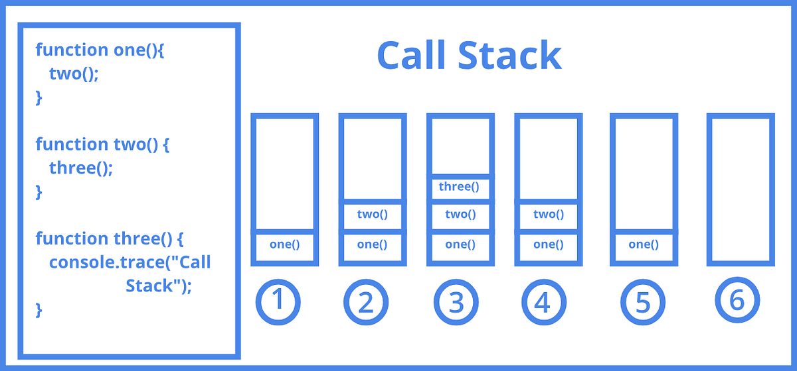

<div style="font-size: 17px;background: black;padding: 2rem;">

# <a href="https://youtu.be/eiC58R16hb8?si=Wf1w-4AF5TqKJQgw">Event Loop</a>

https://www.linkedin.com/pulse/unraveling-javascript-event-loop-comprehensive-guide-michael-baker/

JavaScript is a single-threaded language, which means that it can only execute one task at a time. However, JavaScript also has an <b style="color: Yellow;">event loop</b>, which allows it to execute asynchronous code, enabling JavaScript to handle multiple tasks such as user interactions, network requests, and timers without blocking the main thread. 

## Call Stack

The call stack is a data structure that keeps track of function calls in a "Last In, First Out (LIFO)" manner. When a function is called, it is added to the call stack. When the function execution is complete, it is removed from the stack.


<br>
<br>

## Web APIs

In a browser environment, Web APIs provide functionalities like `setTimeout`, `DOM events`, `HTTP requests (AJAX)`, etc. These APIs are not part of JavaScript itself but are provided by the browser.

## Callback Queue / Task Queue / Event Queue / Macrotask Queue

This is a queue ("First In, First Out (FIFO)" Data Structure) where callbacks are placed when their associated asynchronous operations (like timers or events) are completed. These callbacks are waiting to be executed.

## Event Loop

The event loop is a process that continuously checks the call stack and callback queue. If the call stack is empty, it pushes the first callback from the callback queue to the call stack for execution. This ensures that asynchronous operations are handled in a non-blocking manner.

## Microtasks

In modern JavaScript environments (ES6 and later), there's an additional layer of task handling known as microtasks. Microtasks are high-priority functions that are executed before the next event from the event queue is processed. This allows for finer-grained control over asynchronous task execution. Microtasks are typically used for promise resolution or cleanup operations after the current event loop iteration. They are managed by a separate task queue that is processed after the call stack is empty but before the event queue.

<br>
<hr>
<br>

<span style="color: Chartreuse;">Microtasks</span> are higher priority than <span style="color: Chartreuse;">macrotasks</span>. This means that the event loop will always execute all of the microtasks in the queue before it executes any of the macrotasks.

Here are some example callbacks of microtasks:
- <b style="color: Salmon;">Promises</b> - Promise.resolve(), Promise.reject(), etc
- <b style="color: Salmon;">Mutation Observer </b>callbacks

Here are some example callbacks of macrotasks:
- <b style="color: Salmon;">I/O operations</b> - network requests, file system operations
- <b style="color: Salmon;">Timer events</b> - setTimeout, setInterval
- <b style="color: Salmon;">User interface events</b> - DOM manipulation, user input

The event loop works as follows:
1. The event loop checks the call stack to see if there are any functions that need to be executed.
2. If there are no functions in the call stack, the event loop checks the microtask queue to see if there are any microtasks that need to be executed.
3. If there are any microtasks in the queue, the event loop executes them.
4. If there are no microtasks in the queue, the event loop checks the macrotask queue to see if there are any macrotasks that need to be executed.
5. If there are any macrotasks in the queue, the event loop executes them.
6. The event loop repeats steps 2-5 until there are no more tasks in either queue.

The event loop is a fundamental part of JavaScript and it is important to understand how it works in order to write efficient and effective asynchronous code.

<span style="color: Pink;">------------CODE------------</span>

```js
console.log(1);

setTimeout(() => console.log(2));

Promise.resolve().then(() => console.log(3));

Promise.resolve().then(() => setTimeout(() => console.log(4)));

Promise.resolve().then(() => console.log(5));

setTimeout(() => console.log(6));

console.log(7);
```

<span style="color: Orange;">Output = 1 7 3 5 2 6 4</span>

<span style="color: Pink;">------------EXPLANATION------------</span>

1. Numbers `1` and `7` show up immediately, because simple `console.log` calls don’t use any queues.
2. Then, after the main code flow is finished, the microtask queue runs.
    - It has commands: `console.log(3);` `setTimeout(...4);` `console.log(5)`.
    - Numbers `3` and `5` show up, while `setTimeout(() => console.log(4))` adds the `console.log(4)` call to the end of the macrotask queue.
    - The macrotask queue is now: `console.log(2);` `console.log(6);` `console.log(4)`.
3. After the microtask queue becomes empty, the macrotask queue executes. It outputs `2, 6, 4`.

Finally, we have the output: `1 7 3 5 2 6 4`.

</div>

<!-- <div style="font-size: 17px;background: black;padding: 2rem;"> -->
<!-- <div style="background: DarkRed;padding: 0.3rem 0.8rem;"> [HIGHLIGHT] -->
<!-- <h3 style="border-bottom: 2px solid white; padding-bottom: 2px; display: inline-block;"> [SUBHEADING] -->
<!-- <b style="color: Chartreuse;"> [NOTE] -->
<!-- <b style="color:red;"> [NOTE-2] -->
<!-- <span style="color: Cyan;"> [IMP] -></span> -->
<!-- <b style="color: Salmon;"> [POINT] -->
<!-- <div style="border: 1px solid yellow; padding: 10px;"> [BORDER] -->