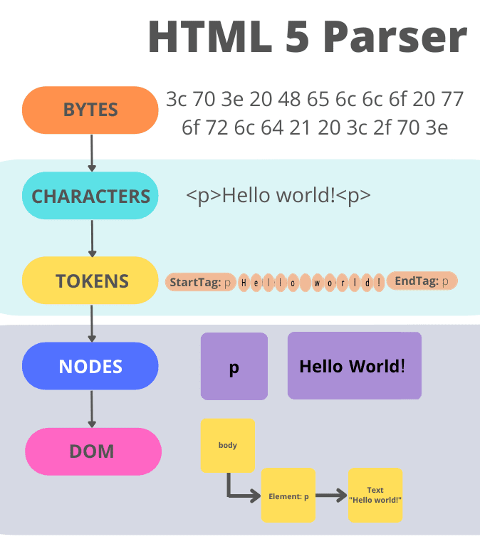
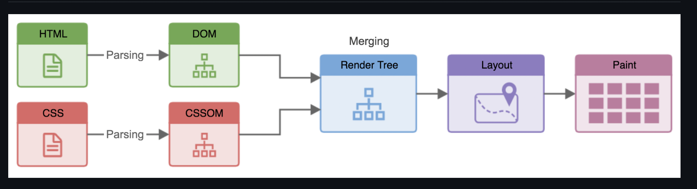
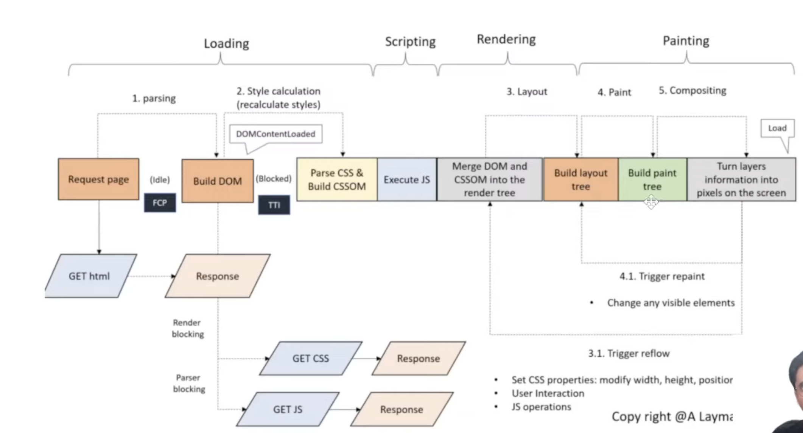
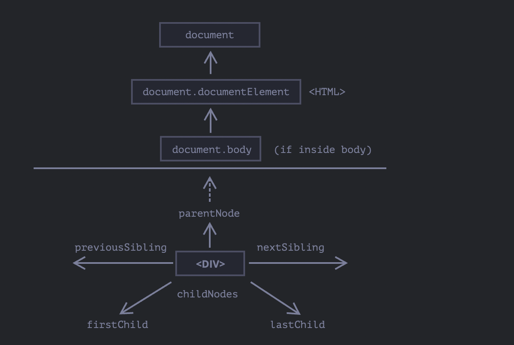
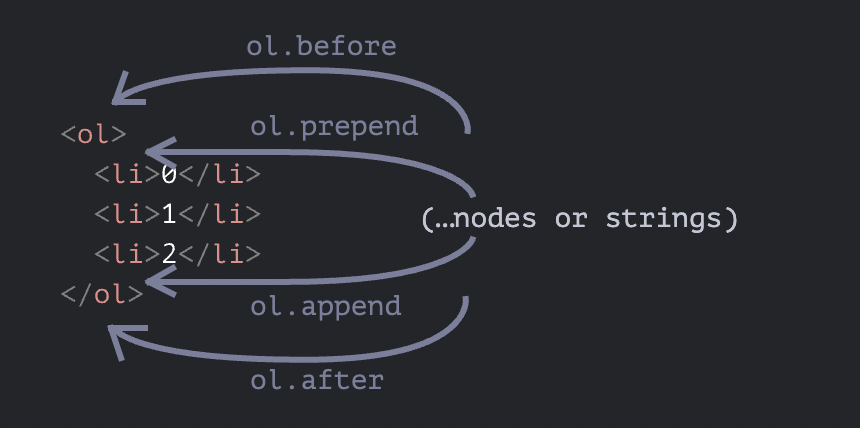
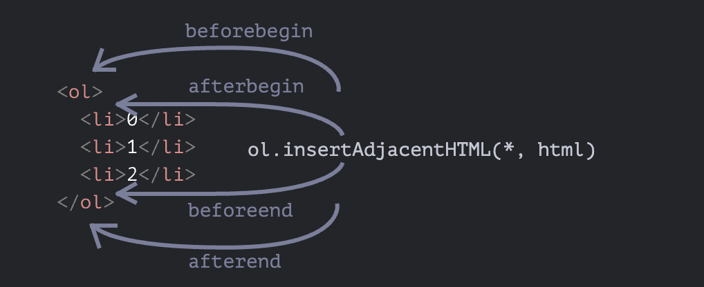
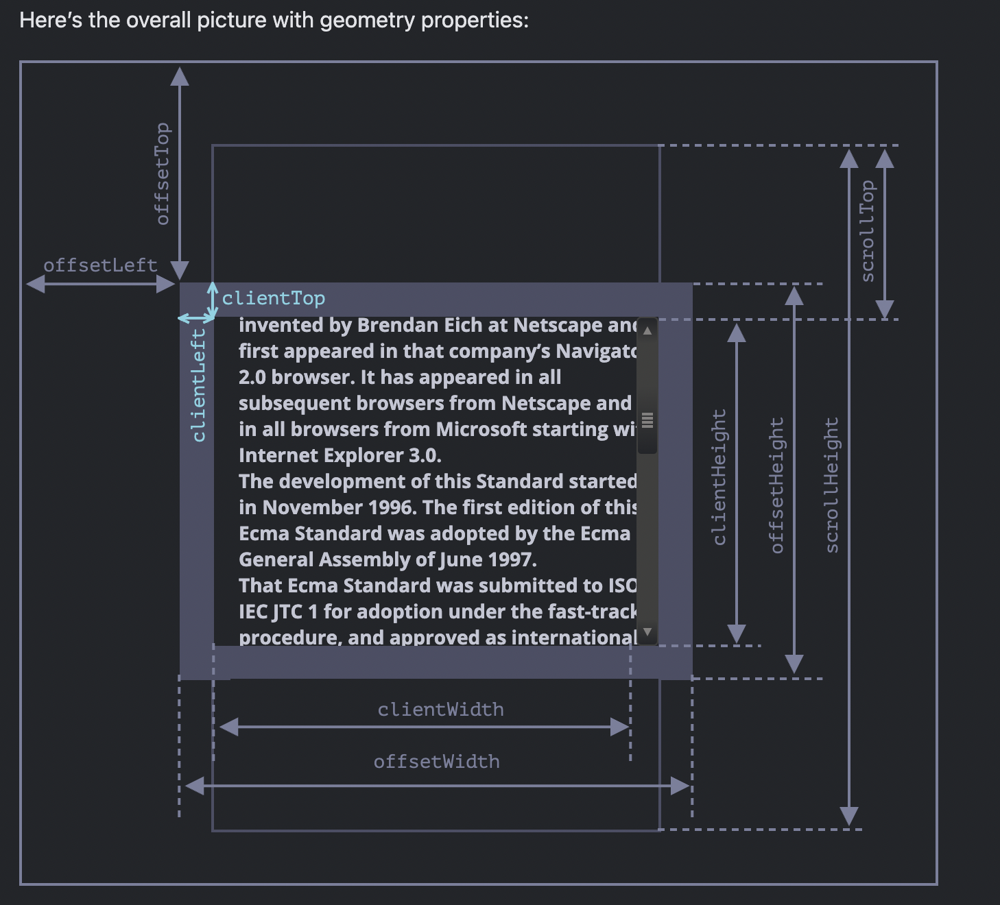
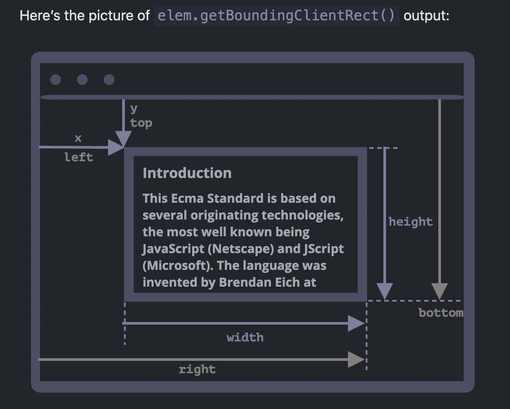

<div style="font-size: 17px;background: black;padding: 2rem;">

# How is HTML rendered on browser?

A web browser is a piece of software that loads files from a remote server (or perhaps a local disk) and displays them to you — allowing for user interaction. Within a browser, there’s a piece of software that figures out what to display to you based on the files it receives. This is called the <span style="color: Cyan;">browser engine<span>.

The browser engine is a core software component of every major browser, and different browser manufacturers call their engines by different names. The browser engine for Firefox is called Gecko, and Chrome’s is called Blink, which happens to be a fork of WebKit.

The rendering process for web pages by browser engine includes the following steps:

- **The Network Phase (Fetching Resources):** It is is the first step in the browser's rendering process. It involves retrieving the necessary files (HTML, CSS, JavaScript, images, etc.) from the server. Here are the steps for it:
  1. **DNS Lookup:** The browser converts the human-readable domain name (e.g., `www.example.com`) into an IP address (e.g., `93.184.216.34`) that computers use to identify each other on the network.
  2. **TCP Handshake:** The browser establishes a connection with the server using the Transmission Control Protocol (TCP).
  3. **TLS Handshake (HTTPS Only):** For secure connections (HTTPS), the browser and server establish an encrypted connection using Transport Layer Security (TLS).
  4. **HTTP Request:** The browser sends an HTTP request to the server for the HTML file (or other resources).
  5. **Server Response:** The server processes the request and sends back a response.
- When you write some HTML, CSS, and JS, and attempt to open the HTML file in your browser, the browser reads the raw <span style="color: Lime;">bytes</span> of HTML from your hard disk (or network).
- Browser can't do anything with bytes of data. So, browser converts it to readable data - <span style="color: orange;">characters</span>.
- Characters are great, but they aren’t the final result. These characters are further parsed into something called <span style="color: hotpink;">tokens</span>. Without this tokenization process, the bunch of characters will just result in a bunch of meaningless text. The parser understands each string in angle brackets (e.g., `<html>`, `<p>`) and understands the set of rules that apply to each of them. For example, a token that represents an anchor tag will have different properties from one that represents a paragraph token. This is how the browser begins to understand what you’ve written.
- Tokens are great, but they are also not our final result. After the tokenization is done, the tokens are then converted into <span style="color: Coral;">nodes</span>. You may think of nodes as distinct objects with specific properties. In fact, a better way to explain this is to see a node as a separate entity within the document object tree.
- Nodes are great, but they still aren’t the final results. Now, here’s the final bit. Upon creating these nodes, the nodes are then linked in a tree data structure known as the <span style="color: Cyan;">DOM(Document Object Modal)</span>. The DOM establishes the parent-child relationships, adjacent sibling relationships, etc. The relationship between every node is established in this DOM object. Now, this is something we can work with.
- In similar way, the browser reads the CSS from all sources and converts it to CSS tree like structure called - <span style="color: Cyan;">CSSOM (CSS Object Modal)</span>. It contains information about how to style the elements. [DOM & CSSOM are independent tree structures]
- The browser merges the DOM and CSSOM trees to create the <span style="color: yellow;">render tree</span>. Each node in the render tree holds layout and style information. The render tree represents the visual representation of the document, taking into account the styling information applied to each element. <u>**Elements that aren't going to be displayed, like the `<head>` element and its children and any nodes with `display: none` are not included in the render tree as they will not appear in the rendered output.**</u> The hidden element will be present in the DOM but not the render tree. This is because the render tree combines information from both the DOM and the CSSOM, so it knows not to include a hidden element in the tree. Each visible node has its CSSOM rules applied to it. The render tree holds all the visible nodes with content and computed styles
- The browser then calculates <span style="color: Gold;">layout</span> of the elements in the render tree, determining their position, size, and arrangement on the screen. It takes into account factors such as the dimensions of the viewport, the size of the elements, and any CSS styling properties that affect layout, such as width, height, padding, margin, and positioning. <span style="color: violet;">Reflow</span> is any subsequent size and position determination of any part of the page or the entire document. The first time the size and position of each node is determined is called `layout`. Subsequent recalculations of are called `reflows`.
- Once the layout is calculated, the browser <span style="color: Coral;">paints</span> the content onto the screen, rendering each element according to its position and styling. This process involves rendering text, applying colors, borders, and backgrounds, and drawing images and other graphical content. The first occurrence of this process is called the <span style="color: DeepSkyBlue;">first Meaningful Paint</span>.
- Finally, the browser <span style="color: SpringGreen;">composites</span> the rendered elements together to create the final visual representation of the document. This includes blending overlapping elements, applying opacity, and handling any other visual effects specified in the CSS stylesheets.

Throughout this process, the browser may also download additional resources such as images, scripts, stylesheets, and fonts referenced in the HTML document and CSS stylesheets. These resources are fetched asynchronously and integrated into the rendering process as they become available.





<br>

<div style="background: DarkRed;padding: 0.3rem 0.8rem;">
One of the most important things to remember is that whenever the browser encounters a script tag, the DOM construction is paused! The entire DOM construction process is halted until the script finishes executing. This is because JavaScript can alter both the DOM and CSSOM. Because the browser isn’t sure what this particular JavaScript will do, it takes precautions by halting the entire DOM construction altogether. That's why script tag should be used at the end of the code. Otherwise, the element you are trying to access in JS code might not have been parsed.
</div>

<br>

This whole time, we have discussed the steps taken between receiving the HTML, CSS, and JS bytes and turning them into rendered pixels on the screen.

This entire process is called the <b style="color: LightGreen;">critical rendering path (CRP)</b>. Optimizing your websites for performance is all about optimizing the CRP. A well-optimized site should undergo progressive rendering and not have the entire process blocked.

<b style="color:Yellow;margin-left: 300px;font-size: 20px;">READ A DETAILED ARTICLE ON THIS <a href="https://blog.logrocket.com/how-browser-rendering-works-behind-scenes">LINK</a></b>

<h3 style="border-bottom: 2px solid white; padding-bottom: 2px; display: inline-block;">Import events of lifecycle of HTML page</h3>

- <b style="color: LightCoral;">DOMContentLoaded</b>: It fires when the initial HTML document has been completely parsed & loaded by the browser, the Document Object Model (DOM) is fully constructed and deferred scripts have downloaded & executed. It doesn't wait for other things like images, stylesheets, subframes, and async scripts to finish loading. It is `document` event. Stage at which it is fired:
  - After: HTML parsing and DOM construction.
  - Before: CSSOM construction, render tree creation, layout, and painting.
- <b style="color: LightCoral;">load</b>: The load event is fired when the whole page has loaded, including all dependent resources such as stylesheets, scripts, iframes, and images, except those that are loaded lazily. It is `window` event. Stage:
  - After: DOM construction, CSSOM construction, render tree creation, layout, painting, and compositing.
  - After: All external resources (images, scripts, etc.) are loaded.
- <b style="color: LightCoral;">beforeunload</b>: Occurs just before the page is unloaded or navigated away from. It allows developers to execute code or prompt the user for confirmation before they leave the current page, potentially preventing accidental navigation or loss of unsaved data. It primarily applies to certain elements that load external resources like - `window`, `iframe`, `img`, `script`, `link`, `video`, `audio`.
- <b style="color: LightCoral;">unload</b>: Triggered when the user almost left, but we still can initiate some operations, such as sending out statistics. It is `window` event.

<br>

# DOM Tree

The backbone of an HTML document is `tags`. According to the Document Object Model (DOM), every HTML tag is an object. Nested tags are “children” of the enclosing one. The text inside a tag is an object as well. All these objects are accessible using JavaScript, and we can use them to modify the page. For example, `document.body` is the object representing the `<body>` tag.

DOM provides a way for programs (such as JavaScript) to dynamically interact with and manipulate the content, structure, and style of web documents.

- The DOM represents a web document as a tree structure, known as the DOM tree.
- The root of the tree is the `document` object, which represents the entire HTML document.
- Each node in the tree corresponds to a different part of the document:
  - <span style="color: Salmon;">Elements</span>: HTML elements such as `<div>`, `<p>`, `<span>`, etc., are represented as element nodes.
  - <span style="color: Salmon;">Attributes:</span> Attributes of elements are represented as attribute nodes.
  - <span style="color: Salmon;">Text Content:</span> Text content within elements is represented as text nodes.
  - <span style="color: Salmon;">Comments:</span> HTML comments are represented as comment nodes.
- Nodes are organized in a parent-child relationship, where each node can have zero or more child nodes and one parent node (except for the root node, which has no parent).
- And every tree node is an object.

<br>

<br><br>

If the browser encounters malformed HTML, it automatically corrects it when making the DOM. For instance, the top tag is always `<html>`. Even if it doesn’t exist in the document, it will exist in the DOM, because the browser will create it. The same goes for `<body>`. As an example, if the HTML file is the single word "Hello", the browser will wrap it into `<html>` and `<body>`, and add the required `<head>`. A document with unclosed tags will become a normal DOM as the browser reads tags and restores the missing parts.

# Traversing through nodes

All operations on the DOM start with the document object. That’s the main “entry point” to DOM. From it we can access any node. Here’s a picture of links that allow for travel between DOM nodes:



The topmost tree nodes are available directly as document properties:

`<html>` = <span style="color: Cyan;">document.documentElement</span> -> The topmost document node is `document.documentElement`. That’s the DOM node of the `<html>` tag.

`<body>` = <span style="color: Cyan;">document.body</span>

`<head>` = <span style="color: Cyan;">document.head</span>

<h3 style="border-bottom: 2px solid white; padding-bottom: 2px; display: inline-block;">Children</h3>

<span style="color: PaleGreen;">Child nodes(children)</span> are nodes that are direct children while all elements that are nested in the given one, including children, their children and so on are <span style="color: Yellow;">descendants</span>.

- <b style="color: Aquamarine;">elem.childNodes:</b> Returns <span style="color: limegreen;">collection</span> of all child nodes, including `text` and `comment` nodes.

    <div style="border: 1px solid yellow; padding: 10px;">
    <b>DOM Collections: </b><br>

  - Collections look like array but they are not array. They are special array-like iterable objects. Array methods like `filter`, `map`, etc. won't work on them. However, we can convert them to array using <span style="color: Cyan;">Array.from</span> method -> `Array.from(document.body.childNodes).filter`
  - `for..of` should be used for iterating over `collections`, not `for..in` because latter one iterates over all enumerable properties. And collections have some “extra” rarely used properties that we usually do not want to get.
  - DOM Collections are <span style="color: Cyan;">read-only</span>. We can’t replace a child by something else by assigning `childNodes[i] = ...`.
  - Almost all DOM collections with minor exceptions are live. In other words, they reflect the current state of DOM. If we keep a reference to `elem.childNodes`, and add/remove nodes into DOM, then they appear in the collection automatically.
  </div>

  <br>

- <b style="color: Aquamarine;">elem.parentNode, elem.firstChild, elem.lastChild, elem.nextSibling, elem.previousSibling:</b> These properties return family members of `elem` node.
- <b style="color: Aquamarine;">elem.hasChildNodes(): </b> Returns true if there are any child nodes to `elem`.

```js
// parent of <body> is <html>
console.log(document.body.parentNode === document.documentElement); // true

// after <head> goes <body>
console.log(document.head.nextSibling); // HTMLBodyElement

// before <body> goes <head>
console.log(document.body.previousSibling); // HTMLHeadElement
```

<b style="border: 2px solid white; padding: 2px 8px; display: inline-block;">Element only navigation:</b> Navigation properties listed above refer to all nodes. For instance, `in childNodes` we can see both text nodes, element nodes, and even comment nodes if they exist. But for many tasks we don’t want text or comment nodes. We want to manipulate element nodes that represent tags and form the structure of the page.

The links are similar to those given above, just with `Element` word inside:

- <b style="color: Orange;">children</b> – only those children that are element nodes.
- <b style="color: Orange;">firstElementChild, lastElementChild</b> – first and last element children.
- <b style="color: Orange;">previousElementSibling, nextElementSibling</b> – neighbor elements.
- <b style="color: Orange;">parentElement</b> – parent element.

<h3 style="border-bottom: 2px solid white; padding-bottom: 2px; display: inline-block;">Searching the element</h3>

- <b style="color: Salmon;">getElementById(<span style="color: RoyalBlue; font-weight: normal;">id</span>):</b> Retrieves an element node by its unique ID attribute.
- <b style="color: Salmon;">getElementsByClassName(<span style="color: RoyalBlue; font-weight: normal;">className</span>):</b> Returns collection of elements that have the given CSS class.
- <b style="color: Salmon;">getElementsByTagName(<span style="color: RoyalBlue; font-weight: normal;">tagName</span>):</b> Returns collection of elements with the given tag. The tag parameter can also be a star `*` for “any tags”.
- <b style="color: Salmon;">document.getElementsByName(<span style="color: RoyalBlue; font-weight: normal;">name</span>):</b> Returns elements with the given `name` attribute, document-wide. Very rarely used.
- <b style="color: Salmon;"><span style="color: DeepSkyBlue; font-weight: normal;">elem</span>.querySelectorAll(<span style="color: RoyalBlue; font-weight: normal;">css_selector</span>):</b> Returns all elements inside `elem` matching the given CSS selector. Unlike other methods, it gives <span style="color: Fuchsia;">static</span> collection. It’s like a fixed array of elements. This is a very powerful functionality:

  - We can use a wide range of CSS selectors, including element selectors, class selectors, ID selectors, attribute selectors, and pseudo-classes.
  - We can combine multiple selectors using commas, e.g., `document.querySelectorAll('p, h1')`.
  - We can get all the elements present on document using `*` css selector - `document.querySelectorAll('*')`.

- <b style="color: Salmon;"><span style="color: DeepSkyBlue; font-weight: normal;">elem</span>.querySelector(<span style="color: RoyalBlue; font-weight: normal;">css_selector</span>):</b> Returns the first element for the given CSS selector. It is also static.
- <b style="color: Salmon;"><span style="color: DeepSkyBlue; font-weight: normal;">elem</span>.matches(<span style="color: RoyalBlue; font-weight: normal;">css_selector</span>):</b> Previous methods were searching the DOM. This method does not look for anything, it merely checks if `elem` matches the given CSS-selector. It returns `true` or `false`.
- <b style="color: Salmon;"><span style="color: DeepSkyBlue; font-weight: normal;">elem</span>.closest(<span style="color: RoyalBlue; font-weight: normal;">css_selector</span>):</b> Looks for the nearest ancestor that matches the CSS-selector. The elem itself is also included in the search.

<br>

<div style="border: 2px solid darkkhaki; padding: 10px;">

<b style="color: Crimson;">getElementsBy\*</b>: These methods return a **<u>Live HTMLCollection</u>** of elements. This means it automatically updates when the document changes.

```html
<div>First div</div>

<script>
  let divs = document.getElementsByTagName("div");
  alert(divs.length); // 1
</script>

<div>Second div</div>

<script>
  alert(divs.length); // 2
</script>
```

<b style="color: Crimson;">querySelectorAll</b>: Returns a **<u>Static NodeList</u>** of elements. This means it does not update automatically if the document changes.

```html
<div>First div</div>

<script>
  let divs = document.querySelectorAll("div");
  alert(divs.length); // 1
</script>

<div>Second div</div>

<script>
  alert(divs.length); // 1
</script>
```

</div>

<br>

# Node properties and DOM Manipulation

- <b style="color: Aquamarine;"><span style="color: DeepSkyBlue; font-weight: normal;">elem</span>.nodeName, <span style="color: DeepSkyBlue; font-weight: normal;">elem</span>.tagName:</b> `document.body.nodeName` and `document.body.tagNames` both return `BODY`. The difference between them is subtle - `tagName` property exists only for Element nodes while the `nodeName` is defined for any Node. Returned value is always uppercase.
- <b style="color: Aquamarine;"><span style="color: DeepSkyBlue; font-weight: normal;">elem</span>.innerHTML:</b> This property allows to get the HTML inside the element as a string. We can also modify it. So it’s one of the most powerful ways to change the page.

  ```html
  document.body.innerHTML = "
  <p>The new BODY!</p>
  ";
  ```

  We can append HTML to an element by using `elem.innerHTML += "more html"`. But we should be very careful about doing it, because what’s going on is not an addition, but a full overwrite. <span style="color: Yellow;">As the content is “zeroed-out” and rewritten from the scratch, all images and other resources will be reloaded.</span>

- <b style="color: Aquamarine;"><span style="color: DeepSkyBlue; font-weight: normal;">elem</span>.outerHTML:</b> This property contains the full HTML of the element. That’s like `innerHTML` plus the element itself. Similar to `innerHTML`, we can assign values here as well.
- <b style="color: Aquamarine;"><span style="color: DeepSkyBlue; font-weight: normal;">elem</span>.textContent:</b> Provides access to the text inside the element - only text, minus all `<tags>`. Writing to `textContent` is much more useful, because it allows to write text the “safe way”.

  ```html
  <div id="news">
    <h1>Headline!</h1>
    <p>Martians attack people!</p>
  </div>

  <script>
    // Headline! Martians attack people!
    alert(news.textContent);
  </script>
  ```

- <b style="color: Aquamarine;"><span style="color: DeepSkyBlue; font-weight: normal;">elem</span>.nodeType:</b> This property provides one more, “old-fashioned” way to get the “type” of a DOM node. It's value is `1` for element nodes, `3` for text nodes, `9` for document object and few others not very important.

<br>

# Attributes and properties

When the browser loads the page, it “reads” (another word: “parses”) the HTML and generates DOM objects from it. For element nodes, <b style="color:red;">most(not all)</b> standard HTML <b style="color: Khaki;">attributes</b> automatically become <b style="color: Cyan;">properties</b> of DOM objects.

For instance, if the tag is `<body id="page">`, then the DOM object has `body.id="page"`. But the attribute-property mapping is not one-to-one!

<h3 style="border-bottom: 2px solid white; padding-bottom: 2px; display: inline-block;">Properties</h3>

We’ve already seen built-in DOM properties. There are a lot. But technically no one limits us, and if there aren’t enough, we can add our own. <span style="color: Cyan;">DOM nodes are regular JavaScript objects. We can alter them.</span> For instance, let’s create a new property in `document.body`:

```js
document.body.myData = {
  name: "Caesar",
  title: "Imperator",
};

console.log(document.body.myData.title); // Imperator
```

<h3 style="border-bottom: 2px solid white; padding-bottom: 2px; display: inline-block;">Attributes</h3>

<b>In HTML, tags may have attributes. When the browser parses the HTML to create DOM objects for tags, it recognizes standard attributes and creates DOM properties from them. So when an element has `id` or another standard attribute, the corresponding property gets created. But that doesn’t happen if the attribute is non-standard.</b>

For instance:

```html
<body id="test" something="non-standard">
  <script>
    alert(document.body.id); // test
    // non-standard attribute does not yield a property
    alert(document.body.something); // undefined
  </script>
</body>
```

<b style="color: Red;">NOTE:</b> A standard attribute for one element can be unknown for another one. For instance, "type" is standard for `<input>` (HTMLInputElement), but not for `<body>` (HTMLBodyElement). Standard attributes are described in the specification for the corresponding element class.

We still got methods to access non-standard attributes!

- <b style="color: Orchid;"><span style="color: DeepSkyBlue; font-weight: normal;">elem</span>.hasAttribute(<span style="color: royalblue; font-weight: normal;">name</span>)</b> – checks for existence.
- <b style="color: Orchid;"><span style="color: DeepSkyBlue; font-weight: normal;">elem</span>.getAttribute(<span style="color: royalblue; font-weight: normal;">name</span>)</b> – gets the value.
- <b style="color: Orchid;"><span style="color: DeepSkyBlue; font-weight: normal;">elem</span>.setAttribute(<span style="color: royalblue; font-weight: normal;">name, value</span>)</b> – sets the value as string.
- <b style="color: Orchid;"><span style="color: DeepSkyBlue; font-weight: normal;">elem</span>.removeAttribute(<span style="color: royalblue; font-weight: normal;">name</span>)</b> – removes the attribute.

<b style="color:red;">NOTE:</b> Attributes are case-insensitive. `ele.getAttribute('id')` is same as `ele.getAttribute('ID')`.

<b style="color:LightSalmon;">WHEN A STANDARD ATTRIBUTE CHANGES, THE CORRESPONDING PROPERTY IS AUTO-UPDATED, AND (WITH SOME EXCEPTIONS) VICE VERSA.</b>

<div style="border: 1px solid yellow; padding: 10px;">

<h3>DOM Properties are typed</h3>

DOM properties are not always strings. For instance, the `input.checked` property (for checkboxes) is a `boolean`:

```html
<input id="input" type="checkbox" checked /> checkbox

<script>
  alert(input.getAttribute("checked")); // the attribute value is: empty string
  alert(input.checked); // the property value is: true
</script>
```

There are other examples. The `style` attribute is a string, but the `style` property is an object:

```html
<div id="div" style="color:red;font-size:120%">Hello</div>

<script>
  // string
  alert(div.getAttribute("style")); // color:red;font-size:120%

  // object
  alert(div.style); // [object CSSStyleDeclaration]
  alert(div.style.color); // red
</script>
```

</div>

<br>

<h3><u>Non-standard attributes and <b style="color: hotpink">dataset</b> </u></h3>

When writing HTML, we use a lot of standard attributes. But what about non-standard, custom ones? Sometimes non-standard attributes are used to pass custom data from HTML to JavaScript, or to “mark” HTML-elements for JavaScript. Example:

```html
<!-- mark the div to show "name" here -->
<div show-info="name"></div>
<!-- and age here -->
<div show-info="age"></div>

<script>
  // the code finds an element with the mark and shows what's requested
  let user = {
    name: "Pete",
    age: 25,
  };

  for (let div of document.querySelectorAll("[show-info]")) {
    // insert the corresponding info into the field
    let field = div.getAttribute("show-info");
    div.innerHTML = user[field]; // first Pete into "name", then 25 into "age"
  }
</script>
```

Also they can be used to style an element. For instance, here for the order state the attribute `order-state` is used:

```css
/* styles rely on the custom attribute "order-state" */
.order[order-state="new"] {
  color: green;
}

.order[order-state="pending"] {
  color: blue;
}
```

Why would using an attribute be preferable to having classes like `.order-state-new`, `.order-state-pending`, `.order-state-canceled`? Because an attribute is more convenient to manage. The state can be changed as easy as:

```js
// a bit simpler than removing old/adding a new class
div.setAttribute("order-state", "canceled");
```

But there may be a possible problem with custom attributes. What if we use a non-standard attribute for our purposes and later the standard introduces it and makes it do something? The HTML language is alive, it grows, and more attributes appear to suit the needs of developers. There may be unexpected effects in such case. To avoid conflicts, there exist `data-*` attributes.

<b style="color: Violet;">All attributes starting with “data-” are reserved for programmers’ use. They are available in the `dataset` property.</b> For instance, if an elem has an attribute named `data-about`, it’s available as `elem.dataset.about`. Multiword attributes like `data-order-state` become camel-cased: `dataset.orderState`.

```html
<body data-about="Elephants">
  <script>
    alert(document.body.dataset.about); // Elephants
  </script>
</body>
```

<br>

# Modifying the document

<b style="color:red;">NOTE:</b> In below points, `nodes or strings` in bracket means comma-separated nodes, strings or both.

- <b style="color: Salmon;">document.createElement(<span style="color: royalblue; font-weight: normal;">tag</span>)</b> - creates an element node dynamically.
- <b style="color: Salmon;"><span style="color: DeepSkyBlue; font-weight: normal;">node</span>.append(<span style="color: royalblue; font-weight: normal;">nodes or strings</span>)</b> – inserts a nodes or strings after the last child of the Element.
- <b style="color: Salmon;"><span style="color: DeepSkyBlue; font-weight: normal;">node</span>.prepend(<span style="color: royalblue; font-weight: normal;">nodes or strings</span>)</b> - inserts nodes or strings before the first child of the Element.
- <b style="color: Salmon;"><span style="color: DeepSkyBlue; font-weight: normal;">node</span>.before(<span style="color: royalblue; font-weight: normal;">nodes or strings</span>)</b> - insert nodes or strings before node.
- <b style="color: Salmon;"><span style="color: DeepSkyBlue; font-weight: normal;">node</span>.after(<span style="color: royalblue; font-weight: normal;">nodes or strings</span>)</b> - insert nodes or strings after node.
- <b style="color: Salmon;"><span style="color: DeepSkyBlue; font-weight: normal;">node</span>.replaceWith(<span style="color: royalblue; font-weight: normal;">nodes or strings</span>)</b> – replaces node with the given nodes or strings.
- <b style="color: Salmon;"><span style="color: DeepSkyBlue; font-weight: normal;">node</span>.remove()</b> - Removes the node.
- <b style="color: Salmon;"><span style="color: DeepSkyBlue; font-weight: normal;">elem</span>.insertAdjacentHTML(<span style="color: royalblue; font-weight: normal;">where, html</span>)</b> - to insert an HTML string “as html”, with all tags and stuff working. The first parameter is a string code word, specifying where to insert relative to elem. Must be one of the following:
  - <span style="color: cyan;">"beforebegin"</span> – insert html immediately before elem,
  - <span style="color: cyan;">"afterbegin"</span> – insert html into elem, at the beginning,
  - <span style="color: cyan;">"beforeend"</span> – insert html into elem, at the end,
  - <span style="color: cyan;">"afterend"</span> – insert html immediately after elem.
- <b style="color: Salmon;"><span style="color: DeepSkyBlue; font-weight: normal;">elem</span>.insertAdjacentText(<span style="color: royalblue; font-weight: normal;">where, text</span>)</b> - the same syntax, but a string of `text` is inserted “as text” instead of `HTML`.
- <b style="color: Salmon;"><span style="color: DeepSkyBlue; font-weight: normal;">elem</span>.insertAdjacentElement(<span style="color: royalblue; font-weight: normal;">where, elem</span>)</b> - the same syntax, but inserts an `element`.
- <b style="color: Salmon;"><span style="color: DeepSkyBlue; font-weight: normal;">elem</span>.cloneNode(<span style="color: royalblue; font-weight: normal;">true</span>)</b> - creates a “deep” clone of the element – with all attributes and subelements. If we call `elem.cloneNode(false)`, then the clone is made without child elements.

<div style="border: 1px solid yellow; padding: 10px; background-color: rgba(232, 202, 199, 0.3); ">

<b style="color:red;">OBSOLETE METHODS!</b>

These methods <span style="color: Gold;">appendChild</span>, <span style="color: Gold;">insertBefore</span>, <span style="color: Gold;">removeChild</span>, <span style="color: Gold;">replaceChild</span> are old school methods for modifying DOM! They are replaced by methods above!

</div>

<br>

```js
const divEl = document.createElement("div"); // Creates <div> element
document.body.append(div); // <div> becomes last child of <body>
divEl.prepend("Hello World!", document.createElement("hr")); // div - <div>Hello World! <hr></div>
divEl.insertAdjacentHTML("beforebegin", "<p>Hello</p>"); // body - <body><p>Hello</p><div>...</div></body>
```

<div style="border: 1px solid springgreen; padding: 10px;">

<b style="color:red;">Note:</b> The strings in `append`, `prepend`, `before` & `after` are inserted “as text”, not “as HTML”, with proper escaping of characters such as <, >. So in above code of `prepend`, if we had inserted `'<p>Hello</p>'` instead of `Hello World!`, this would be resulting `div` - `<div>&lt;p&gt;Hello&lt;/p&gt; <hr></div>`. That's the reason we needed `insertAdjacentHTML`.

In other words, strings are inserted in a safe way, like `elem.textContent` does it. So, these methods can only be used to insert DOM nodes or text pieces.

</div>
<br>


<br>
<br>

<div style="border: 1px solid skyblue; padding: 10px;">
<b style="color:Orange;">If we want to move an element to another place – there’s no need to remove it from the old one. All insertion methods automatically remove the node from the old place.</b>

For instance, let’s swap elements:

```html
<div id="first">First</div>
<div id="second">Second</div>
<script>
  // no need to call remove
  second.after(first); // take #second and after it insert #first
</script>
```

</div>

<br>

# Styles and Classes

Changing a class is one of the most often used actions in scripts. In the ancient time, there was a limitation in JavaScript: a reserved word like `"class"` could not be an object property. That limitation does not exist now, but at that time it was impossible to have a `"class"` property, like `elem.class`. So for classes the similar-looking property `"className"` was introduced.

- <b style="color: Plum;"><span style="color: DeepSkyBlue; font-weight: normal;">elem</span>.className</b>: Corresponds to the "class" attribute. Assigning value to it will replace entire string of classes i.e. if an element has multiple class names, all will be replaced. That's why there are other properties.
- <b style="color: Plum;"><span style="color: DeepSkyBlue; font-weight: normal;">elem</span>.classList</b>: A special object with methods to add/remove/toggle a single class. Besides, it is iterable, so we can list all classes with `for..of`.
- <b style="color: Plum;"><span style="color: DeepSkyBlue; font-weight: normal;">elem</span>.classList.add/remove(<span style="color: royalblue; font-weight: normal;">"class-name"</span>)</b>: Adds/removes the class.
- <b style="color: Plum;"><span style="color: DeepSkyBlue; font-weight: normal;">elem</span>.classList.toggle(<span style="color: royalblue; font-weight: normal;">"class-name"</span>)</b>: Adds the class if it doesn’t exist, otherwise removes it.
- <b style="color: Plum;"><span style="color: DeepSkyBlue; font-weight: normal;">elem</span>.classList.contains(<span style="color: royalblue; font-weight: normal;">"class-name"</span>)</b>: Checks for the given class, returns `true/false`.

```html
<body class="main page">
  <script>
    for (let name of document.body.classList) {
      alert(name); // main, and then page
    }
  </script>
</body>
```

- <b style="color: PaleGreen;"><span style="color: DeepSkyBlue; font-weight: normal;">elem</span>.style</b>: The property `elem.style` is an object that corresponds to what’s written in the `"style"` attribute. Setting `elem.style.width="100px"` works the same as if we had in the attribute `style` a string `width:100px`. For multi-word property the camelCase is used i.e. every `-` is removed and following character becomes uppercase :- `background-color  => elem.style.backgroundColor`, etc.

  It's important to note that while `element.style` expects an object, assigning a string directly to it (like `element.style = 'background: red; color: blue;';`) works due to JavaScript's flexibility. It's generally recommended to set individual style properties directly rather than assigning a string. However using `elem.setAttribute('style', 'color: red...')` is perfectly fine.

- <b style="color: PaleGreen;"><span style="color: DeepSkyBlue; font-weight: normal;">elem</span>.style.cssText</b>: Used to set the full style as a string. Can append string as well like `elem.style.cssText += 'background: red'`.

- <b style="color: PaleGreen;">getComputedStyle(<span style="color: royalblue; font-weight: normal;">element, [pseudo]</span>)</b>: This method is used to read css properties. 1st argument is element to read the value for and 2nd argument is a pseudo-element (if required), for instance `::before`. An empty string or no argument means the element itself. The result is an object with styles, like `elem.style`, but now with respect to all CSS classes. It actually returns the resolved value of the property (after considering all CSS inheritence).

<br>

<div style="background: DarkMagenta; padding: 1rem 0.8rem;">

The `getComputedStyle` method retrieves the computed styles of an element. These are the final, actual values of all CSS properties as they are rendered on the page, including styles set by external stylesheets, inline styles, or inherited styles.

While `style` property on an element refers only to the inline styles directly applied to that element through JavaScript or in the HTML `style` attribute. It doesn’t include styles applied from external stylesheets or inherited styles.

</div>

<br>

# Element size and scrolling

There are many JavaScript properties that allow us to read information about element width, height and other geometry features. We often need them when moving or positioning elements in JavaScript. All below mentioned properties (except 2 explicitly mentioned) are <b style="color:HotPink;">read-only</b>.

<b style="color:red;">NOTE: </b> Don't confuse `height` property obtained from `style` property or `getComputedStyle` with below mentioned properties like `clientHeight`, `offsetHeight`, etc. The former ones only give the css property that you set while writing code while below properties give element's actual dimensions on screen, which could be different (for example if you just set `padding` and `height` css, actual height of element will be different from height set in CSS).

<h3 style="border-bottom: 2px solid white; padding-bottom: 2px; display: inline-block;">Client Properties:</h3>

- <b style="color: DarkSalmon;">clientWidth & clientHeight</b>: These properties represent the width and height of the content area of the element plus its padding, excluding border, margin and scrollbar. They make up the area which has background color (that you set). `clientHeight = contentHeight + padding`.
- <b style="color: DarkSalmon;">clientLeft & clientTop</b>: These properties represent the width of the left/top border of the element. It’s commonly used to determine the distance between the top/left edge of the element’s border.

<h3 style="border-bottom: 2px solid white; padding-bottom: 2px; display: inline-block;">Offset Properties:</h3>

These properties in JavaScript are used to retrieve information about an HTML element's dimensions and position in relation to its offset parent.

- <b style="color: DarkSalmon;">offsetWidth & offsetHeight</b>: These properties represent the total width and height of an element, including its padding, border, and scrollbar (if present), but excluding margin. `offsetHeight = Content height + padding + top and bottom borders`.
- <b style="color: DarkSalmon;">offsetLeft & offsetTop</b>: These properties represent the distance between the outer left/top edge of the element and the outer left/top edge of its offset parent (typically the closest positioned ancestor).

<u><b>EXAMPLE OF CLIENT AND OFFSET PROPERTIES:</b></u>

```html
<html>
  <head>
    <style>
      body {
        margin: 0;
      }
      .heading {
        background-color: Cyan;
        height: 100px;
        width: 400px;
        border: 15px solid Green;
        padding: 30px;
        margin: 200px 500px;
      }
    </style>
  </head>

  <body>
    <div class="heading"></div>
  </body>
</html>
```

```js
const ele = document.getElementsByClassName("heading")[0];

console.log(ele.clientHeight); // 160
console.log(ele.clientWidth); // 460
console.log(ele.offsetHeight); // 190
console.log(ele.offsetWidth); // 490

console.log(ele.clientLeft); // 15
console.log(ele.clientTop); // 15
console.log(ele.offsetLeft); // 500
console.log(ele.offsetTop); // 200
```

<h3 style="border-bottom: 2px solid white; padding-bottom: 2px; display: inline-block;">Scroll Properties:</h3>

- <b style="color: DarkSalmon;">scrollWidth & scrollHeight</b>: These properties represent the total width and height of the element's content, including overflow content that is not visible. They do not include border width/height but they do include padding. `scrollHeight = Content height + vertical padding (if any) + any content overflow`
- <b style="color: DarkSalmon;">scrollLeft & scrollTop</b>: These properties represent the number of pixels that the element's content is scrolled from its upper-left corner in the horizontal and vertical directions, respectively. It includes padding but not border. It reflects how much the element has been vertically scrolled. For `scrollTop`, it ranges from` 0 (top)` to `scrollHeight - clientHeight`. <b style="color:Crimson;">It is writable, allowing you to programmatically set the scroll position.</b>

<h3 style="border-bottom: 2px solid white; padding-bottom: 2px; display: inline-block;">Bounding Rectangle:</h3>

- <b style="color: DarkSalmon;">getBoundingClientRect()</b>: This method returns a `DOMRect` object providing information about the size and position of the element relative to the viewport. It includes properties like `left`, `top`, `right`, `bottom`, `width`, and `height`.

<br>

<b style="color: Red;">NOTE:</b> If there are no `transforms` applied to the element, `offsetWidth` and `offsetHeight` are the same as the `width` and `height` of `getBoundingClientRect()`. However, if `transforms` exist, `offsetWidth` and `offsetHeight` return the element's layout width and height, while `getBoundingClientRect()` returns the rendering width and height. For example, if an element has a width of 100px and a transform of scale(0.5), `getBoundingClientRect()` will return 50 as the width, while `offsetWidth` will return 100

<br>

```js
var element = document.getElementById("myElement");

// Offset properties
console.log("Offset Width:", element.offsetWidth);
console.log("Offset Height:", element.offsetHeight);
console.log("Offset Left:", element.offsetLeft);
console.log("Offset Top:", element.offsetTop);

// Client properties
console.log("Client Width:", element.clientWidth);
console.log("Client Height:", element.clientHeight);
console.log("Client Left:", element.clientLeft);
console.log("Client Top:", element.clientTop);

// Scroll properties
console.log("Scroll Width:", element.scrollWidth);
console.log("Scroll Height:", element.scrollHeight);
console.log("Scroll Left:", element.scrollLeft);
console.log("Scroll Top:", element.scrollTop);

// Bounding rectangle
var rect = element.getBoundingClientRect();
console.log("Bounding Rect:", rect);
```

<br>


<br>

</div>

<!-- <div style="font-size: 17px;background: black;padding: 2rem;"> -->
<!-- <div style="background: DarkRed;padding: 0.3rem 0.8rem;"> [HIGHLIGHT] -->
<!-- <h3 style="border-bottom: 2px solid white; padding-bottom: 2px; display: inline-block;"> [SUBHEADING] -->
<!-- <b style="color: Chartreuse;"> [NOTE] -->
<!-- <b style="color:red;"> [NOTE-2] -->
<!-- <span style="color: Cyan;"> [IMP] -></span> -->
<!-- <b style="color: Salmon;"> [POINT] -->
<!-- <div style="border: 1px solid yellow; padding: 10px;"> [BORDER] -->
