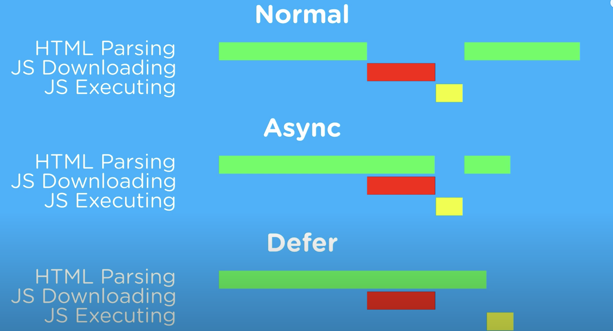

<div style="font-size: 17px;background: black;padding: 2rem;">

# Repaint vs Reflow

A <span style="color: Khaki;">Repaint</span> occurs when changes are made to an elements skin that changes visibility, but do not affect its layout. Examples of this include `outline`, `visibility`, `background-color`, `border-color`, `color`, `background-image`. Repaint is merely the changing of pixels on the monitor.

`opacity` and `transform` won't trigger even repaint. They'll just trigger <span style="color: DeepSkyBlue;">recomposting</span>.

<span style="color: LawnGreen;">Reflow</span> means re-calculating the positions and geometries of elements in the document. It is triggered when changes are made to the structure of the DOM, such as adding, removing, or modifying elements, or when CSS styles that affect layout (such as dimensions, positioning, or visibility) are modified. Reflow of the element will cause the subsequent reflow of all the child and ancestor elements in the DOM. Accessing layout properties of elements, such as `offsetWidth`, `clientWidth`, `getComputedStyle()`, or `getBoundingClientRect()`, will also trigger reflow immediately to return the correct value. Generally, all APIs that synchronously provide layout metrics will trigger forced reflow / layout. Reflow is very expensive in terms of performance, and is one of the main causes of slow DOM scripts, especially on devices with low processing power, such as phones. In many cases, they are equivalent to laying out the entire page again. <a href="https://csstriggers.com/">Click here</a> to know which CSS property causes repaint and which one causes reflow</a>

<h3 style="border-bottom: 2px solid white; padding-bottom: 2px; display: inline-block;">Minimize repaints and reflows</h3>

- <b style="color: Aquamarine;">Batch DOM Manipulations</b>: If multiple changes are needed in the DOM, perform them all at once rather than individually. To do that, we can choose following options:

  - Use a <b style="color: Gold;">documentFragment</b> to hold temp changes.
  - Use <b style="color: Khaki;">template</b> elements.
  - Clone, update, replace the node.
  - Hide the element with `display: none` (1 reflow, 1 repaint), add 100 changes, restore the display (total 2 reflow, 2 repaint).

  ```js
  // ❌ Don't do like this
  for (let i = 1; i <= 100; i++) {
    const newEle = document.createElement("p");
    newEle.textContent = "newly created paragraph element";
    document.body.appendChild(newEle);
  }

  // ✅ Insted do like this
  const docFrag = document.createDocumentFragment();
  for (let i = 1; i <= 100; i++) {
    const newEle = document.createElement("p");
    newEle.textContent = "newly created paragraph element";
    docFrag.appendChild(newEle);
  }
  document.body.appendChild(docFrag);
  ```

- <b style="color: Aquamarine;">Batch CSS manipulations</b>: Don't change styles by multiple statements, instead:

  - Add `class`
  - Change <b style="color: Violet;">cssText</b>

- <b style="color: Aquamarine;">Cache Layout Properties</b>: If you need to access layout properties (e.g., offsetWidth, offsetHeight) multiple times, cache the values to avoid triggering reflows each time you access them.
- <b style="color: Aquamarine;">Use CSS Transitions or Animations</b>: Instead of directly modifying CSS properties with JavaScript, leverage CSS transitions or animations for smoother visual effects. This offloads the work to the browser's rendering engine, which can optimize performance. Also, <span style="color: Coral;">prefer `transform` and `opacity` for animations instead of properties like `width`, `height`, or `margin`</span>.
- <b style="color: Aquamarine;">Use CSS Flexbox or Grid Layouts</b>: Certain CSS properties (e.g., `flexbox`, `grid`) are optimized for performance compared to older layout models (e.g., `float`, `inline-block`).
- <b style="color: Aquamarine;">Reduce DOM depth</b>: Changes at one level in the DOM tree can cause changes at every level of the tree. This leads to more time being spent performing reflow.
- <b style="color: Aquamarine;">Avoid unnecessary complex CSS selectors</b>: descendant selectors in particular - which require more CPU power to do selector matching.

<h3 style="border-bottom: 2px solid white; padding-bottom: 2px; display: inline-block;">Render Blocking Resources</h3>

Render-blocking resources are external files (such as CSS and JavaScript) that prevent the browser from rendering the visible part of a webpage until they are fully loaded and processed. These resources can delay the initial display of content to the user, leading to slower page load times and potentially a poorer user experience. Here are the common types of render-blocking resources:

- <b style="color: SandyBrown;">CSS</b>: External CSS files that are included in the `<head>` section of an HTML document can block rendering because the browser needs to download and parse the CSS for construction of CSSOM before it can render the layout of the page. This delay can be particularly noticeable if the CSS file is large or contains critical styles needed to render above-the-fold content.
- <b style="color: SandyBrown;">Fonts</b>: External font files (e.g., Google Fonts) can be render-blocking if they are included in the `<head>` section of the HTML document. The browser needs to download and process the font files before it can render text with those fonts, which can delay the display of text content on the page.

<h3 style="border-bottom: 2px solid white; padding-bottom: 2px; display: inline-block;">Parser Blocking Resource</h3>

The resources that prevent the browser's HTML parser from continuing to parse and construct the Document Object Model (DOM) until they are fully downloaded and processed are called Parser Blocking Resources.

For example - A `<script>` element without `async` or `defer` attributes. When the parser encounters a `<script>` element, the browser needs to evaluate and execute the script before proceeding with parsing the rest of the HTML. This is by design, as scripts may modify or access the DOM during a time while it is still being constructed.

```html
<!-- This is a parser-blocking script: -->
<script src="/script.js"></script>
```

<b style="color: red;">Note:</b> A parser-blocking `<script>` must also wait for any in-flight render-blocking CSS resources to arrive and be parsed before the browser can execute it. This is also by design, as a script may access styles declared in the render-blocking style sheet (for example, by using `element.getComputedStyle()`).

<div style="border: 2px solid yellow; padding: 10px;">
<h3><u>Difference between Render Blocking Resources and Parser Blocking Resources</u></h3>

Imagine an HTML page has two `<script src="...">` elements. The parser sees the first one. It has to stop\* parsing while it fetches and then executes the javascript, because it might contain `document.write()` method calls that fundamentally change how the subsequent markup is to be parsed. Fetching resources over the internet is comparatively much slower than the other things the browser does, so it sits waiting with nothing to do. Eventually the JS arrive, executes and the parser can move on. It then sees the second `<script src="...">` tag and has to go through the whole process of waiting for the resource to load again. It's a sequential process, and that's parser blocking.

CSS resources are different. When the parser sees a stylesheet to load, it issues the request to the server, and moves on. If there are other resources to load, these can all be fetched in parallel (subject to some HTTP restrictions). But only when the CSS resources are loaded and ready can the page be painted on the screen. That's render blocking, and because the fetches are in parallel, it's a less serious slow down.

</div>

<br>

# Async & Differ

In modern websites, scripts are often “heavier” than HTML: their download size is larger, and processing time is also longer.

When the browser loads HTML and comes across a `<script>...</script>` tag, it can’t continue building the DOM. It must execute the script right now. The same happens for external scripts `<script src="..."></script>`: the browser must wait for the script to download, execute the downloaded script, and only then can it process the rest of the page. That leads to two important issues:

1. Scripts can’t see DOM elements below them, so they can’t add handlers etc.
2. If there’s a bulky script at the top of the page, it “blocks the page”. Users can’t see the page content till it downloads and runs:

```html
<p>...content before script...</p>

<script src="https://javascript.info/article/script-async-defer/long.js?speed=1"></script>

<!-- This isn't visible until the script loads -->
<p>...content after script...</p>
```

There are some workarounds to that. For instance, we can put a script at the bottom of the page. Then it can see elements above it, and it doesn’t block the page content from showing. But this solution is far from perfect. For example, the browser notices the script (and can start downloading it) only after it downloaded the full HTML document. For long HTML documents, that may be a noticeable delay. Such things are invisible for people using very fast connections, but many people in the world still have slow internet speeds and use a far-from-perfect mobile internet connection.

Luckily, there are two `<script>` attributes that solve the problem for us: <b style="color: Chartreuse;">defer</b> and <b style="color: Chartreuse;">async</b>.

<h3 style="border-bottom: 2px solid white; padding-bottom: 2px; display: inline-block;">Defer</h3>

The `defer` attribute tells the browser not to wait for the script. Instead, the browser will continue to process the HTML, build DOM. The script loads “in the background”, and then runs when the DOM is fully built.

Here’s the same example as above, but with `defer`:

```html
<p>...content before script...</p>

<script defer src="https://javascript.info/article/script-async-defer/long.js?speed=1"></script>

<!-- visible immediately -->
<p>...content after script...</p>
```

In other words:

- Scripts with `defer` never block the page.
- Scripts with `defer` always execute when the DOM is ready (but before `DOMContentLoaded` event). This ensures that if your script needs to interact with the DOM or if it relies on other scripts that are also deferred, it will work as expected.

The following example demonstrates the second part:

```html
<p>...content before scripts...</p>

<script>
  document.addEventListener("DOMContentLoaded", () => alert("DOM ready after defer!"));
</script>

<script defer src="https://javascript.info/article/script-async-defer/long.js?speed=1"></script>

<p>...content after scripts...</p>
```

1. The page content shows up immediately.
2. `DOMContentLoaded` event handler waits for the deferred script. It only triggers when the script is downloaded and executed.

<b style="color: red;">Deferred scripts keep their relative order, just like regular scripts.</b>

Let’s say, we have two deferred scripts: the `long.js` and then `small.js`:

```html
<script defer src="https://javascript.info/article/script-async-defer/long.js"></script>
<script defer src="https://javascript.info/article/script-async-defer/small.js"></script>
```

Browsers scan the page for scripts and download them in parallel, to improve performance. So in the example above both scripts download in parallel. The `small.js` probably finishes first. But the `defer` attribute, besides telling the browser “not to block”, ensures that the relative order is kept. So even though `small.js` loads first, it still waits and runs after `long.js` executes. That may be important for cases when we need to load a JavaScript library and then a script that depends on it.

<h3 style="border-bottom: 2px solid white; padding-bottom: 2px; display: inline-block;">Async</h3>

The `async` attribute is somewhat like `defer`. It also makes the script non-blocking. But it has important differences in the behavior:

- `async` scripts execute as soon as they are downloaded, which is not necessarily in the order in which they appear in the document. Other scripts don’t wait for `async` scripts, and `async` scripts don’t wait for them.
- `DOMContentLoaded` and `async` scripts don’t wait for each other:
  - `DOMContentLoaded` may happen both before an `async` script (if an `async` script finishes loading after the page is complete). <b style="color: Yellow;">That means DOM generation might not be complete and `async` script will still start execution as soon as its download is completed. While `defer` waits for DOM construction to complete.</b>
  - …or after an `async` script (if an `async` script is short or was in HTTP-cache)

In other words, `async` scripts load in the background and run when ready. The DOM and other scripts don’t wait for them, and they don’t wait for anything. A fully independent script that runs when loaded.

Since `async` scripts can load at any time, they may attempt to interact with DOM elements that are not yet loaded, leading to errors. `defer` scripts wait until the DOM is ready, making them a safer bet for scripts that need to manipulate the DOM.

Async scripts are great when we integrate an independent third-party script into the page: counters, ads and so on, as they don’t depend on our scripts, and our scripts shouldn’t wait for them.

<b style="color: Aquamarine;">Both async & defer attributes are only for external scripts. They are ignored if the script tag has no src.</b>

<h3 style="border-bottom: 2px solid white; padding-bottom: 2px; display: inline-block;">Dynamic scripts</h3>

There’s one more important way of adding a script to the page.

We can create a script and append it to the document dynamically using JavaScript:

```js
let script = document.createElement("script");
script.src = "/article/script-async-defer/long.js";
document.body.append(script); // (*)
```

Dynamic scripts behave as `async` by default. This can be changed if we explicitly set `script.async=false`. Then scripts will be executed in the document order, just like `defer`.


<br><br>

<div style="border: 1px solid yellow; padding: 10px;">
⚠️ <b> Page without scripts should be usable</b>

<br>

Please note: if you’re using `defer` or `async`, then user will see the page before the script loads.

In such case, some graphical components are probably not initialized yet.

Don’t forget to put “loading” indication and disable buttons that aren’t functional yet. Let the user clearly see what he can do on the page, and what’s still getting ready.

</div>

<br>

# Lazy Loading

According to the <a href="https://httparchive.org/reports/page-weight">HTTP Archive</a>, images are the most-requested asset type for most websites, and they usually take up more bandwidth than any other resource. At the 90th percentile, sites send over 5 MB of images on desktop and mobile.

Previously, there were two ways to defer the loading of off-screen images:

- Using the **Intersection Observer API**
- Using `scroll`, `resize`, or `orientationchange` event handlers

Either option can let developers include lazy loading behavior, and many developers have built third-party libraries to provide abstractions that are even easier to use.

With lazy loading supported directly by the browser, however, there's no need for an external library. Browser-level lazy loading also ensures that loading of images still works even if the client disables JavaScript. Note however that loading is only deferred when JavaScript is enabled.

The <span style="color: HotPink;">loading</span> attribute is an HTML attribute that lets you control when an image (or iframe) should be loaded by the browser. It was introduced as a native, declarative way to implement lazy loading without having to write custom JavaScript.

- <b style="color:Khaki;">Lazy Loading: </b>When you set `loading="lazy"` on an `` element, you tell the browser to defer loading the image until it’s near the viewport (i.e., when the user is about to see it). This is particularly useful for pages with many images or below-the-fold content, as it reduces initial load time and saves bandwidth.

- <b style="color:Khaki;">Eager Loading: </b>Conversely, `loading="eager"` (which is also the default behavior if the attribute is omitted) instructs the browser to load the image immediately, regardless of whether it’s in the visible area.

```html

```

In this example, the browser will postpone loading `example.jpg` until it’s about to appear on the user’s screen.

**<u>BENEFITS:</u>**

- **Improved Performance:** By loading images only when needed, pages can render faster. This improves metrics like First Contentful Paint (FCP) and Largest Contentful Paint (LCP).
- **Reduced Data Usage:** Users, especially on mobile networks, benefit because images that aren’t immediately needed aren’t downloaded right away.
- **Simpler Implementation:** Before the advent of the loading attribute, developers often had to implement lazy loading with JavaScript (using techniques like the Intersection Observer API). 

<b style="color:red;">Caution:</b> Don't lazy-load images that are likely to be in-viewport when the page loads, especially LCP images.

<div style="border: 1px solid yellow; padding: 10px; background-color: rgba(6, 84, 17, 0.48);">

While the browser loads an image, it doesn't immediately know the image's dimensions, unless they're explicitly specified. To let the browser reserve enough space on a page for images, and avoid disruptive layout shifts, it is recommended to add `width` and `height` attributes to all `` tags. Alternatively, specify their values directly in an inline style.

The best practice of setting dimensions applies to `` tags regardless of whether you're lazy loading them, but lazy loading can make it more important.

Lazy loading in Chromium is implemented in a way that makes images more likely to be loaded as soon as they're visible, but there's still a chance that they won't load at the right time. If that happens, not specifying width and height on your images increases their impact on Cumulative Layout Shift. If you can't specify your images' dimensions, lazy loading them can save network resources at the risk of these increased layout shifts.

In most scenarios, images still lazy load if you don't specify dimensions, but there are a few edge cases you should be aware of. Without `width` and `height` specified, image dimensions default to 0×0 pixels. If you have a gallery of images, the browser might decide that all of them fit inside the viewport at the start, because each image takes up no space and no image is pushed offscreen. In this case, the browser decides to load everything, making the page load more slowly.

</div>

<h3 style="border-bottom: 2px solid white; padding-bottom: 2px; display: inline-block;">fetchpriority attribute</h3>

The `eager` value is an instruction to load the image as usual, without delaying the load further if the image is off-screen. It doesn't load the image faster than another image that doesn't have a `loading` attribute.

If you want to increase the fetch priority of an important image (for example, the LCP image), use `Fetch Priority` with `fetchpriority="high"`.

An image with `loading="lazy"` and `fetchpriority="high"` is still delayed while it's off-screen, and then fetched with a high priority when it's almost within the viewport. This combination isn't really necessary because the browser would likely load that image with high priority anyway.

<h3 style="border-bottom: 2px solid white; padding-bottom: 2px; display: inline-block;">content-visibility</h3>

`content-visibility` is a CSS property that allows the browser to skip rendering an element and its children until they are needed. This can significantly improve page performance by reducing rendering and layout calculations for offscreen content.

```css
.element {
  content-visibility: auto; /* or visible, hidden */
}
```

<u>**Values:**</u>

- `visible` (default): The element and its children are fully rendered.
- `hidden`: The element and its children are not rendered at all (similar to display: none but without affecting layout).
- `auto`: The browser determines whether to render the element based on whether it is visible in the viewport. If it's offscreen, rendering is deferred, improving performance.

<u>**Example:**</u>

```css
.lazy-load {
  content-visibility: auto;
  contain-intrinsic-size: 500px; /* Placeholder size to avoid layout shifts */
}
```

This ensures that offscreen elements don’t impact initial rendering while preventing layout shifts when they appear.

<br>

# Resource Hints

Resource hints are HTML markup attributes that provide hints or directives to the browser, guiding its behavior in handling external resources such as CSS files, JavaScript files, fonts, images, and other assets. These hints allow developers to optimize the loading process, improve performance, and enhance the user experience of web pages.

Resource hints are typically specified using the <b style="color: Chartreuse;">rel</b> attribute on `<link>` and `<script>` elements, and they inform the browser about how to handle the loading, prioritization, and processing of external resources. There are several types of resource hints, each serving a specific purpose:

<h3 style="border-bottom: 2px solid white; padding-bottom: 2px; display: inline-block;">1. preconnect</h3>

Establishes an early connection to a specified origin (domain) before the browser actually requests any resources from that origin. Includes actions such as DNS resolution, TCP connection setup, and TLS negotiation to reduce latency for subsequent requests to resources hosted on that origin. For example, you may be hosting your images or assets on a CDN or other cross-origin:

```html
<link rel="preconnect" href="https://example.com" />
```

By using this hint, you anticipate that the browser plans to connect to a specific cross-origin server in the very near future, and that the browser should open that connection as soon as possible, ideally before waiting for the HTML parser or preload scanner to do so.

If you have a large amount of cross-origin resources on a page, use it for those resources which are the most critical to the current page.

A common use case for preconnect is `Google Fonts`. `Google Fonts` recommends that you preconnect to the https://fonts.googleapis.com domain that serves the `@font-face` declarations and to the https://fonts.gstatic.com domain that serves the font files.

```html
<link rel="preconnect" href="https://fonts.googleapis.com" /> <link rel="preconnect" href="https://fonts.gstatic.com" crossorigin />
```

The <span style="color: Cyan;">crossorigin</span> attribute is used to indicate whether a resource must be fetched using Cross-Origin Resource Sharing (CORS). When using the `preconnect` hint, if the resource being downloaded from the origin uses CORS—such as font files—then you need to add the `crossorigin` attribute to the `preconnect` hint.

<b style="color: red;">Caution:</b> If you omit the `crossorigin` attribute, the browser opens a new connection when it downloads the font files, and doesn't reuse the connection opened with the `preconnect` hints.

<h4><u>Example use case:</u></h4>

```html
<!-- Preconnect to a CDN origin -->
<link rel="preconnect" href="https://cdn.example.com" />

<!-- Example CSS file hosted on the CDN -->
<link rel="stylesheet" href="https://cdn.example.com/styles.css" />

<!-- Example JavaScript file hosted on the CDN -->
<script src="https://cdn.example.com/script.js" defer></script>
```

- The `<link rel="preconnect">` tag is used to instruct the browser to preconnect to the CDN origin (`https://cdn.example.com`). This initiates early network-related tasks such as DNS resolution, TCP connection setup, and TLS negotiation for the specified origin.
- The HTML document also includes links to external resources hosted on the CDN, such as a CSS file (`styles.css`) and a JavaScript file (`script.js`). These resources are fetched after the preconnection to the CDN origin is established.
- The JavaScript file is included with the `defer` attribute, which ensures that it is executed after the HTML document is parsed. However, since the browser has already preconnected to the CDN origin, the connection setup overhead for fetching the JavaScript file is reduced.

<h3 style="border-bottom: 2px solid white; padding-bottom: 2px; display: inline-block;">2. dns-prefetch</h3>

While opening connections to cross-origin servers early can significantly improve initial page load time, it may not be either reasonable or possible to establish connections to many cross-origin servers at once. If you're concerned that you may be overusing preconnect, a much less costly resource hint is the <b style="color:Tomato;">dns-prefetch</b> hint.

Per its name, dns-prefetch doesn't establish a connection to a cross-origin server, but rather just performs the DNS lookup for it ahead of time. A DNS lookup occurs when a domain name is resolved to its underlying IP address. While layers of DNS caches at the device and network levels help to make this a generally fast process, it still takes some amount of time.

```html
<link rel="dns-prefetch" href="https://fonts.googleapis.com" /> <link rel="dns-prefetch" href="https://fonts.gstatic.com" />
```

DNS lookups are fairly inexpensive, and because of their relatively small cost, they may be a more appropriate tool in some cases than a `preconnect`. In particular, it may be a desirable resource hint to use in cases of links that navigate to other websites that you think the user is likely to follow.

<b style="color: orange;"><i>dns-prefetch = DNS <br> preconnect = DNS + TCP + TLS</i></b>

<h3 style="border-bottom: 2px solid white; padding-bottom: 2px; display: inline-block;">3. prefetch</h3>

The <span style="color: Yellow;">prefetch</span> directive is used to initiate a low priority request for a resource likely to be used for future navigations. This directive largely follows the same format as the `preload` directive, only the `<link>` element's `rel` attribute uses a value of `"prefetch"` instead. Unlike the `preload` directive, however, `prefetch` is largely speculative in that you're initiating a fetch for a resource for a future navigation that may or may not happen.

There are times when `prefetch` can be beneficial—for example, if you've identified a user flow on your website that most users follow to completion, a `prefetch` for a render-critical resource for those future pages can help to reduce load times for them.

<b style="color: Red;">Note</b>: Given the speculative nature of `prefetch`, its use comes with the potential downside that data used to fetch the resource may go unused if the user does not navigate to the page that ends up needing the prefetched resource. Rely on your analytics or other data sources for your website's usage patterns to decide for yourself if using `prefetch` is a good idea. Prerendering can be beneficial for scenarios where the user's next action is predictable, such as clicking on a link, and can provide a seamless transition to the next page by reducing perceived load times.

<h3 style="border-bottom: 2px solid white; padding-bottom: 2px; display: inline-block;">4. preload</h3>

Preloading resources using the <b style="color: Violet;">preload</b> resource hint allows developers to instruct the browser to fetch and load critical resources as soon as possible, even before they are needed by the rendering process. This can significantly improve the perceived performance of a web page by ensuring that essential resources are available when required.

Unlike `prefetch`, which is speculative, `preload` is declarative—it signals that the resource is definitely needed soon (e.g., for rendering the above-the-fold content). The browser downloads it immediately.

```html
<link rel="preload" href="styles.css" as="style" />
<link rel="preload" href="script.js" as="script" />
<link rel="preload" href="/lcp-image.jpg" as="image" />
```

- The `<link rel="preload">` tag is used to instruct the browser to preload 3 critical resources
- The <b style="color: HotPink;">as</b> attribute specifies the type of resource being preloaded.

<b style="color: LightSalmon;">Important</b>: A resource specified in a `preload` directive is downloaded twice if the `as` attribute is missing on the directive's `<link>` element. For a list of `as` attribute values, consult the <a href="https://developer.mozilla.org/docs/Web/HTML/Attributes/rel/preload#what_types_of_content_can_be_preloaded">MDN documentation on as attribute values</a>.

<b style="color: Red;">🚨 Caution 🚨</b>: If you are using preload to download an image specified by an `` element that varies based on the user's viewport, be sure to add the `srcset` attribute to the preload hint to download the correct image for the current viewport. You should also exclude the src attribute so browsers that don't support responsive preloading don't download the fallback image.

Similarly to `preconnect`, the `preload` directive requires the `crossorigin` attribute if you are preloading a CORS resource—such as fonts. If you don't add the `crossorigin` attribute—or add it for non-CORS requests—then the resource is downloaded by the browser twice, wasting bandwidth that could have been better spent on other resources.

It's important to note that while preloading resources can improve performance, it should be used judiciously and selectively for critical resources that are required for the initial page load. Overuse of preload hints for non-critical resources may lead to unnecessary network requests and increased server load.

<h3 style="border-bottom: 2px solid white; padding-bottom: 2px; display: inline-block;">5. prerender</h3>

This hint instructs the browser to fully render a page in the background, including downloading resources and executing scripts, so it’s ready to display instantly if the user navigates to it. The browser treats the hinted URL as if the user has already clicked the link, preparing the entire page in a hidden tab or buffer. It is best for pages with a high likelihood of being visited next (e.g., a checkout page after adding an item to the cart). This is a more aggressive optimization technique compared to preloading or prefetching, as it loads the entire page content.

```html
<link rel="prerender" href="next-page.html">
```

Overall, prerendering offers a powerful optimization technique for improving user experience by minimizing perceived load times and providing seamless transitions between pages. However, it's important to use prerendering judiciously and consider its potential impact on server load and resource consumption. Additionally, browser support for prerendering may vary, so it's essential to test and verify compatibility across different browsers.

<br>

# Document Fragment and template element

A <b style="color:DarkCyan;">DocumentFragment</b> is a lightweight, ephemeral(lasting or used for only a short period of time) DOM node that serves as a container for holding a group of DOM nodes in memory. It is not part of the main DOM tree, meaning it doesn't exist in the document hierarchy. Instead, it acts as a temporary storage area for building and manipulating a set of DOM nodes before appending them to the document.

Here are some key points about `DocumentFragment`:

- <b style="color: Salmon;">Lightweight Container:</b> Unlike regular DOM elements, a `DocumentFragment` does not have any visual representation or impact on the layout of the document. It exists solely in memory.
- <b style="color: Salmon;">Efficient Manipulation:</b> Manipulating a `DocumentFragment` is typically faster and more efficient than directly manipulating the main DOM tree. This is because changes made to a `DocumentFragment` do not trigger reflows or repaints on the document.
- <b style="color: Salmon;">Use Cases:</b>
  - <b style="color: BurlyWood;">Batch DOM Manipulation:</b> When you need to create or modify multiple DOM nodes, it's often better to do so within a `DocumentFragment` to minimize performance overhead.
  - <b style="color: BurlyWood;">Templates:</b> `DocumentFragment` is commonly used when working with templates in JavaScript frameworks. You can build up a template structure within a `DocumentFragment`, manipulate it as needed, and then append the entire fragment to the document.
- <b style="color: Salmon;">Creation:</b> You can create a `DocumentFragment` using the <b style="color: Cyan;">document.createDocumentFragment()</b> method:<br>

  ```js
  var fragment = document.createDocumentFragment();
  ```

- <b style="color: Salmon;">Manipulation:</b> You can append, insert, or remove nodes from a `DocumentFragment` using regular DOM manipulation methods such as `appendChild()`, `insertBefore()`, or `removeChild()`.
  ```js
  var div = document.createElement("div");
  fragment.appendChild(div);
  ```
- <b style="color: Salmon;">Appending to the Document:</b> Once you've built up the desired structure within the `DocumentFragment`, you can append the entire fragment to the document, which efficiently updates the DOM.
  ```js
  var parentElement = document.getElementById("parent");
  parentElement.appendChild(fragment);
  ```

<h3 style="border-bottom: 2px solid white; padding-bottom: 2px; display: inline-block;">Template element</h3>

A built-in <b style="color: Cyan;">&lt;template&gt;</b> element serves as a storage for HTML markup templates. The browser ignores its contents, only checks for syntax validity, but we can access and use it in JavaScript, to create other elements. It provides a way to declare fragments of HTML markup that are not rendered when the page loads but can be instantiated and inserted into the document dynamically using JavaScript. Also it can be reused multiple times in a document.

The template content is available in its `content` property as a `DocumentFragment` – a special type of DOM node. We can treat it as any other DOM node, except one special property: when we insert it somewhere, its children are inserted instead.

```html
<template id="tmpl">
  <script>
    alert("Hello");
  </script>
  <div class="message">Hello, world!</div>
</template>

<script>
  let elem = document.createElement("div");

  // Clone the template content to reuse it multiple times
  elem.append(tmpl.content.cloneNode(true));

  document.body.append(elem);
  // Now the script from <template> runs
</script>
```

Templates are commonly used in JavaScript applications for generating dynamic content, such as rendering lists, components, or repeating structures. And since templates can be cloned and inserted multiple times, they promote code reusability by allowing you to define and reuse common HTML structures.

<br>

# Image Performance

Images are often the heaviest and most prevalent resource on the web. As a result, optimizing images can significantly improve performance on your website. In most cases, optimizing images means reducing the network time by sending fewer bytes, but you can also optimize the amount of bytes sent to the user by serving images that are properly sized for the user's device. Images can be added to a page using the `` or `<picture>` elements, or the CSS `background-image` property.

<b style="color:red;">STILL TO UNDERSTAND DIFFERENCE BETWEEN IMG WITH SRCSET AND PICTURE ELEMENT</b>

<h3 style="border-bottom: 2px solid white; padding-bottom: 2px; display: inline-block;"><span style="color: HotPink;">&lt;img&gt;</span> with <span style="color: HotPink;">srcset</span>: Browser-Driven Simplicity</h3>

The `` element with the `srcset` attribute is a straightforward way to provide multiple versions of the same image, letting the browser decide which one to use based on factors like screen resolution or viewport size.

**<u>How It Works:</u>**

- You list different image files along with their widths (e.g., `image-400w.jpg 400w, image-800w.jpg 800w`) in the `srcset` attribute.
- The browser picks the most suitable image based on the device’s pixel density (like retina displays) or the viewport width.
- A fallback image is specified in the `src` attribute for browsers that don’t support `srcset`.

**<u>Example:</u>**

```html

```

On a small mobile screen, the browser might choose `medium.jpg`. On a large desktop with a high-resolution display, it might pick `large.jpg`.

<h3 style="border-bottom: 2px solid white; padding-bottom: 2px; display: inline-block;"><span style="color: HotPink;">&lt;picture&gt;</span> Element: Developer-Driven Precision</h3>

The `<picture>` element takes responsiveness to the next level by giving you explicit control over which image is displayed based on specific conditions, like screen size, orientation, or even image format support.

**<u>How It Works:</u>**

- Inside the `<picture>` tag, you use multiple `<source>` elements, each with a media attribute (a CSS media query) and a srcset attribute (the image to load if the condition matches).
- The browser evaluates the `<source>` elements in order and selects the first one that matches the device’s conditions.
- If no `<source>` matches, it falls back to the `` element inside the `<picture>`.

**<u>Example:</u>**

```html
<picture>
  <source media="(min-width: 800px)" srcset="large.jpg">
  <source media="(min-width: 600px)" srcset="medium.jpg">
  
</picture>
```

If the screen is wider than `800px`, `large.jpg` loads. Between `600px` and `800px`, it’s `medium.jpg`. Below `600px`, it falls back to `small.jpg`.


<br>

# Search Engine Optimization (SEO)

<span style="color: Chartreuse;">Search engine optimization (SEO)</span> is the art and science of getting pages to rank higher in search engines such as Google. Because search is one of the main ways in which people discover content online, ranking higher in search engines can lead to an increase in traffic to a website.

In Google and other search engines, the results page often features paid ads at the top of the page, followed by the regular results or what search marketers call the "organic search results". Traffic that comes via SEO is often referred to as "organic search traffic" to differentiate it from traffic that comes through paid search. Paid search is often referred to as search engine marketing (SEM) or pay-per-click (PPC).

Search engine optimization is a key part of online marketing because search is one of the primary ways that users navigate the web. 

Search results are presented in an ordered list, and the higher up on that list a site can get, the more traffic the site will tend to receive. For example, for a typical search query, the number one result will receive 40-60% of the total traffic for that query, with the number two and three results receiving significantly less traffic. Only 2-3% of searchers click beyond the first page of search results. Thus, even a small improvement in search engine rankings can result in a website receiving more traffic and potentially business.

Because of this, many businesses and website owners will try to manipulate the search results so that their site shows up higher on the <span style="color: Yellow;">Search Engine Results Page (SERP)</span> than their competitors. This is where SEO comes in.

<u>Dwell Time: </u>Dwell Time is the amount of time that a Google searcher spends on a page from the search results before returning back to the SERPs. Many SEO professionals consider Dwell Time an important Google ranking signal.

<u>Bounce Rate: </u>Bounce Rate is defined as the percentage of visitors that leave a webpage without taking an action, such as clicking on a link, filling out a form, or making a purchase.

<h4><u>SEO Techniques</u></h4>

- <b style="color: LawnGreen;">Keyword Research</b>: Identifying the keywords and phrases that users are searching for related to your business, products, or services. Keyword research helps determine which terms to target in your content and optimization efforts. Additionally, consider using tools like <span style="color: Cyan;">Google Trends</span> or <span style="color: Lime;">Ahrefs</span> to better understand popular topics and your audience’s search intent.
- <b style="color: LawnGreen;">On-Page Optimization:</b>
    - <b style="color: PaleGreen;">Title Tags and Meta Descriptions</b>: Title tags and meta descriptions are HTML elements that give context to a page’s content. A title tag appears on the search engine result as clickable headlines, while a meta description offers short snippets about what readers can expect to find on the page. Optimize title tags to include target keywords and accurately describe the content of the page and write compelling meta descriptions that entice users to click through to the page from search results.
    - <b style="color: PaleGreen;">Headings (H1, H2, etc.)</b>: They are HTML elements that give structure and meaning to a web page’s content, helping search engines understand its contents. Header tags consist of `<h1>` to `<h6>` HTML elements. Focus on your `<h1>` and `<h2>` tags since they are commonly used for the content’s title and headings. List your keywords and include them in these tags accordingly.
    - <b style="color: PaleGreen;">URL Structure</b>: An SEO-friendly URL should be easy to read, simple to understand, and related to the page’s context. Create SEO-friendly URLs that include target keywords and describe the content of the page.
    - <b style="color: PaleGreen;">Internal Linking</b>: Internal linking is a process of adding hyperlinks within your content to other pages or posts on your website to improve navigation and distribute link equity. This creates a web of interlinked content and helps search engines recognize the structure and relevance of each page.
- <b style="color: LawnGreen;">Off-Page Optimization</b>:
    - <b style="color: PaleGreen;">Link Building</b>: Backlinks, also known as inbound links or incoming links, are links from one website to another. In the context of SEO, backlinks are important because they are seen as a vote of confidence or trust from one website to another. Search engines like Google consider backlinks as one of the key factors in determining a website's authority, relevance, and credibility.
    - <b style="color: PaleGreen;">Social Signals</b>: Engaging with social media platforms to promote content, attract traffic, and build brand awareness.
    - <b style="color: PaleGreen;">Online Reputation Management</b>: Monitoring and managing online reviews, mentions, and references to maintain a positive online reputation.
- <b style="color: LawnGreen;">Content</b>: Create valuable, informative, and unique content that satisfies user intent and provides answers to their queries. And make sure content is up-to-date.
- <b style="color: LawnGreen;">Technical SEO</b>:
    - <b style="color: PaleGreen;">Site Structure</b>: Ensuring a logical and crawlable site structure that allows search engines to discover and index all pages.
    - <b style="color: PaleGreen;">Page Speed Optimization</b>: Optimizing page loading times to improve user experience and search engine rankings. <span style="color: Cyan;">Core Web Vitals</span> are used by Google to measure user experience. They measure a page’s load time, interactivity, and the stability of the content as it loads. Google highly recommends in its own documentation that site owners optimize them.
    - <b style="color: PaleGreen;">Mobile-Friendliness</b>: Ensuring that websites are optimized for mobile devices to accommodate mobile users and comply with Google's mobile-first indexing.
    - <b style="color: PaleGreen;">Crawlability and Indexability</b>: Removing crawl errors, fixing broken links, and ensuring that important pages are indexed by search engines.
    - <b style="color: PaleGreen;">Schema Markup</b>: Implementing schema markup to provide search engines with additional context about the content of web pages.

<br>

# <a href="https://web.dev/articles/vitals">Core Web Vitals</a>

<span style="color: Violet;">Web Vitals</span> is a Google initiative to provide unified guidance for web page quality signals that are essential to delivering a great user experience on the web. <span style="color: Orange;">Core Web Vitals</span> are the subset of Web Vitals. Core Web Vitals (CWVs) are a set of three metrics that measure a webpage's speed, interactivity, and visual stability. These metrics are important for ranking in search engine optimization (SEO). Improving CWVs can help a website rank higher in search results and improve user experience.

CWVs focus on three key aspects of web performance: loading, interactivity, and visual stability. Core Web Vitals are intended to help website owners and developers understand and improve the user experience of their websites, particularly in terms of speed, responsiveness, and stability.

The three Core Web Vitals metrics are:

<h4><u>1. Largest Contentful Paint (LCP):</u></h4>

- LCP measures the loading performance of a web page by identifying the time it takes for the largest content element (such as an image or text block) to become visible within the viewport. The types of elements considered for Largest Contentful Paint are:
    - `` elements (the first frame presentation time is used for animated content such as GIFs or animated PNGs)
    - `<image>` elements inside an `<svg>` element
    - `<video>` elements (the poster image load time or first frame presentation time for videos is used—whichever is earlier)
    - An element with a background image loaded using the url() function, (as opposed to a CSS gradient)
    - Block-level elements containing text nodes or other inline-level text element children.
- A fast LCP indicates that the main content of the page loads quickly, improving the overall user experience. <span style="color: LawnGreen;">Google recommends an LCP of 2.5 seconds or less is good user experience, 2.5 - 4 needs improvement and more than 4 is poor.</span>

<h4><u>2. Cumulative Layout Shift (CLS):</u></h4>

- CLS is a measure of the largest burst of layout shift scores for every unexpected layout shift that occurs during the lifespan of a page. A layout shift occurs any time a visible element changes its position from one rendered frame to the next. Unexpected movement of page content usually happens when resources load asynchronously or DOM elements are dynamically added to the page before existing content. The cause of the movement might be an image or video with unknown dimensions, a font that renders larger or smaller than its fallback, or a third-party ad or widget that dynamically resizes itself.
- A low CLS ensures that page content remains stable and predictable, preventing frustrating user experiences caused by elements shifting unexpectedly. <span style="color: LawnGreen;">Google recommends a CLS score of 0.1 or less is good user experience, 0.1 to 0.25 needs improvement and beyond 0.25 is poor.</span>

<h4><u>3. Interaction to Next Paint (INP)</u></h4>

- This metric that assesses page responsiveness using data from the Event Timing API. INP observes the latency of all click, tap, and keyboard interactions with a page throughout its lifespan, and reports the longest duration, ignoring outliers. A low INP means the page is consistently able to respond quickly to the vast majority of user interactions. <span style="color: LawnGreen;">Less than 200 milliseconds means good responsiveness, 200-500 is avg and above 500 means poor responsiveness.</span>
- Some interactions naturally take longer than others, but for especially complex interactions, it's important to quickly present some initial visual feedback to tell the user something is happening. The time until the next paint is the earliest opportunity to do this. Therefore, the intent of INP is to measure not all the eventual effects of the interaction (such as network fetches and UI updates from other asynchronous operations), but the time in which the next paint is blocked. By delaying visual feedback, you make users think the page isn't responding to their actions.

<div style="border: 1px solid yellow; padding: 10px;">
Initially FID (First Input Delay) was 3rd metric of CWV. But Google replaced it with Interaction to Next Paint (INP) in March 2024.
<h4><u>First Input Delay (FID):</u></h4>

- FID measures the responsiveness of a web page by quantifying the delay between when a user interacts with the page (e.g., clicks a button or taps a link) and when the browser responds to that interaction.
- A low FID ensures that the page is responsive to user input, providing a smooth and interactive browsing experience. Google recommends an FID of 100 milliseconds or less for a good user experience.

INP is the successor metric to First Input Delay (FID). While both are responsiveness metrics, FID only measured the input delay of the first interaction on a page. INP improves on FID by considering all page interactions, beginning from the input delay, to the time it takes to run event handlers, and finally up until the browser has painted the next frame.

These differences mean that both INP and FID are different types of responsiveness metrics. Where FID was a load responsiveness metric designed to assess the page's first impression on the user, INP is a more reliable indicator of overall responsiveness, regardless of when in the life of a page interactions occur.
</div>

<br>

Web developers and site owners can use tools like Google PageSpeed Insights, Google Search Console, and Lighthouse to measure and monitor their website's Core Web Vitals performance, identify areas for improvement, and optimize their websites accordingly.

</div>

<!-- <div style="font-size: 17px;background: black;padding: 2rem;"> -->
<!-- <div style="background: DarkRed;padding: 0.3rem 0.8rem;"> [HIGHLIGHT] -->
<!-- <h3 style="border-bottom: 2px solid white; padding-bottom: 2px; display: inline-block;"> [SUBHEADING] -->
<!-- <b style="color: Chartreuse;"> [NOTE] -->
<!-- <b style="color:red;"> [NOTE-2] -->
<!-- <span style="color: Cyan;"> [IMP] -></span> -->
<!-- <b style="color: Salmon;"> [POINT] -->
<!-- <div style="border: 1px solid yellow; padding: 10px;"> [BORDER] -->
