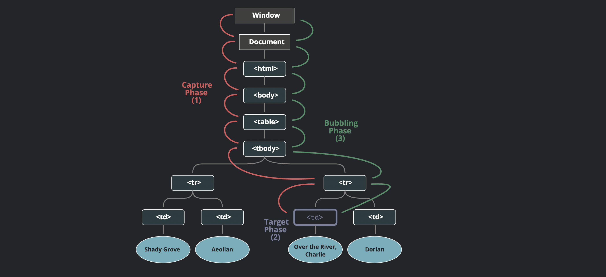

<div style="font-size: 17px;background: black;padding: 2rem;">

# Events

<b>An event is a signal that something has happened. All DOM nodes generate such signals (but events are not limited to DOM).</b><br>
Here’s a list of the most useful DOM events, just to take a look at:

- `click` – when the mouse clicks on an element (touchscreen devices generate it on a tap).
- `mouseover` / `mouseout` – when the mouse cursor comes over / leaves an element.
- `mousedown` / `mouseup` – when the mouse button is pressed / released over an element.
- `mousemove` – when the mouse is moved.

<b style="color: Crimson;">LIST OF ALL IMPORTANT JS EVENTS - <a href="https://www.w3schools.com/jsref/dom_obj_event.asp">Click Here!</a></b>

## Event Handlers

An event handler is a piece of JavaScript code that specifies what should happen when a particular event occurs. It's a function associated with an event that gets executed in response to that event being triggered. Event handlers are used to add interactivity and behavior to web pages. There are several ways to assign a handler.

<h3 style="border-bottom: 2px solid white; padding-bottom: 2px; display: inline-block;">1. HTML-attribute method</h3>

A handler can be set in HTML with an attribute named `on<event>`. For instance, to assign a `click` handler for an `input`, we can use `onclick`, like here:

```html
<input value="Click me" onclick="alert('Click!')" type="button" />
```

On mouse click, the code inside `onclick` runs. An HTML-attribute is not a convenient place to write a lot of code, so we’d better create a JavaScript function and call it there. Here a click runs the function `countRabbits()`:

```html
<script>
  function countRabbits() {
    for (let i = 1; i <= 3; i++) {
      alert("Rabbit number " + i);
    }
  }
</script>

<input type="button" onclick="countRabbits()" value="Count rabbits!" />
```

<h3 style="border-bottom: 2px solid white; padding-bottom: 2px; display: inline-block;">2. DOM Property</h3>

We can assign a handler using a DOM property `on<event>`. For instance, `elem.onclick`:

```js
<input id="elem" type="button" value="Click me">
<script>
  elem.onclick = function() {
    alert('Thank you');
  };
</script>
```

<span style="color: Chartreuse;">To remove a handler – assign `elem.onclick = null`.</span>

<div style="border: 3px solid yellow; padding: 10px;">

The value of `this` inside a handler is the element. The one which has the handler on it. In the code below button shows its contents using this.innerHTML:

```html
<button onclick="alert(this.innerHTML)">Click me</button>
```

<hr>

Don’t use `setAttribute` for handlers. Such a call won’t work:

```js
// a click on <body> will generate errors,
// because attributes are always strings, function becomes a string
document.body.setAttribute("onclick", function () {
  alert(1);
});
```

</div>

<h3 style="border-bottom: 2px solid white; padding-bottom: 2px; display: inline-block;">3. addEventListener</h3>

The fundamental problem of the aforementioned ways to assign handlers is that we can’t assign multiple handlers to one event.

```js
input.onclick = function () {
  alert(1);
};
// ...
input.onclick = function () {
  alert(2);
}; // replaces the previous handler
```

Developers of web standards understood that long ago and suggested an alternative way of managing handlers using the special methods <b style="color: LightSeaGreen;">addEventListener</b> and <b style="color: LightSeaGreen;">removeEventListener</b> which aren’t bound by such constraint.

The syntax to add a handler:

```js
element.addEventListener(event, handler, [options]);
```

- `event`: Event name, e.g. "click".
- `handler`: The handler function.
- `options`: It is optional and it's details are in "Bubbling and Capturing" section.

To remove the handler, use `removeEventListener`:

```js
element.removeEventListener(event, handler, [options]);
```

It's important to remove event listeners when they're no longer needed to avoid memory leaks and collisions of events from components. Modern browsers garbage collect event handlers of removed DOM elements, but legacy browsers like IE don't.

<div style="border: 3px solid lightgreen; padding: 10px;">

<b style="color: Orange;">To remove a handler we should pass exactly the same function as was assigned.</b>

This doesn’t work:

```js
elem.addEventListener( "click" , () => alert('Thanks!'));
// ....
elem.removeEventListener( "click", () => alert('Thanks!'));
The handler won’t be removed, because removeEventListener gets another function – with the same code, but that doesn’t matter, as it’s a different function object.
```

Here’s the right way:

```js
function handler() {
  alert("Thanks!");
}

input.addEventListener("click", handler);
// ....
input.removeEventListener("click", handler);
```

Please note – if we don’t store the function in a variable, then we can’t remove it. There’s no way to “read back” handlers assigned by addEventListener.

</div>

<br>

<div style="border: 1px solid yellow; padding: 10px; background-color: rgba(103, 114, 230, 0.2);">

<span style="color: Yellow;">Event handlers attached using `addEventListener` cannot be removed by `element.eventName = null` (the method we used to remove event handlers in previous method).</span> This is beacuse:

**<u>Separation of Mechanisms:</u>** The `addEventListener` mechanism and the property-based (`element.onclick`) mechanism are managed independently. An event listener added via `addEventListener` does not affect the `onclick` property of the element.

**<u>Internal Storage:</u>** When you use `addEventListener`, the browser stores your handler in an internal list. Setting `element.onclick = null` only affects the handler assigned to the `onclick` property, not those in the internal list created by `addEventListener`.

</div>

<br>

Multiple calls to `addEventListener` allow it to add multiple handlers, like this:

```js
<input id="elem" type="button" value="Click me"/>

<script>
  function handler1() {
    alert('Thanks!');
  };

  function handler2() {
    alert('Thanks again!');
  }

  elem.onclick = () => alert("Hello");
  elem.addEventListener("click", handler1); // Thanks!
  elem.addEventListener("click", handler2); // Thanks again!
</script>
```

<b style="color: Fuchsia;">Event object:</b> To properly handle an event we’d want to know more about what’s happened. Not just a “click” or a “keydown”, but what were the pointer coordinates? Which key was pressed? And so on. When an event happens, the browser creates an event object, puts details into it and passes it as an argument to the handler.

```js
<input type="button" value="Click me" id="elem">

<script>
  elem.onclick = function(event) {
    // show event type, element and coordinates of the click
    alert(event.type + " at " + event.target);
    alert("Coordinates: " + event.clientX + ":" + event.clientY);
  };
</script>
```

Some properties of `event` object:

- <span style="color: DarkOrange;">type</span>: Event type, here it’s `click`.
- <span style="color: DarkOrange;">target</span>: This property refers to the element that originated or triggered the event — i.e., the element where the event actually occurred. Example: If you click a `<button>` inside a `<div>`, and the event listener is attached to the `<div>`, `event.target` will be the `<button>` (the element you clicked), because that’s where the event started.
- <span style="color: DarkOrange;">currentTarget</span>: This property refers to the element to which the event listener is attached — i.e., the element currently handling the event. In the same scenario (clicking a `<button>` inside a `<div>` with a listener on the `<div>`), `event.currentTarget` will be the `<div>`, because that’s where the listener is registered.
- <span style="color: DarkOrange;">clientX / clientY</span>: Window-relative coordinates of the cursor, for pointer events.
- <span style="color: DarkOrange;">timeStamp</span>: The time at which the event was created (in milliseconds since the epoch).

There are more properties. Many of them depend on the event type: keyboard events have one set of properties, pointer events – another one.

<br>

# Bubbling and Capturing

Suppose 3 div elements are nested. And `onclick` handlers are attched to each of them. Now if innermost `div` is clicked, all 3 div tag's click handler will be triggered.

<span style="color: Lime;">Event propagation</span> refers to the process by which events are propagated or transmitted through the DOM (Document Object Model) hierarchy, allowing event handlers to be triggered on multiple elements based on the event's origin and propagation phase. The standard DOM Events describes 3 phases of event propagation:

<b style="color: Salmon;">1. Event Capturing Phase:</b>

- During the capturing phase, the event is first captured by the outermost ancestor element and then propagates down through the DOM hierarchy to the target element where the event originated.
- Event handlers registered using event capturing (by passing `true` as the third parameter to `addEventListener`) are invoked during this phase.
- Capturing phase allows ancestor elements to intercept events before they reach the target element.

<b style="color: Salmon;">2. Event Target Phase:</b>

- Once the event reaches the target element, it enters the target phase.
- Event handlers registered directly on the target element are invoked during this phase.

<b style="color: Salmon;">3. Event Bubbling Phase:</b>

- After the target phase, the event bubbles up through the DOM hierarchy from the target element back to the outermost ancestor element.
- Event handlers registered using event bubbling (**<u>by default behavior</u>** or by passing `false` as the third parameter to `addEventListener`) are invoked during this phase.
- Bubbling phase allows ancestor elements to handle events that were not handled by the target element or its descendants.
  <br>


<br>

```html
<div id="outer">
  <div id="inner">Click me!</div>
</div>
```

```js
// EVENT BUBBLING
const outer = document.getElementById("outer");
const inner = document.getElementById("inner");

outer.addEventListener("click", function (event) {
  console.log("Bubbling: Outer");
});

inner.addEventListener("click", function (event) {
  console.log("Bubbling: Inner");
});
```

```js
// EVENT CAPTURING
const outer = document.getElementById("outer");
const inner = document.getElementById("inner");

outer.addEventListener(
  "click",
  function (event) {
    console.log("Capturing: Outer");
  },
  true
); // Third parameter specifies capturing phase

inner.addEventListener(
  "click",
  function (event) {
    console.log("Capturing: Inner");
  },
  true
); // Third parameter specifies capturing phase
```

<h3 style="border-bottom: 2px solid white; padding-bottom: 2px; display: inline-block;">Stopping Propagation</h3>

The <b style="color:yellow;">event.stopPropagation()</b> method is a mechanism in JavaScript used to stop the propagation of an event through the DOM hierarchy. If it is called inside an event handler during any phase (capturing or bubbling), it immediately stops the propagation of the event, preventing it from reaching further up or down the DOM hierarchy.

For example:

```html
<div onclick="alert('Div was clicked!')">
  <button onclick="handleClick(event)">Click me!</button>
</div>

<script>
  function handleClick(event) {
    event.stopPropagation(); // This prevents the div's onclick from firing
    alert("Button was clicked!");
  }
</script>
```

The <b style="color:yellow;">event.stopImmediatePropagation()</b> method is similar to `event.stopPropagation()`, but with an additional effect: it not only stops the propagation of the current event but also prevents any other event handlers of the same type on the same element from being executed. This means that event handlers registered later for the same event type on the same element will not be invoked, regardless of whether they were registered during the capturing or bubbling phase.

```js
const element = document.getElementById("element");

// Event handler 1
element.addEventListener("click", function (event) {
  console.log("Event handler 1");
});

// Event handler 2
element.addEventListener("click", function (event) {
  console.log("Event handler 2");
  event.stopImmediatePropagation(); // Stop propagation immediately
});

// Event handler 3 (this won't be executed due to stopImmediatePropagation())
element.addEventListener("click", function (event) {
  console.log("Event handler 3 (should not be executed)");
});
```

<br>

# Event Delegation

Event delegation is a design pattern in JavaScript where instead of attaching event handlers to individual elements, you attach a single event handler to a parent element. This parent element then listens for events that bubble up from its child elements. When an event occurs, the parent element's event handler is triggered, and you can determine which specific child element triggered the event.

Here's how event delegation works:

1. <span style="color: Aquamarine;">Attach Event Listener to Parent Element:</span> Instead of attaching event listeners directly to child elements, you attach a single event listener to a common parent element that contains all the child elements you're interested in.

2. <span style="color: Aquamarine;">Use Event Bubbling:</span> Since events in the DOM bubble up from the target element to its ancestors, the event will eventually reach the parent element where the event listener is attached.

3. <span style="color: Aquamarine;">Check Target Element:</span> Inside the event handler attached to the parent element, you can inspect the event object to determine which specific child element triggered the event (the event target). You can then perform the desired action based on the event target. Two common ways of checking that specific child are:

    - <span style="color: Gold;">Using `dataset` as identifiers on those children.</span>
    - <span style="color: Gold;">Using combination of `:nth-child()` pseudo class and `document.querySelector`.</span>

```html
<ul id="parent-list">
  <li>Item 1</li>
  <li>Item 2</li>
  <li>Item 3</li>
</ul>

<script>
  // Attach event listener to parent element
  document.getElementById("parent-list").addEventListener("click", function (event) {
    // Check if the clicked element is an <li> element
    if (event.target.tagName === "LI") {
      // Perform action on the clicked <li> element
      console.log("Clicked item:", event.target.textContent);
    }
  });
</script>
```

In this example, we attach a click event listener to the `<ul>` element (parent-list). When a click event occurs anywhere within the `<ul>` element, the event bubbles up to the `<ul>` element, triggering the event listener. We then check if the event target (`event.target`) is an `<li>` element. If it is, we perform the desired action (in this case, logging the text content of the clicked `<li>` element). This allows us to handle click events for all `<li>` elements within the `<ul>` element using a single event listener attached to the parent `<ul>` element.

<h3 style="border-bottom: 2px solid white; padding-bottom: 2px; display: inline-block;">Benefits of event delegation</h3>

- By attaching an event listener to a parent element, you can handle events on many child elements, which reduces memory footprint and setup time.
- You only need to manage one event listener instead of multiple, resulting in cleaner and more maintainable code.
- Event delegation simplifies your code by reducing the number of event listeners you need to manage.
- Event delegation works well with dynamically added elements, and any new elements added at runtime that match the delegation criteria will automatically have the event listener.

<br>

# Browser default actions

Many events automatically lead to certain actions performed by the browser. For instance:

- A click on a link – initiates navigation to its URL.
- A click on a form submit button – initiates its submission to the server.
- Pressing a mouse button over a text and moving it – selects the text.

If we handle an event in JavaScript, we may not want the corresponding browser action to happen, and want to implement another behavior instead.

<h3 style="border-bottom: 2px solid white; padding-bottom: 2px; display: inline-block;">Preventing browser actions</h3>

There are two ways to tell the browser we don’t want it to act:

- The main way is to use the event object. There’s a method <span style="color: Yellow;">event.preventDefault()</span>.
- If the handler is assigned using `on<event>` <span style="color:orange;">(not by `addEventListener` - in this case `false` value returned is ignored)</span>, then returning `false` also works the same.

```html
<a href="/" onclick="return false">Click here</a>
<!-- OR -->
<a href="/" onclick="event.preventDefault()">here</a>
```

The property <span style="color: Cyan;">event.defaultPrevented</span> is `true` if the default action was prevented, and `false` otherwise.

<br>

# Creating and triggering custom events

We can create and dispatch custom events using the `CustomEvent` constructor and the `dispatchEvent` method. Custom events allow you to define your own event types and pass custom data along with the event. Here's how you can dispatch custom events:

<span style="color: Cyan;">1.) Creating a Custom Event:</span>

- Use the `CustomEvent` constructor to create a new custom event. You can specify the event type and provide additional options, such as custom data.
- The `CustomEvent` constructor accepts two parameters:
  - `type`: The type of the custom event.
  - `eventInitDict (optional)`: An object containing options for the event, such as detail to pass custom data. If you want to send custom data, <b style="color:red;">detail</b> property **<u>must</u>** hold it.

```js
const myCustomEvent = new CustomEvent("customEventName", { detail: { key: "value" } });
```

<span style="color: Cyan;">2.) Dispatching the Custom Event:</span>

- Use the `dispatchEvent` method to dispatch the custom event on a target element.
- The `dispatchEvent` method accepts the custom event as its parameter.

```js
const targetElement = document.getElementById("targetElementId");
targetElement.dispatchEvent(myCustomEvent);
```

<span style="color: Cyan;">3.) Handling the Custom Event:</span>
To handle the custom event, you can attach event listeners to the target element or any ancestor element using the standard addEventListener method.

```js
targetElement.addEventListener("customEventName", function (event) {
  console.log("Custom event triggered:", event.detail);
});
```

</div>

<!-- <div style="font-size: 17px;background: black;padding: 2rem;"> -->
<!-- <div style="background: DarkRed;padding: 0.3rem 0.8rem;"> [HIGHLIGHT] -->
<!-- <h3 style="border-bottom: 2px solid white; padding-bottom: 2px; display: inline-block;"> [SUBHEADING] -->
<!-- <b style="color: Chartreuse;"> [NOTE] -->
<!-- <b style="color:red;"> [NOTE-2] -->
<!-- <span style="color: Cyan;"> [IMP] -></span> -->
<!-- <b style="color: Salmon;"> [POINT] -->
<!-- <div style="border: 1px solid yellow; padding: 10px;"> [BORDER] -->
