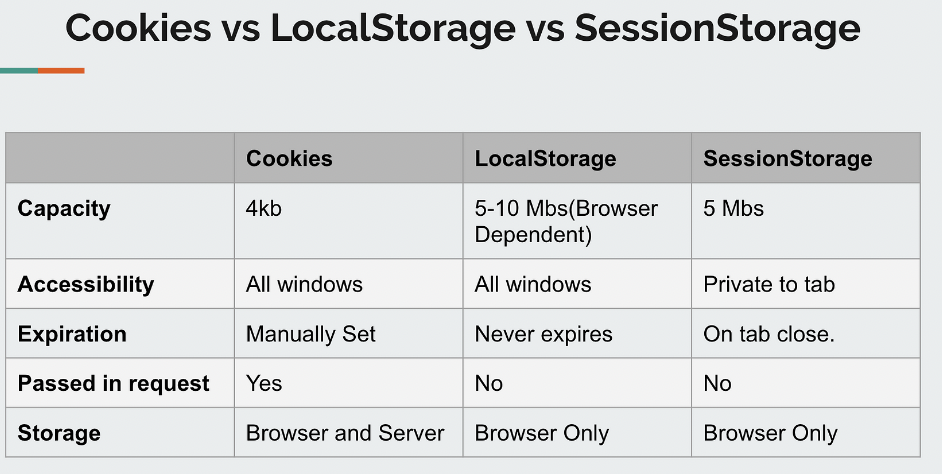

<div style="font-size: 17px;background: black;padding: 2rem;">

# Cookies

Cookies are small files of information that websites send to web browsers to remember information about a user's visit. These files can include information like a user's login status, shopping cart contents, and preferences. The next time a user visits the website, it will recognize the cookie and use the stored data.

Cookies can help websites recognize users and recall their login information and preferences. This can make it easier for a user to visit the site again and make it more useful to them. Cookies are also used for advertising purposes.

<h3 style="border-bottom: 2px solid white; padding-bottom: 2px; display: inline-block;">Working:</h3>

Data stored in a cookie is created by the server upon your connection. This data is labeled with an ID unique to you and your computer. When the cookie is exchanged between your computer and the network server, the server reads the ID and knows what information to specifically serve you.

<h3 style="border-bottom: 2px solid white; padding-bottom: 2px; display: inline-block;">Structure:</h3>

- Cookies are small text files with key-value pairs.
- They have a limited size (usually up to 4KB per cookie).
- Each cookie has attributes such as name, value, domain, path, expiration, and secure flag.
- Cookies are sent as HTTP headers in the request and response messages exchanged between the client and server.

<h3 style="border-bottom: 2px solid white; padding-bottom: 2px; display: inline-block;">Types:</h3>

- <b style="color: Salmon;">Session Cookies:</b> These cookies are temporary and expire when the browser session ends (i.e., when the user closes the browser). They are often used for session management purposes.
- <b style="color: Salmon;">Persistent Cookies:</b> These cookies have a specified expiration date/time set by the server. They remain on the user's device even after the browser is closed and can be used for long-term storage of user preferences or authentication tokens.

<br>

While cookies are essential for many web applications, they also raise privacy and security concerns. Cookies can be exploited for tracking user behavior across different websites, leading to privacy violations and concerns about data collection. Security measures such as HTTPOnly and Secure flags can be used to enhance cookie security and prevent certain types of attacks, such as cross-site scripting (XSS) and session hijacking.

You should clear your cache and cookies regularly. Depending on your settings, the cache can grow quite big, use a lot of disk space on your computer, and cause slow web browsing.

Due to international laws, such as the EU’s General Data Protection Regulation (GDPR), and certain state laws, like the California Consumer Privacy Act (CCPA), many websites are now required to ask for permission to use certain cookies with your browser and provide you with information on how their cookies will be used if you accept.

If you don't accept cookies, some website owners may not allow you to use their websites. You may also not receive the full user experience on certain websites.

<br>

# Local Storage

Local Storage is a web storage API provided by modern web browsers that allows web applications to store data persistently on the client side. This means that the data is available when the browser is reopened, even after the user has closed the tab or window. Unlike cookies, which have limitations in terms of size and are sent with every HTTP request, local storage provides a larger storage capacity (5-10 MB) and allows developers to store data without affecting server-side communication.

Local Storage is accessed using the `localStorage` object, which is part of the global `window` object in JavaScript. The `localStorage` object provides methods for setting, getting, and removing data from the local storage.

<span style="color: Chartreuse;">Local Storage stores data as strings. When storing non-string data types such as objects or arrays, they need to be serialized into JSON strings before storage and deserialized upon retrieval.</span>

- Save data to local storage: `localStorage.setItem(key, value);`
- Read data from local storage: let lastname = `localStorage.getItem(key)`;
- Remove data from local storage: `localStorage.removeItem(key)`;
- Remove all (clear local storage): `localStorage.clear()`;
- Get total number of keys: `localStorage.length`
- Get key by index: `localStorage.key(i)`

<b>LOOPING OVER `localStorage` OBJECT:</b>

```js
// ------ 1st Method ------

for (let key in localStorage) {
  const value = localStorage.getItem(key);
  console.log(`Key: ${key}, Value: ${value}`);
}

// ------ 2nd Method ------

let keys = Object.keys(localStorage);
for (let key of keys) {
  alert(`${key}: ${localStorage.getItem(key)}`);
}
```

`for-in` loop method will iterate over all enumerable properties of the object, including built-in properties and methods inherited from the localStorage prototype. Therefore, using a traditional for loop with localStorage.length is often preferred for iterating specifically over the stored key-value pairs.


<span style="color: Cyan;">Local Storage data is scoped to the origin (scheme, host, and port) of the web application. This means that data stored by one web application cannot be accessed by another web application running on a different origin.</span> For example, data stored by an application served from `https://example.com` is not accessible to an application served from `https://anotherdomain.com`. It helps prevent unauthorized access to sensitive data stored by one web application from another application running on a different origin. Local Storage is shared across all pages from the same origin, including different tabs and windows.

However, local storage is not meant to store sensitive data. Third-party code on the website can easily access the data, which might lead to a security breach. For example, data loaded in an incognito browsing session is cleared once the last private tab is closed.

Data loaded in an incognito browsing session is cleared once the last private tab is closed

<br>

# Session Storage

Session Storage is accessed using the `sessionStorage` object, which is part of the global `window` object in JavaScript.

Properties and methods are the same, but it’s much more limited:

- The sessionStorage exists only within the current browser tab.
    - Another tab with the same page will have a different storage.
    - But it is shared between iframes in the same tab (assuming they come from the same origin).
- The data survives page refresh, but not closing/opening the tab.

<br>



</div>

<!-- <div style="font-size: 17px;background: black;padding: 2rem;"> -->
<!-- <div style="background: DarkRed;padding: 0.3rem 0.8rem;"> [HIGHLIGHT] -->
<!-- <h3 style="border-bottom: 2px solid white; padding-bottom: 2px; display: inline-block;"> [SUBHEADING] -->
<!-- <b style="color: Chartreuse;"> [NOTE] -->
<!-- <b style="color:red;"> [NOTE-2] -->
<!-- <span style="color: Cyan;"> [IMP] -></span> -->
<!-- <b style="color: Salmon;"> [POINT] -->
