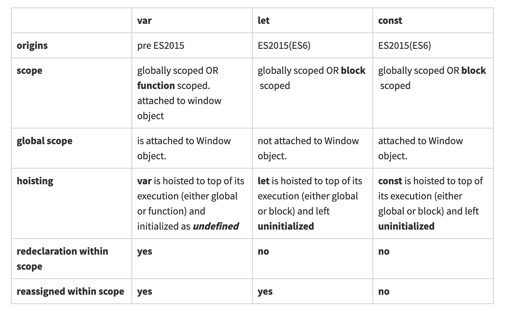

<div style="font-size: 17px;background: black;padding: 2rem;">

In JavaScript, variables are used to store data values. They are containers for storing information that can be referenced and manipulated within a program. Variables can hold various types of data, including numbers, strings, booleans, objects, arrays, functions, and more.

In JavaScript, variables are declared using the `var`, `let`, or `const` keywords, followed by the variable name. Variables in JS can also be declared without any of these keywords directly.

```js
var x = 10;
let y = "Hello";
const PI = 3.14;
```

In computer programs, variables are often declared without a value. The value can be something that has to be calculated, or something that will be provided later, like user input. A variable declared without a value will have the value <span style="color: red;">undefined</span>.

<u><b>Variable Scope: </b></u>Scope refers to the visibility and accessibility of variables within a program. It depends on where variable is declared and how it is declared (means using let, var, const or without using any of them).

<h3 style="border-bottom: 2px solid white; padding-bottom: 2px; display: inline-block;">Hoisting: </h3>

<b>Hoisting is a JavaScript's default mechanism where variable, function and class declarations are moved to the top of their <u>containing scope</u> during the compilation phase. Due to this, variable can be decalared after it has been used.</b>

```js
fun(); // Hello World!
function fun() {
  console.log("Hello World!");
}
```

```js
x = 5;
console.log(x); // 5
var x;
```

<span style="color: SpringGreen;">JavaScript initializations are Not Hoisted. That means variable will remain undefined until the line of initialization is reached.</span> [ABOVE FUNCTION IS WORKING BECAUSE THAT IS FUNCTION DECLARATION, NOT INITIALIZATION]

```js
function fun() {
  if (true) {
    console.log(x); // undefined
    var x = 9;
  }
}
fun();
```

<h3 style="border-bottom: 2px solid white; padding-bottom: 2px; display: inline-block;">var</h3>

<b style="color:Yellow;">1.)</b> Before the introduction of `let` and `const` in ES6, `var` was the primary way to declare variables in JavaScript. The scope of a `var` variable is either the function in which it is declared (function scope) or the global scope if it's declared outside any function.

```js
function example() {
  if (true) {
    var x = 10;
    console.log(x); // Output: 10
  }
  console.log(x); // Output: 10
}

example();
```

In the above example, variable `x` is having scope of `example` function and it is moved to the top of it's scope. Therefore, even though x is declared inside the `if` block, it can still be accessed outside of it.

```js
var x = 10;
const fun = () => {
  console.log(x); // Undefined
  if (true) {
    var x;
  }
};
fun();
```

In the above example, we can see `x` is hoisted from if block to top of function. That is because it has functional scope.

<b style="color:Yellow;">2.)</b> It can be re-declared in same scope.

```js
var carName = "Volvo";
var carName;
```

<b style="color:Yellow;">3.)</b> These variables are hoisted.

<h3 style="border-bottom: 2px solid white; padding-bottom: 2px; display: inline-block;">let</h3>

<b style="color:Yellow;">1.)</b> `let` was introduced in ECMAScript 6 (ES6) to address some of the issues with var. The scope of a let variable is limited to the block in which it is declared (block scope), which is typically denoted by a set of curly braces `{}`.

```js
function example() {
  if (true) {
    let y = 20;
    console.log(y); // Output: 20
  }
  console.log(y); // ReferenceError: y is not defined
}

example();
```

In this example, the variable `y` is declared using `let`. It has block scope, which means it is only accessible within the block it's declared in (inside the if block). When we try to access y outside of the block, we get a `ReferenceError` because y is not defined in that scope. This behaviour helps prevent unintended variable leakage and makes the code easier to understand.

<b style="color:Yellow;">2.)</b> Cannot be re-declared in the <b style="color:red;"><u>same scope</u></b> <b style="color: Chartreuse;">even by other means like `var` and `const` as well</b>. Notice the "same scope" wording. This below code is totally fine.

```js
{
  let a = 1;
  {
    let a = 2;
  }
}
```

```js
let a; var a; // ❌ SyntaxError: Identifier 'a' has already been declared!
var b; let b; // ❌ SyntaxError: Identifier 'b' has already been declared!
var c; var c; // ✅ Successfully executed!
```

<b style="color:Yellow;">3.)</b> These variables are hoisted but until the initialization, they stay in the <span style="color: Coral;">temporal dead zone</span> - a concept in JavaScript that refers to the period between a variable's declaration and its initialization. During this time, the variable is inaccessible and attempting to use it will result in a `ReferenceError: Cannot access variable before initialization`. See the difference in errors logged in below code for both console statements.

  ```js
  console.log(x); // ReferenceError: Cannot access 'x' before initialization [Reason: `x` is hoisted]
  let x = 5;

  console.log(y); // ReferenceError: y is not defined
  ```

<h3 style="border-bottom: 2px solid white; padding-bottom: 2px; display: inline-block;">const</h3>

`const` is also introduced in ES6 and stands for "constant." Variables declared with `const` are exactly like `let`, but they have an additional characteristic -> their value cannot be reassigned once it has been assigned. In other words, const variables are immutable.

```js
function example() {
  const z = 30;
  console.log(z); // Output: 30

  z = 40; // TypeError: Assignment to constant variable
}

example();
```

<br>



<br>

<h3 style="border-bottom: 2px solid white; padding-bottom: 2px; display: inline-block;">DIRECT DECLARATION</h3>

When a variable is declared without a keyword, it becomes a global variable. Global variables are accessible from anywhere in the code. This behavior is often referred to as "implicit global variables" or "global leakage," and it's generally considered a bad practice because it can lead to unintended consequences and hard-to-debug issues, especially in large codebases or collaborative projects where multiple developers are working on the same code. It's recommended to always declare variables explicitly with `var`, `let`, or `const` to prevent accidental global variables and ensure better code maintainability and readability.

```js
function example() {
  myVar = 10; // This creates a global variable named myVar
  console.log(myVar); // 10
}

example();
console.log(myVar); // 10 (accessible globally)
```

<br>

# Variable Shadowing

Variable shadowing in JavaScript is a phenomenon that occurs when a variable declared within a certain scope has the same name as a variable declared in an outer scope. The inner variable "shadows" the outer one within its scope.

```js
var x = 10;

function outerFunction() {
  var x = 20;
  console.log(x); // 20
}

outerFunction();

console.log(x); // 10
```

<h3 style="border-bottom: 2px solid white; padding-bottom: 2px; display: inline-block;">Illegal Shadowing</h3>

Now, while shadowing a variable, it should not cross the boundary of the scope, i.e. we can shadow `var` variable by `let` variable but cannot do the opposite. So, if we try to shadow `let` variable by `var` variable, it is known as Illegal Shadowing and it will give the error as “variable is already defined.”

```js
var a; { var a; } // ✅ Successfully executed!
let b; { let b; } // ✅ Successfully executed!
let c; { var c; } // ❌ SyntaxError: Identifier 'c' has already been declared
var d; { let d; } // ✅ Successfully executed!
```

This happens because `let` is block-scoped and `var` is function-scoped or globally scoped, leading to a conflict.

</div>

<!-- <div style="background: DarkRed;padding: 0.3rem 0.8rem;"> [HIGHLIGHT] -->
<!-- <h3 style="border-bottom: 2px solid white; padding-bottom: 2px; display: inline-block;"> [SUBHEADING] -->
<!-- <b style="color: Chartreuse;"> [NOTE] -->
<!-- <b style="color:red;"> [NOTE-2] -->
<!-- <span style="color: Cyan;"> [IMP] -></span> -->
<!-- <b style="color: Salmon;"> [POINT] -->
<!-- <div style="border: 1px solid yellow; padding: 10px;"> [BORDER] -->
