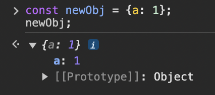
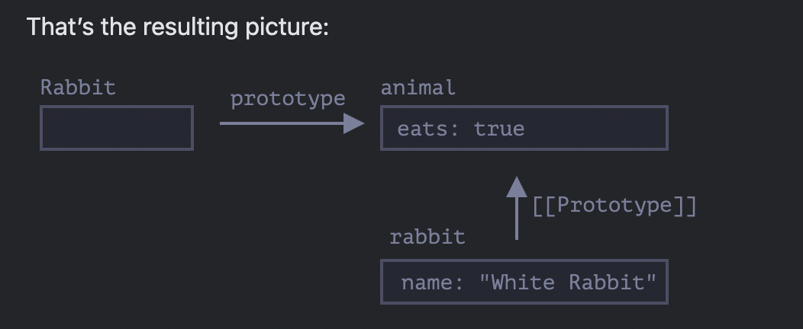
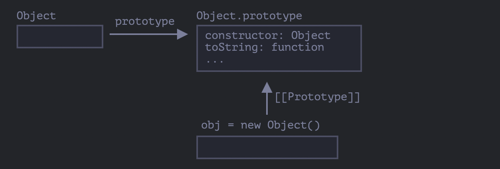
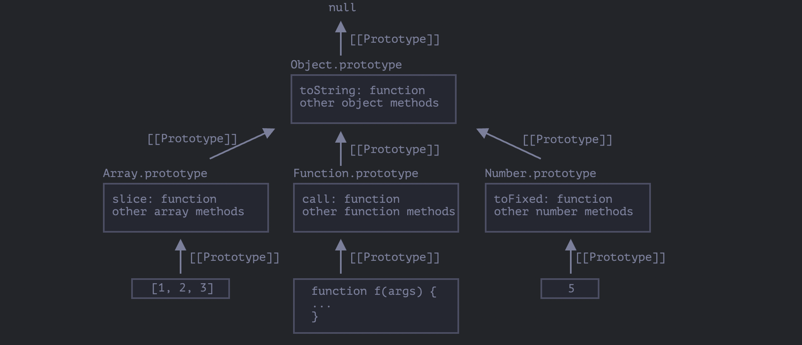

<div style="font-size: 17px;background: black;padding: 2rem;">

<b>Prototypal inheritance is a core concept in JavaScript that allows objects to inherit properties and methods from other objects. Unlike classical inheritance found in languages like Java or C++, which uses classes as blueprints for creating objects, JavaScript uses prototypes as the mechanism for inheritance.</b>

For instance, we have a `user` object with its properties and methods, and want to make new objects `admin` and `guest` as slightly modified variants of it. We’d like to reuse what we have in user, not copy/reimplement its methods, just build a new object on top of it.

# [[Prototype]]

In JavaScript, objects have a special hidden property `[[Prototype]]` (as named in the specification), that is either `null` or references another object. That object is called “a prototype”:


<br>

When you try to access a property of an object: if the property can't be found in the object itself, the prototype is searched for the property. If the property still can't be found, then the prototype's prototype is searched, and so on until either the property is found, or the end of the chain is reached, in which case `undefined` is returned. In programming, this is called “prototypal inheritance”.

<u style="color:Coral;"><b>Shadowing Properties:</b></u> What happens if you define a property in an object, when a property with the same name is defined in the object's prototype? This should be predictable, given the description of the prototype chain. Direct properties will be checked first.

The property `[[Prototype]]` is internal and hidden, but there are many ways to set it. They are mentioned below:

<h3 style="border-bottom: 2px solid white; padding-bottom: 2px; display: inline-block;">1) <span style="color: lightgreen;">&#95;&#95;proto&#95;&#95;</span> Property</h3>

This property of an object points to its prototype. While `__proto__` is not part of the standard language, most modern JavaScript environments support it.

```js
let animal = {
  eats: true,
};
let rabbit = {
  jumps: true,
};
rabbit.__proto__ = animal; // sets rabbit.[[Prototype]] = animal
console.log(rabbit.eats); // Output - True. Since we are reading a property missing in rabbit, JS automatically takes it from animal.
```

Here we can say that "animal is the prototype of rabbit" or "rabbit prototypically inherits from animal". So if animal has a lot of useful properties and methods, then they become automatically available in rabbit. Such properties are called “inherited”.

The prototype chain can be longer:

```js
let animal = {
  eats: true,
  walk() {
    console.log("Animal walk");
  },
};

let rabbit = {
  jumps: true,
  __proto__: animal,
};

let longEar = {
  earLength: 10,
  __proto__: rabbit,
};

// walk is taken from the prototype chain
longEar.walk(); // Animal walk
console.log(longEar.jumps); // true (from rabbit)
```

<b style="color:red;"><u>NOTE:</u></b> When we set `obj1.__proto__ = obj2`, prototype of `obj2` will also come along!!

<div style="border: 1px solid yellow; padding: 10px;">
There are only two limitations:<br>

1. The references can’t go in circles. JavaScript will throw an error if we try to assign **__proto__** in a circle.<br>
2. The value of `__proto__` can be either an object or `null`. Other types are ignored. Setting `__proto__` to `null` effectively removes the prototype chain from the object, meaning the object will no longer inherit properties and methods from any other object, including the base `Object.prototype`.

```js
  const obj = {};
  console.log(obj.toString()); // [object Object]

  obj.__proto__ = null;
  console.log(obj.toString); // undefined
```

</div>

<br>

<div style="border: 2px solid blue; padding: 10px;">

1. `[[Prototype]]`:

- `[[Prototype]]` is an internal, hidden property of an object.
- It points to the object’s prototype (the object it inherits properties and methods from).
- This property isn’t directly accessible or modifiable in code. Instead, it's a concept that exists within the JavaScript engine for handling inheritance and prototype chains.
- When accessing a property on an object, JavaScript uses the `[[Prototype]]` chain to search up the hierarchy until it either finds the property or reaches the end of the chain.

2. `__proto__`:

- It is a <b><u>non-standard accessor property</u></b> (not a data property that directly holds a value, JavaScript calls an internal getter function that retrieves the `[[Prototype]]` when you access it) that allows developers to interact with the `[[Prototype]]` of an object. Supported by all browsers but is outdated.
- It provides a way to get or set the `[[Prototype]]` of an object explicitly, even though `[[Prototype]]` itself is hidden.
- This property is widely supported but was never a formal part of the ECMAScript standard until ES6, which included it as a de-facto feature primarily for compatibility.
- For example, you can access or modify an object’s prototype with `someObject.__proto__`, although using `Object.getPrototypeOf` and `Object.setPrototypeOf` is generally recommended for setting or retrieving prototypes in modern code.

</div>

<br>

<h3 style="border-bottom: 2px solid white; padding-bottom: 2px; display: inline-block;">2) Prototype methods</h3>

The modern methods to get/set a prototype are:

- <span style="color: Cyan;">Object.getPrototypeOf(obj)</span> – returns the `[[Prototype]]` of `obj`. `null` is returned if it does not exist.
- <span style="color: Cyan;">Object.setPrototypeOf(obj, proto)</span> – sets the `[[Prototype]]` of `obj` to `proto`.
- <span style="color: Cyan;">Object.create(proto[, descriptors])</span> - creates an empty object with given `proto` as `[[Prototype]]` and optional property descriptors.

```js
let animal = {
  eats: true,
};

// create a new object with animal as a prototype
let rabbit = Object.create(animal); // same as {__proto__: animal}

console.log(rabbit.eats); // true

console.log(Object.getPrototypeOf(rabbit) === animal); // true

Object.setPrototypeOf(rabbit, {}); // change the prototype of rabbit to {}
```

The only usage of `__proto__`, that’s not frowned upon, is as a property when creating a new object: `{ __proto__: ... }`. Although, there’s a special method for this too:<br>

<h3 style="border-bottom: 2px solid white; padding-bottom: 2px; display: inline-block;">3) F.prototype</h3>

In JavaScript, all functions have a property named <b style="color:DarkSalmon;">prototype</b>. When you call a function as a constructor, this property is set as the prototype of the newly constructed object

```js
let animal = {
  eats: true,
};

function Rabbit(name) {
  this.name = name;
}

Rabbit.prototype = animal;

let rabbit = new Rabbit("White Rabbit"); //  rabbit.__proto__ == animal

console.log(rabbit.eats); // true
```

Setting `Rabbit.prototype = animal` literally states the following: "When a new Rabbit is created, assign its `[[Prototype]]` to `animal`".

<b style="color:red;">NOTE:</b> `F.prototype` here means a regular property named "prototype" on `F`. It sounds something similar to the term “prototype”, but here we really mean a regular property with this name.



<br>

<div style="border: 4px solid Teal; padding: 10px;">

<b style="color:red;">NOTE:</b>

1. <b style="color: Chartreuse;">obj.hasOwnProperty(key)</b> method can be used to check if 'obj' object has the specified property `key` as its own property (not the inherited ones). It returns true if `obj` has its own (not inherited) property named `key`.
2. The <b style="color: Cyan;">for..in</b> loop iterates over inherited properties. <span style="color: DarkSalmon;">One must wonder why the properties of base `Object.prototype` do not get iterated while looping over an object? That is because those properties are set to be not enumerable by default.</span>
3. <b style="color: Violet;">Object.keys()</b> does not give inherited keys.
4. `this` is not affected by prototypes at all. No matter where the method is found: in an object or its prototype. In a method call, `this` is always the object before the dot.
</div>

<br>

# Native prototypes

The "prototype" property is widely used by the core of JavaScript itself. All built-in constructor functions use it. Consider the below code:

```js
let obj = {};
alert(obj); // "[object Object]" ?
```

Where’s the code that generates the string `"[object Object]"`? That’s a built-in `toString` method, but where is it? The `obj` is empty! But the short notation `obj = {}` is the same as `obj = new Object()`, where <b style="color: MediumSpringGreen;">Object</b> is a built-in object constructor function, with its own `prototype` referencing a huge object with `toString` and other methods.

When `new Object()` is called (or a literal object `{...}` is created), the `[[Prototype]]` of it is set to `Object.prototype` according to the rule that we discussed above.



<br>

So then when `obj.toString()` is called the method is taken from `Object.prototype`.

```js
let obj = {};

console.log(obj.__proto__ === Object.prototype); // true
console.log(obj.toString === obj.__proto__.toString); //true
console.log(obj.toString === Object.prototype.toString); //true
```

Please note that there is no more `[[Prototype]]` in the chain above `Object.prototype`.

```js
console.log(Object.prototype.__proto__); // null
```

Other built-in objects such as <b style="color: MediumSpringGreen;">Array</b>, <b style="color: MediumSpringGreen;">Date</b>, <b style="color: MediumSpringGreen;">Function</b> and others also keep methods in prototypes. For instance, when we create an array `[1, 2, 3]`, the default `new Array()` constructor is used internally. So `Array.prototype` becomes its prototype and provides methods. That’s very memory-efficient.

<div style="font-size: 17px;background: black;padding: 2rem; background-color: rgba(103, 114, 230, 0.2);">

**One example:** `Array.prototype` is specially created array object that provides the methods and behaviors all arrays share. It must be something like this:

```js
{
  length: __,
  isArray: __,
  slice: ___,
  ... 
}
```

</div>

<br>

```js
let arr = [1, 2, 3];

// it inherits from Array.prototype?
console.log(arr.__proto__ === Array.prototype); // true

// then from Object.prototype?
console.log(arr.__proto__.__proto__ === Object.prototype); // true

// and null on the top.
console.log(arr.__proto__.__proto__.__proto__); // null
```

By specification, all of the built-in prototypes have `Object.prototype` on the top. That’s why some people say that “everything inherits from objects”. Here’s the overall picture (for 3 built-ins to fit):



<br>

Other built-in objects also work the same way. Even functions – they are objects of a built-in <b style="color: MediumSpringGreen;">Function</b> constructor, and their methods (`call`/`apply` and others) are taken from `Function.prototype`.

```js
function f() {}

console.log(f.__proto__ == Function.prototype); // true
console.log(f.__proto__.__proto__ == Object.prototype); // true, inherit from objects
```

The most intricate thing happens with strings, numbers and booleans. As we remember, they are not objects. But if we try to access their properties, temporary wrapper objects are created using built-in constructors <b style="color: MediumSpringGreen;">String</b>, <b style="color: MediumSpringGreen;">Number</b> and <b style="color: MediumSpringGreen;">Boolean</b>. They provide the methods and disappear.

These objects are created invisibly to us and most engines optimize them out, but the specification describes it exactly this way. Methods of these objects also reside in prototypes, available as `String.prototype`, `Number.prototype` and `Boolean.prototype`.

<h3 style="border-bottom: 2px solid white; padding-bottom: 2px; display: inline-block;">Changing native prototypes</h3>

Native prototypes can be modified. For instance, if we add a method to `String.prototype`, it becomes available to all strings:

```js
String.prototype.show = function () {
  console.log(this);
};

"BOOM!".show(); // BOOM!
```

Prototypes are global, so it’s easy to get a conflict. If two libraries add a method `String.prototype.show`, then one of them will be overwriting the method of the other. So, generally, modifying a native prototype is considered a bad idea.

<b> In modern programming, there is only one case where modifying native prototypes is approved. That’s polyfilling. Polyfilling is a term for making a substitute for a method that exists in the JavaScript specification, but is not yet supported by a particular JavaScript engine. </b>

We may then implement it manually and populate the built-in prototype with it. For instance:

```js
if (!String.prototype.repeat) {
  // if there's no such method
  // add it to the prototype

  String.prototype.repeat = function (n) {
    // repeat the string n times

    // actually, the code should be a little bit more complex than that
    // (the full algorithm is in the specification)
    // but even an imperfect polyfill is often considered good enough
    return new Array(n + 1).join(this);
  };
}

console.log("La".repeat(3)); // LaLaLa
```

</div>
