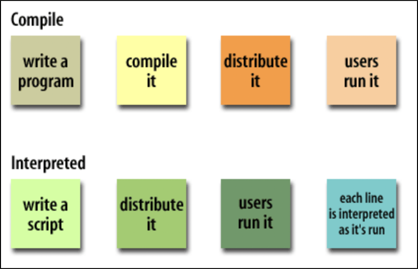

<div style="font-size: 17px;background: black;padding: 2rem;">

JavaScript (JS) is the most popular lightweight, interpreted compiled programming language. It can be used for both Client-side as well as Server-side developments. JavaScript also known as a scripting language for web pages. A scripting language is a computer language that is interpreted instead of compiled. Some examples of scripting languages include: JavaScript, Python, Ruby, PHP.

<table style="font-family: Arial, Helvetica, sans-serif;border-collapse: collapse; width: 100%; border: 1px solid #ddd;">
  <tr>
    <th>Compiled Language</th>
    <th>Interpreted Language</th>
  </tr>

  <tr>
    <td>Compiled languages are translated directly into machine code or intermediate code (bytecode) by a compiler before execution. The resulting machine code can be executed directly by the computer's processor.</td>
    <td>Interpreted languages are translated line-by-line or statement-by-statement into machine code instructions by an interpreter at runtime. The interpreter reads and executes the code directly without producing a separate executable file.</td>
  </tr>

  <tr>
    <td>Compiled languages tend to have faster execution speeds because the code is translated into machine code beforehand, and there is no need for interpretation during runtime.</td>
    <td>Interpreted languages generally have slower execution speeds because the interpreter has to translate and execute the code line-by-line or statement-by-statement during runtime.</td>
  </tr>

<tr>
    <td>Compiled languages often require separate compilation for different platforms or architectures, resulting in platform-specific executables. However, some compiled languages (like Java) produce bytecode, which can be executed on any platform with the appropriate virtual machine.</td>
    <td>Interpreted languages typically have greater portability since the interpreter can run on different platforms, allowing the same source code to be executed without modification on various systems.</td>
</tr>
</table>

<br>

When JavaScript was created, it initially had another name: “LiveScript”. But Java was very popular at that time, so it was decided that positioning a new language as a “younger brother” of Java would help. But as it evolved, JavaScript became a fully independent language with its own specification called ECMAScript, and now it has no relation to Java at all.

<div style="background: DarkRed;padding: 0.3rem 0.8rem;">ECMAScript is a standardized scripting language specification that serves as the basis for several scripting languages, the most well-known of which is JavaScript. It defines the core features and functionality of the language, providing guidelines for how implementations of the language should behave.</div><br>

Today, JavaScript can execute not only in the browser, but also on the server, or actually on any device that has a special program called the JavaScript engine. The browser has an embedded engine sometimes called a “JavaScript virtual machine". Different engines have different “codenames”. For example:
- V8 – in Chrome, Opera and Edge.
- SpiderMonkey – in Firefox.
- …There are other codenames like “Chakra” for IE, “JavaScriptCore”, “Nitro” and “SquirrelFish” for Safari, etc.


<br>

# Where to write JS Code

## Internal JS

In HTML, JavaScript code is inserted between `<script>` and `</script>` tags. Old JavaScript examples may use a type attribute: `<script type="text/javascript">`. The type attribute is not required. JavaScript is the default scripting language in HTML. Example:

```
<script>
document.getElementById("demo").innerHTML = "My First JavaScript";
</script>
```

You can place any number of scripts in an HTML document. Scripts can be placed in the `<body>`, or in the `<head>` section of an HTML page, or in both.

## External JS

Scripts can also be placed in separate files called as Javascript files. JavaScript files have the file extension .js. Those files will directly have js code, they cannot contain `<script>` tags. To use an external script, put the name of the script file in the src (source) attribute of a `<script>` tag: `<script src="myScript.js"></script>`. <br/>

An external script can be referenced in 3 different ways:

- With a full URL (a full web address) : `<script src="https://www.w3schools.com/js/myScript.js"></script>`
- With a file path (like /js/) : `<script src="/js/myScript.js"></script>`
- Without any path : `<script src="myScript.js"></script>` <br/>

Placing scripts in external files has some advantages:

- It separates HTML and code
- It makes HTML and JavaScript easier to read and maintain
- Cached JavaScript files can speed up page loads


</div>

<!-- <div style="background: DarkRed;padding: 0.3rem 0.8rem;"> [HIGHLIGHT] -->
<!-- <h3 style="border-bottom: 2px solid white; padding-bottom: 2px; display: inline-block;"> [SUBHEADING] -->
<!-- <b style="color: Chartreuse;"> [NOTE] -->
<!-- <b style="color:red;"> [NOTE-2] -->
<!-- <span style="color: Cyan;"> [IMP] -></span> -->
<!-- <b style="color: Salmon;"> [POINT] -->
